指针和内存的问题

在c++中创建指针，会分配用来存储地址的内存，但不会分配用来存储指针所指向的数据的内存，为数据提供空间是一个独立的步骤。


内存问题

类中的结构体成员变量怎么释放。

类中的指针成员变量，包括结构体指针等如何释放。


### **指针需要被初始化**

指针变量不仅仅是指针，是指向特定类型的指针。

**判断能否修改一个指针的值，关键在于判断这个指针是否已经指向了一个已经申请好的内存空间！**

**使用`int *p`还是`int* p`**

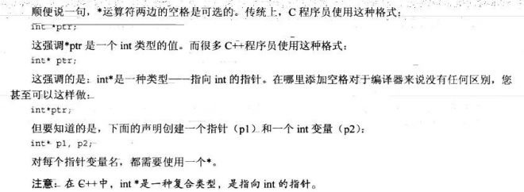


**指针的初始化**

1.将指针初始化为变量的地址

```c++
int higgens=5;
int *p = &higgens; // 将p初始化为higgens的地址。
```

int *p; 变量名叫p，类型为int *,可存放一个int数据的地址 。

2.malloc为指针分配内存空间

```c++
char *pt = nullptr;// 给指针初始化
pt = (char *)malloc(10 * sizeof(char)); 
```

3.使用new来为指针进行初始化

```c++
double *pt = new double; 
*pt= 100.0；
```

new根据类型确定需要多少字节内存，申请一个长度正确的内存块，并返回内存块地址，然后将地址赋值给pt。

pt指向一个数据对象，其并没有变量名称呼。

```c++
//2.
char *getname()
{
	char temp[80];
	char *pn = new char[strlen(temp) + 1];
	strcpy(pn, temp);
	return pn;
}
char *name;
name = getname();
delete [] name;
```


**如果没有被初始化其可以使任何值，这样给他赋值，会导致内存问题，因为任何值并不是希望存储的内存地址。**

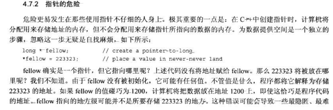

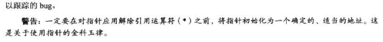


### 使用new分配内存

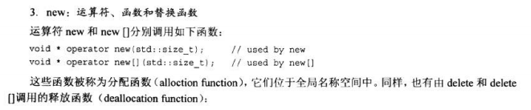

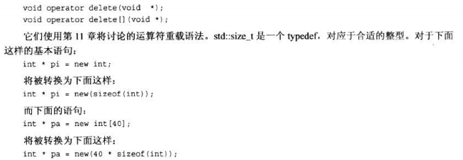


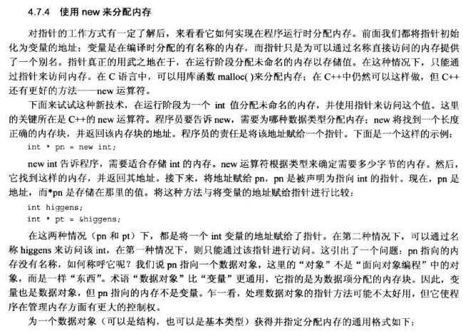

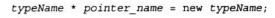

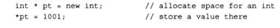

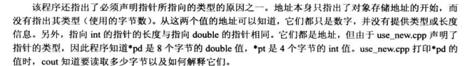

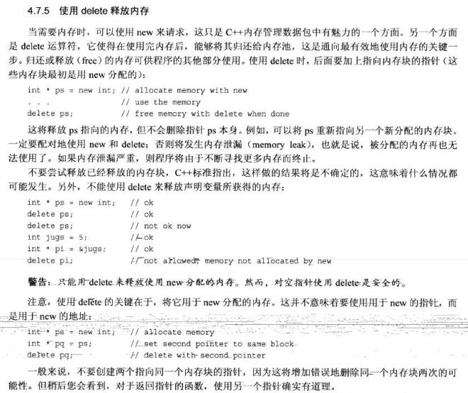


- 实现运行时分配内存。
- new时需要指定类型来确定需要多少字节的内存
- new从堆区分配内存需要手动释放。
- 使用new从堆区分配的内存需要使用delete进行释放。否则被分配的内存再也无法使用导致内存泄露问题。
- **不要创建两个指向同一个内存块的指针，这可能导致错误的重复释放同一个内存块。**


### new创建动态数组

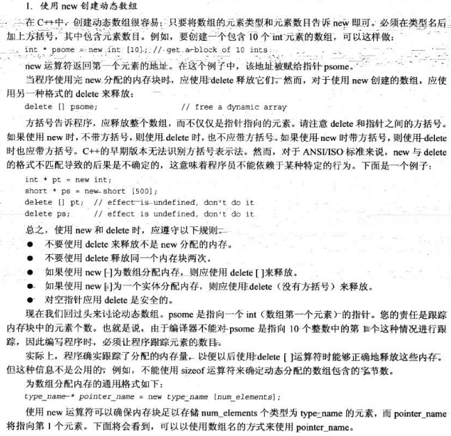


可以将指针当做数组名使用，直接使用索引访问动态数组。

指针变量+1，增加的量等于它指向类型的字节数。

如下例子

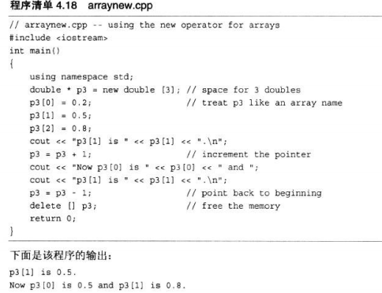

对数组应用sizeof运算符得到的是数组的长度，对指针应用得到的是指针的长度，即便其指向的是一个数组。

获得指针的地址：

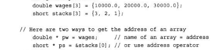

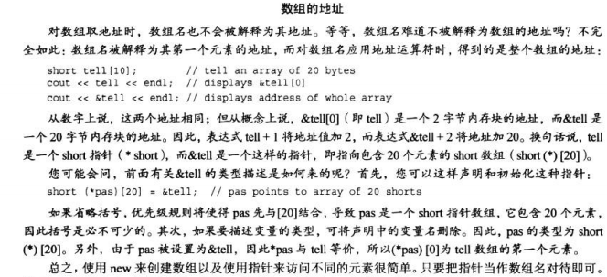


### new创建动态结构

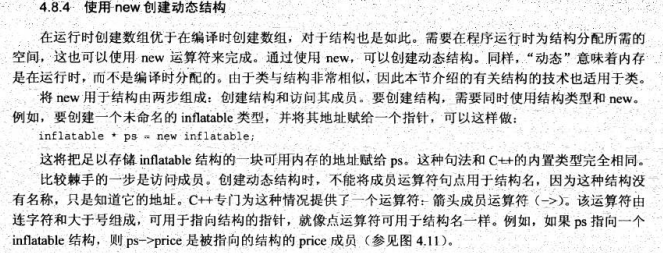

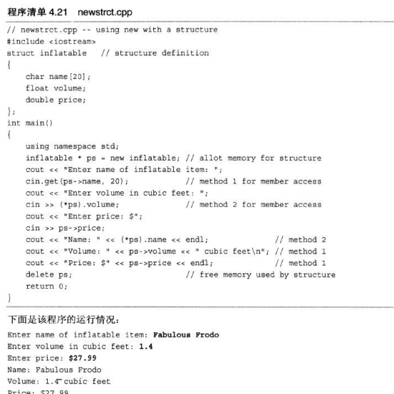


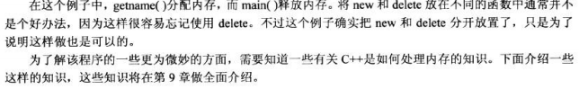


new找不到请求的内存量会引发std::bad_alloc异常


### C++3种管理数据内存的方式

- 自动存储：函数被调用时自动产生，函数结束时消亡
- 静态存储：整个程序执行期间都存在。
- 动态存储：数据生命周期自行定义。

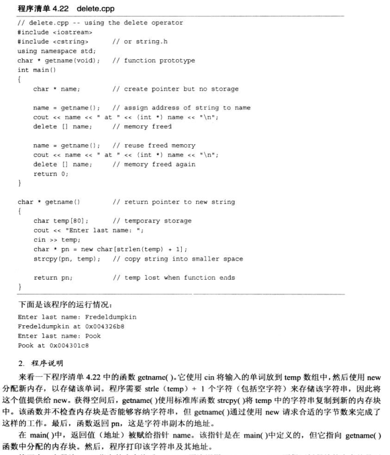

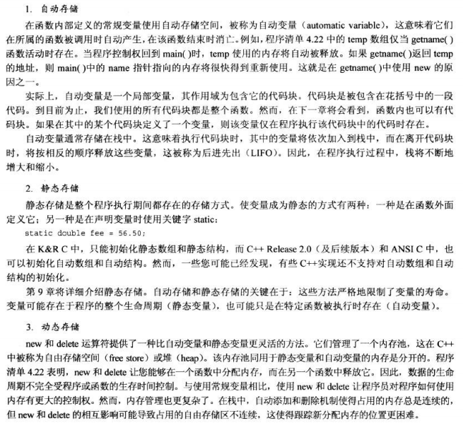


### 指针的声明，赋值，解引用

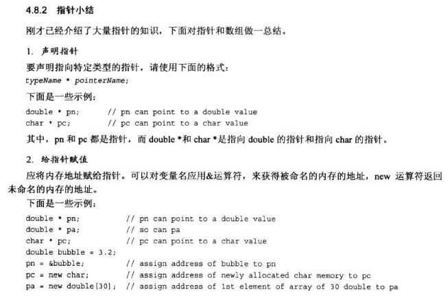

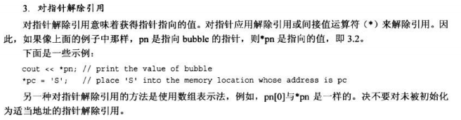

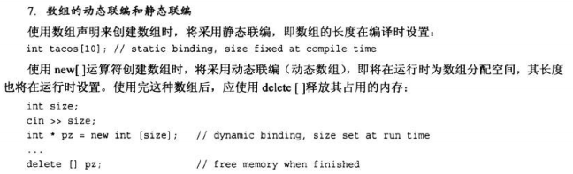

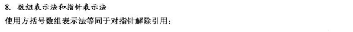

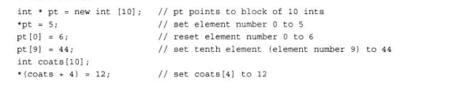

**将地址赋值给指针变量需进行强制转换。**

### 指针和字符串

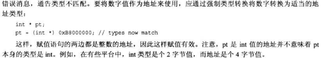

**如果给cout提供一个字符的地址，它将从该字符开始打印，直到遇到空字符为止。**

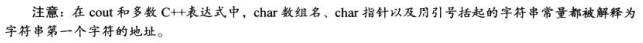


### 内存泄露


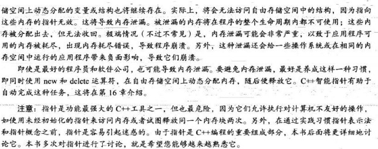


### 函数中传入指针

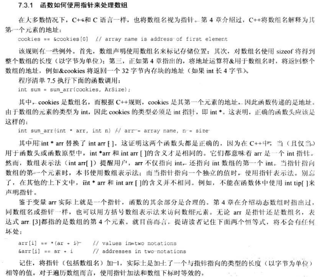


### 头文件


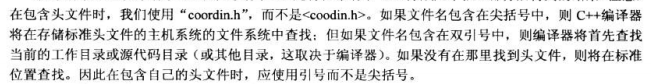

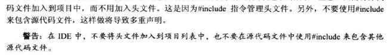


大程序的管理，如果只修改了一个文件，则可以只重新编译该文件，然后将它与其他文件的编译版本链接。


### 静态持续变量

静态持续变量的3种链接性：

- 外部链接性，可在其他文件中访问
- 内部链接性，只能当前文件中访问
- 无链接性，只能代码块中访问。

static 修饰的变量在代码块内部，是没有链接性的静态持续变量，只能在函数块中使用它，但是与自动变量不同，即使函数没有被执行其也留在内存中。

static修饰的变量在代码块外部，是链接性为内部的静态持续变量，从声明位置到文件结尾的位置都可被使用，但是只能在包含该代码的文件中使用它。

而如果不用static修饰，在函数块外面声明自动变量，则其为链接性为外部的静态持续变量。可以在其他文件中使用该变量。


### nullptr NULL 0的区别


C++中值为0的指针被称为空指针，c++确保空指针不会指向有效数据。

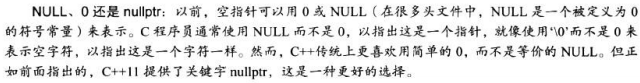
