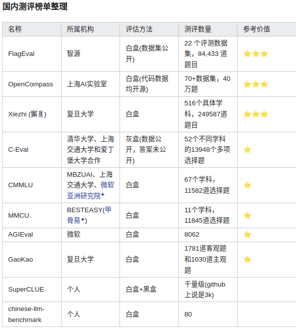
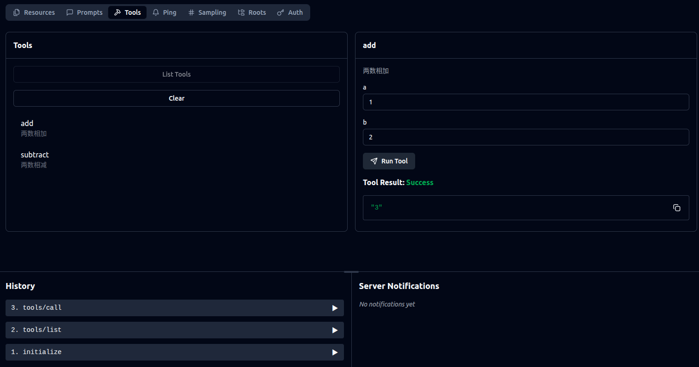

[TOC]

有哪些常见的大模型？这些大模型的推出时间线，公司背景，特点（架构，参数）。大模型工作原理，能力范围。如何训练。如何搭建自己的chat服务。

常见的概念认识：LoRA，prompt，RAG， agent， function call， openAI API, langchain。

大模型的应用落地的方式。

软硬件配套体系。

大模型的评测体系。

大模型的安全维护。

怎样算作大模型？

当前的大模型训练参数（不同部署端的参数规模），训练设备（硬件成本），训练方法（分布式？），训练语料库（来源大小），调参方式？

落地的大模型？

垂直领域的使用？

如何评价大模型的好坏？


## Q&A


- **常见的通用大模型的参数规模，训练GPU时长，训练设备，计算量?**

举个例子。from [Llama3 model card](https://github.com/meta-llama/llama3/blob/main/MODEL_CARD.md)

|         | **Training Data**                            | **Params** | **Context length** | **GQA** | **Token count** | **Knowledge cutoff** |
| ------- | -------------------------------------------- | ---------- | ------------------ | ------- | --------------- | -------------------- |
| Llama 3 | A new mix of publicly available online data. | 8B         | 8k                 | Yes     | 15T+            | March, 2023          |
|         |                                              | 70B        | 8k                 | Yes     |                 | December, 2023       |

|             | **Time (GPU hours)** | **Power Consumption (W)** | **Carbon Emitted(tCO2eq)** |
| ----------- | -------------------- | ------------------------- | -------------------------- |
| Llama 3 8B  | 1.3M                 | 700                       | 390                        |
| Llama 3 70B | 6.4M                 | 700                       | 1900                       |
| Total       | 7.7M                 |                           | 2290                       |

Llama3 8B 和Llama 3 70B两个模型，参数规模分别为80亿和700亿个参数。在 H100-80GB 型号的硬件（散热功耗为 700W）上累计使用了 7.7M GPU 小时的计算。 （换算出来 即1000张H100花近一年训练，1w张H100花一个多月训练）


- **是否需要重新训练大模型？什么情况下需要重新训练大模型？**

以下是我的理解：

通用大模型本身具有强泛化性可以通过微调或迁移学习来适应新的任务，无需从头开始训练。

对当前开源LLM的针对特定任务进行优化有以下几种方法：

1. Prompt提示工程优化。大概是优化输入问题的表达结构和方式以获得更满足需求的答案。

2. 模型微调。针对特定的领域数据，可采用微调的方法，也需要一定量的领域数据和训练需要的硬件资源。训练相较推理需要的显存量是几倍增长的。

   FFT全量微调

   PEFT (Parameter-Efficient Fine Tuning)只对部分的参数进行训练

3. 重新训练

   这种需要大量的数据资源和硬件资源，训练成本很高，此外可能会出现灾难性遗忘过拟合等问题，资源成本预算不足一般不建议。


- **怎样算作大模型**？

大模型是指具有大规模参数和复杂计算结构的机器学习模型。这些模型通常由深度神经网络构建而成，拥有数十亿甚至数千亿个参数。

现在出现了轻量大模型比如Qwen的0.5B模型。虽然没有一个特别的定义，但是可认为亿级参数量就算是大模型了。

- **如何利用多卡加载大模型进行推理和训练？**

- **如何针对特定领域定制化微调大模型？**
- 大模型的集群训练是怎样的，基于什么并行架构，多卡直接的数据传输是怎样的，nvidia推出的


- 需求是什么?需要达到什么应用效果？针对哪个领域？如果需要训练是否能有数据支持？

  如果得到了较好的模型，如何应用？

  云端部署：如果是服务化部署，服务器需要有足够的资源算力来响应用户请求。

  本地部署：比如应用与智能安防，部署时为保证算力需指定用户设备。

  边缘部署：智能家居或智能边缘设备，就需要考虑从轻量大模型着手

  混合部署：服务器和部署端进行绑定，一个用于接收数据增量训练或微调一个用于推理，适合需要隐私保护的特殊场景。

- **选择什么参数量的能直接开始训练的大模型？**

  不同的参数级模型适应不同的任务。模型量级选择需考虑任务需求以及硬件资源成本。

  当前已有资源6张3090卡共144GB,能够满足7B级别模型的训练。单卡能满足7B参数量模型的半精度及以下精度的模型推理，已部署视频理解模型进行过测试。

- **训练的算力资源需要多少？**

  算力资源的多少需要根据：选择的模型和预期训练时长来决定。

  在模型参数、预训练数据量一定的情况下，对于给定型号的GPU，训练时长越短，所需的GPU数量就越多。比较理想的情况就是，尽量提升GPU的峰值性能（如从英伟达A100到H100，再到B100，峰值性能从312TFlops到990TFlops，再到2250TFlops）、提升GPU利用率，然后在GPU数量和训练时长之间找一个平衡点。

  >  以GPT3-175B为例，在300B tokens的数据上训练175B参数量的GPT3，40GB显存A100的峰值性能为312TFlops，设GPU利用率为0.45，期望30天完成（训练时长2592000秒）
  >
  > 则需要的A100的数量= (8 x 175 x 109 x 300 x 109) / (2592000 x 312 x 1012x 0.45) ≈ 1154块


## 大模型的认识

### 常见的大模型

**常见的一些大语言模型**

- Llama
- GPT
- Claude
- Gemini/Gemma
- Mistral
- Vicuna
- BLOOM
- Grok
- Amazon Nova
- Phi
- calme
- Falcon
- OPT
- Qwen
- DeepSeek
- MiniMax
- GLM
- Yi
- baichuan
- InternLM
- MiniCPM
- Orion
- XVERSE
- BELLE

ref:

[Open LLM Leaderboard](https://huggingface.co/spaces/open-llm-leaderboard/open_llm_leaderboard#/)

[AI大模型大全、排行榜等相关资源](https://www.datalearner.com/ai-models/leaderboard/datalearner-llm-leaderboard)

[开源语言模型百宝袋](https://github.com/createmomo/Open-Source-Language-Model-Pocket)

[Llama中文社区](https://github.com/LlamaFamily/Llama-Chinese?tab=readme-ov-file#%E5%BF%AB%E9%80%9F%E4%B8%8A%E6%89%8B-%E4%BD%BF%E7%94%A8llamacpp)

[Awesome AGI](https://github.com/ArronAI007/Awesome-AGI)


### 模型架构

#### MoE大模型

GPT/Llama/Mistral  /GML

这些底座模型有不同的数据配比、指令规范，微调模型、剪枝。

主流的开源模型体系?模型技术架构？

MoE大模型


**prefix LM 和 causal LM 区别是什么？**

前缀语言模型和因果语言模型

prefixLM生成过的句子互相可见，没生成的只能见到之前生成过得。causalLM不管是生成过得还是没生成的句子都只能见到以前的句子

#### Tokenizer

tokenizer即分词器，大模型需要将输入的文本token化，将文本字符转换为数字序列。

大模型使用的分词算法主要以下几种：

- **Byte Pair Encoding (BPE)**

  BPE是一种数据压缩算法，BPE每一步都将最常见的一对相邻数据单位替换为该数据中没有出现过的一个新单位，反复迭代直到满足停止条件。这种方法能够将需要维护的很大的词汇表进行压缩。

  通过统计文本中相邻字符序列的频率，然后合并最频繁出现的对来创建新的词汇表项。BPE允许模型有效地处理常见单词和短语，同时也能很好地应对未登录词。这种方式不仅能够平衡词汇表大小还具有处理罕见词的能力。

- **BBPE(Byte-level BPE)**

  论文：[Neural Machine Translation with Byte-Level Subwords](https://link.zhihu.com/?target=https%3A//readpaper.com/pdf-annotate/note%3FpdfId%3D4498433294026301441%26noteId%3D1905877401569905152) 在基于BPE基础上提出以Byte-level为粒度的分词算法Byte-level BPE，即BBPE。

  BBPE考虑将一段文本的UTF-8编码(UTF-8保证任何语言都可以通用)中的一个字节256位不同的编码作为词表的初始化基础Subword。

  BBPE从性能和原理上和BPE大差不差，最主要区别是BPE基于char粒度去执行合并的过程生成词表，而BBPE是基于4个字节、总共256个不同的字节编码（Byte) 去执行合并过程生成词表。

- **WordPiece**

  也是合并子词构造词汇表，在合并策略上与BPE不同。WordPiece选择合并似然概率最大的相邻字符对加入词表中作为新的Subword。似然概率的值代表两个子词间的互信息，概率值计算也依赖于子词出现的频率，所以合并计算量比BPE大。

- **UniLM**

  BPE 以及 WordPiece 是初始化一个小词表，然后一个个增加到限定的词汇量，UniLM是开始时先构建足够大的词表，之后每一步选择一定比例的计算概率低的Subword从词表中删除，直到限定词汇量。

**SentencePiece**：

SentencePiece它是谷歌推出的子词开源工具包，其中集成了BPE、ULM子词算法。除此之外，SentencePiece还能支持字符和词级别的分词。

目前大模型做token基本直接调用这个库。

ref:

[Byte Pair Encoding (BPE)]()https://zhuanlan.zhihu.com/p/424631681

[NLP 中的Tokenizer：BPE、BBPE、WordPiece、UniLM](https://zhuanlan.zhihu.com/p/649030161)

### 轻量化大模型

如何降低参数量的同时保证推理效果？

得到模型进行部署的压缩方式？

### 大模型的涌现能力

当一个复杂系统由很多微小个体构成，这些微小个体凑到一起，相互作用，当数量足够多时，在宏观层面上展现出微观个体无法解释的特殊现象，就可以称之为“涌现现象”。

大模型的涌现现象主要体现为模型规模在小于某个临界值之前基本不具备任务解决能力，突破规模的临界点后，模型表现大幅度提升。

关于模型规模和模型能力的问题

- 继续增加模型的规模探究模型的表现的提升。
- 改进模型结构和训练手段，使得较低成本达到涌现能力
- 目前有些任务仍无法出现涌现能力。
- 为什么会出现涌现能力？如何判定任务能否出现涌现能力，临界点？

[大语言模型的涌现能力：现象与解释](https://zhuanlan.zhihu.com/p/621438653)

### 大模型相关参数

#### Token

Token 是指模型处理的基本数据单位。它可以是单词、字符、短语甚至图像片段、声音片段等。例如，一句话会被分割成多个 Token，每个标点符号也会被视为单独的 Token。

Token 的划分方式会影响模型对数据的理解和处理。例如，中英文的 Token 划分方式就存在差异。对于中文，由于存在多音字和词组的情况，Token 的划分需要更加细致。

相同的句子生成的token序列不同可能取决于大模型的分词规则、架构以及数据集。

#### Temperature

控制生成文本的随机性。

值越高，模型生成的文本越随机越有创造性，但也可能导致语法错误或无意义的文本。

值越低，模型越确定，可以生成符合逻辑和常识的输出，但是可能缺乏创造或者重复输出。

#### Top_p

生成词的概率累加，从高到底概率累计达到p的那组词中随机选择下一个词。

p越大，可能的可选词的越多，生成文本越多样。

p越小，可选词越少，生成文本越确定。

#### Top_k

生成词的概率排序，从概率最高的top`k`个词中选择下一个词。

k越大，选择范围越大，生成文本越多样。

k值越小，选择范围越窄，生成的文本越趋向于高概率的词。

较小的`k`值可以提高文本的相关性和连贯性，而较大的`k`值则增加了文本的多样性。

>  以上三个参数都用来控制模型输出的随机性多样性。


#### Context Window

上下文窗口是模型在生成回答时考虑的 Token 数量。它决定了模型能够捕捉信息的范围。上下文窗口越大，模型能够考虑的信息就越多，生成的回答也就越相关和连贯。

#### Context Length 

上下文长度是模型一次能够处理的最大 Token 数量。它决定了模型处理能力的上限。上下文长度越大，模型能够处理的数据量就越大。


### 大模型的相关文件

#### 模型权重文件

大模型权重文件下载时涉及到的多种格式的文件。

- **模型权重文件**

  常见的有`.pt`、`.ckpt`、`.safetensors`、`.bin`、`.h5`

  如果是多个`.bin`文件通常还带一个`pytorch_model.bin.index.json`文件。

- **配置文件**

  - `config.json`包含模型的配置信息（如模型架构、参数设置等）,可能包含隐藏层的数量、每层的神经元数、注意力头的数量等
  - `generation_config.json`是用于生成文本的配置文件，包含了生成文本时的参数设置，如`max_length`、`temperature`、`top_k`等

- **词汇表文件**

  - `tokenizer.json`包含了模型使用的词汇表信息，如词汇表的大小、特殊标记的ID等

  - `tokenizer_config.json`定义了分词器的配置，包括分词策略、最大序列长度等。

  - `vocab.txt `或` vocab.json`：定义了模型的词汇表，包含了所有可识别的 token 及其对应的 ID。

  - `special_tokens_map.json `文件用于定义和管理模型中使用的特殊标记，确保模型能够正确处理这些标记并根据它们的行为进行调整。比如`vicuna-7b-delta-v0`中的该文件：

    bos_token 表示序列的开始标记，对应 <s>。

    eos_token 表示序列的结束标记，对应 </s>。

    unk_token 表示未知词标记，对应 <unk>。

  - `merge.txt` 文件用于存储 BPE 合并规则，即定义了如何将两个子词合并为一个更大的子词。具体来说，`merge.txt` 文件记录了所有可能的字符对及其合并顺序，确保分词器在处理输入文本时能够正确地将子词组合成完整的单词或短语。

#### 大模型文件命名

可能遇到一些模型文件，包含如base,chat,instruct关键字。

**Base 模型 (base)**
定义：Base模型通常是指未经特定任务微调的基础预训练模型，在训练过程中最初被开发和优化的，它旨在平衡性能和资源消耗。
用途：这些模型通常用于进一步的微调，以适应特定任务或应用场景。如：智能对话、文本内容生成等
特点：它们包含了大量通用知识，但没有针对特定任务进行优化。

```
Qwen2.5-0.5B
DeepSeek-V3-Base
```

**Instruct 模型 (instruct)**
定义：Instruct模型是为遵循指令或完成特定任务而设计和优化的模型。
用途：用于执行具体指令，如回答问题、生成文本、翻译等任务。
特点：经过指令数据集微调，能够更好地理解和执行用户提供的指令。

```
Qwen2.5-0.5B-Instruct
```

**Chat 模型 (chat)**
定义：Chat模型专门为对话系统（聊天机器人）设计和优化。
用途：用于生成自然语言对话，能够理解上下文并生成连贯且有意义的回复。如：聊天机器人、智能助力
特点：通常经过大量对话数据微调，具备更好的上下文理解能力和对话生成能力。

```
Qwen-72B-Chat
```

**Int4/Int8模型 **
定义：模型使用低精度进行量化，以减少内存占用和计算资源需求。
用途：适用于资源受限的环境，如移动设备或嵌入式系统，同时保持较高的性能表现。
特点：通过量化技术显著减少了模型大小和计算复杂度，但可能会牺牲部分精度。

```
Qwen-72B-Chat-Int4
```

**Math模型**

专门解决数学问题

```
Qwen2.5-Math-1.5B
```

**Coder模型**

专注代码生成、代码推理和代码修复等方面。

```
Qwen2.5-Coder-32B-Instruct
```

**VL模型**

针对视觉任务的大模型，用于图像视频理解，可实现基于图像视频的问答、对话、内容创作等。

```
Qwen2.5-VL-3B-Instruct
```

ref：https://blog.csdn.net/qq_43127132/article/details/140447880

### 大模型的下载

下载大模型模型文件的方法。

#### 方法1：使用Transformer库下载

使用huggingface的[Transformers](https://huggingface.co/docs/hub/transformers)库

安装库

```bash
pip install transformers
```

下载模型

```python
# Load model directly
from transformers import AutoTokenizer, AutoModelForCausalLM

tokenizer = AutoTokenizer.from_pretrained("deepseek-ai/DeepSeek-R1-Distill-Qwen-1.5B")
model = AutoModelForCausalLM.from_pretrained("deepseek-ai/DeepSeek-R1-Distill-Qwen-1.5B")
```

默认下载路径为`~/.cache/huggingface/hub/models--deepseek-ai--DeepSeek-R1-Distill-Qwen-1.5B`

这里下载需要配置一下代理：

```bash
set HTTP_PROXY=http://127.0.0.1:2340
set HTTPS_PROXY=https://127.0.0.1:2340
```

#### 方法2：魔塔社区下载(推荐)

使用魔塔社区的`modelscope`库

安装

```bash
pip install modelscope
```

下载模型

```python
from modelscope import snapshot_download
model_dir = snapshot_download('deepseek-ai/DeepSeek-R1-Distill-Qwen-1.5B')
```

或者使用命令行

```bash
# 下载完整模型repo
modelscope download --model deepseek-ai/DeepSeek-R1-Distill-Qwen-1.5B

# 下载单个文件到指定本地文件夹（以下载README.md到当前路径下“dir”目录为例）
modelscope download --model deepseek-ai/DeepSeek-R1-Distill-Qwen-1.5B README.md --local_dir ./dir
```

默认存储路径为`~/.cache/modelscope`


> 比如Llama-3.1-8B的模型，使用hf下载命令或在页面直接下载时，需要提交信息进行授权，但是可直接使用modelscope 命令行快速下载。

```bash
modelscope download --model LLM-Research/Meta-Llama-3.1-8B-Instruct --local_dir ./Meta-Llama-3.1-8B-Instruct
```

#### 方法3：huggingface-cli命令下载（推荐）

先安装`huggingface_hub`包

```
pip install -U huggingface_hub
```

使用命令下载

```bash
# 设置huggingface国内镜像站地址
# 也可将该行写入文件 ~/.bashrc
export HF_ENDPOINT=https://hf-mirror.com

# 以DeepSeek-R1-Distill-Qwen-1.5B为例
# 下载到当前路径下的指定目录
huggingface-cli download --resume-download deepseek-ai/DeepSeek-R1-Distill-Qwen-1.5B --local-dir ./DeepSeek-R1-Distill-Qwen-1.5B

# 下载wikitext数据集
huggingface-cli download --repo-type dataset --resume-download wikitext --local-dir wikitext
```


#### 方法4：页面点击模型进行下载

相关文件需要逐个下载。

#### 方法5： Git lfs下载

没用过。

### 大模型和HF

#### 大模型上传到HF

到用户处点击`new model`可进行上传和创建新模型。模型上传后点击模型名后面的灰色图标，可以在huggingface界面上查看模型各层的shape ，value和数据类型。

#### HF的space构建

构建space用于大模型的demo展示。可以申请到免费的cpu。

选择合适的SDK, Streamlit, Gradio,docker等。gradio甚至可以选择模板，chatbot， text2img.leaderboard这些。

创建了一个gradio项目，有默认的界面出现。可以git clone 代码，修改后push得到自定义的界面。

### 大模型的多种文件存储格式

#### .safetensors格式

Safetensors 是一种专为存储和加载大型张量（tensors）而设计的文件格式。它由 Hugging Face 团队开发，旨在提供一种高效、安全且易于使用的方式来管理机器学习模型的权重和其他相关数据。Safetensors 文件通常以 `.safetensors` 为扩展名。Safetensors 具备安全、加载速度快等多个优点，尤其适用于需要处理大型模型文件并关注安全性的场景。

虽然 Safetensors 和 Pickle 都可以用于序列化和反序列化 Python 对象，但它们之间存在一些关键区别：

- 安全性：Pickle 不被认为是一种安全的数据存储和共享格式，因为它可以在反序列化过程中执行任意代码，这可能存在安全风险。Safetensors 旨在提供一种安全的张量和模型存储格式，具有加密和访问控制等功能。
- 可移植性：Pickle 专为 Python 设计，并不总是与其他编程语言兼容。Safetensors 旨在与各种深度学习框架和库兼容，允许用户在不同工具和工作流程之间共享他们的模型和数据。
- 性能：序列化和反序列化大型 Python 对象时，Pickle 可能会很慢，尤其是与更优化的序列化格式（如 Protocol Buffers 或 Apache Arrow）相比时。Safetensors 旨在快速高效地存储和共享张量，而张量是许多深度学习模型的基本构建块。

保存

```python
import torch
from safetensors.torch import save_file
 
# 假设有一个 PyTorch 模型
model = torch.nn.Linear(10, 2)
 
# 获取模型的 state_dict
state_dict = model.state_dict()
 
# 保存为 safetensors 文件
save_file(state_dict, "model.safetensors")
 
```

加载

```python
import torch
from safetensors.torch import load_file
 
# 加载 safetensors 文件
state_dict = load_file("model.safetensors")
 
# 创建模型实例并加载 state_dict
model = torch.nn.Linear(10, 2)
model.load_state_dict(state_dict)
 
```

ref:

https://blog.csdn.net/CSDNDN/article/details/143741137

#### GGUF格式

​	GGUF（GPT-Generated Unified Format）是由 Georgi Gerganov（著名开源项目llama.cpp的创始人）定义发布的一种大模型文件格式。GGUF 继承自其前身 GGML，但 GGML 格式有一些缺点，已被完全弃用并被 GGUF 格式取代。GGUF 是一种二进制格式文件的规范，原始的大模型预训练结果经过转换后变成 GGUF 格式可以更快地被载入使用，也会消耗更低的资源。原因在于 **GGUF 采用了多种技术来保存大模型预训练结果从而实现了快速的模型加载，包括采用紧凑的二进制编码格式、优化的数据结构、内存映射、高效的序列化和反序列化、数据压缩、优化的索引和访问机制、少量的依赖和外部引用**。综上所述，GGUF 可以理解为一种格式定义，采用相应的工具将原始模型预训练结果转换成GGUF之后可以更加高效的使用。

​	目前，HuggingFace 已经对 GGUF 格式提供了支持。同时，HuggingFace 开发了一个JavaScript脚本可以用来解析 HuggingFace Hub 上 GGUF 格式的模型的信息。并且可以直接在HF平台上对GGUF的元数据进行预览，包括模型的架构、具体参数等。

#### GGUF格式转换

llama.cpp官方提供了转换脚本，可以将pt格式的预训练结果以及safetensors模型文件转换成GGUF格式的文件。转换的时候也可以选择量化参数，降低模型的资源消耗。

**使用llama.cpp仓库的convert_hf_to_gguf.py脚本来转换。**

```bash
git clone https://github.com/ggerganov/llama.cpp.git
pip install -r llama.cpp/requirements.txt

# fp16
python llama.cpp/convert_hf_to_gguf.py ./qwen2_0.5b_instruct  --outtype f16 --verbose --outfile qwen2_0.5b_instruct_f16.gguf

# q8_0
python llama.cpp/convert_hf_to_gguf.py ./qwen2_0.5b_instruct  --outtype q8_0 --verbose --outfile qwen2_0.5b_instruct_q8_0.gguf

```

这里`--outtype`是输出类型，代表含义：

- q2_k：特定张量（Tensor）采用较高的精度设置，而其他的则保持基础级别。
- q3_k_l、q3_k_m、q3_k_s：这些变体在不同张量上使用不同级别的精度，从而达到性能和效率的平衡。
- q4_0：这是最初的量化方案，使用 4 位精度。
- q4_1 和 q4_k_m、q4_k_s：这些提供了不同程度的准确性和推理速度，适合需要平衡资源使用的场景。
- q5_0、q5_1、q5_k_m、q5_k_s：这些版本在保证更高准确度的同时，会使用更多的资源并且推理速度较慢。
- q6_k 和 q8_0：这些提供了最高的精度，但是因为高资源消耗和慢速度，可能不适合所有用户。
- fp16 和 f32: 不量化，保留原始精度。
  

#### GGUF 与 safetensors 格式的区别

​	safetensors是一种由Hugging Face推出的新型的安全的模型存储格式。它特别关注模型的安全性和隐私保护，同时保证了加载速度。safetensors文件仅包含模型的权重参数，不包括执行代码，这有助于减少模型文件的大小并提高加载速度。此外，safetensors支持零拷贝（zero-copy）和懒加载（lazy loading），没有文件大小限制，并且支持bfloat16/fp8数据类型。但safetensors没有重点关注性能和跨平台交换。在大模型高效序列化、数据压缩、量化等方面存在不足，并且它只保存了张量数据，没有任何关于模型的元数据信息。

​	而gguf格式是一种针对大模型的二进制文件格式。专为GGML及其执行器快速加载和保存模型而设计。它是GGML格式的替代者，旨在解决GGML在灵活性和扩展性方面的限制。它包含加载模型所需的所有信息，无需依赖外部文件，这简化了模型部署和共享的过程，同时有助于跨平台操作。此外，GGUF还支持量化技术，可以降低模型的资源消耗，并且设计为可扩展的，以便在不破坏兼容性的情况下添加新信息。

​	总的来说，safetensors更侧重于安全性和效率，适合快速部署和对安全性有较高要求的场景，特别是在HuggingFace生态中。而gguf格式则是一种为大模型设计的二进制文件格式，优化了模型的加载速度和资源消耗，适合需要频繁加载不同模型的场景。	

ref:

https://blog.csdn.net/pythonhy/article/details/142919327

https://blog.csdn.net/mingzai624/article/details/140881097

#### 模型分片

以[Llama-3.3-70B-Instruct](https://huggingface.co/meta-llama/Llama-3.3-70B-Instruct/tree/main)为例，其下面有多个`.safetensor`模型权重文件，此外还会提供一个`model.safetensor.index.json`文件。

通过分片可以将模型分割成小块，每个分片包含模型的较小部分，通过在不同设备上分配模型权重来解决GPU内存限制。

分片的好处：

- Memory Efficiency: 分片可以在内存有限的设备上运行大型模型。分片无需将整个模型加载到内存中，而是只允许加载和处理必要的部分，从而显著减少内存需求。

-  Faster Inference: 通过将计算分布在多个设备上，分片有助于实现并行性，从而缩短推理时间。这在处理大规模模型时特别有用，否则在单个设备上运行速度会很慢。 

- Scalability: 分片有助于在具有多个 GPU 的分布式系统甚至跨集群上部署大型模型，从而可以处理海量工作负载和更大规模的任务。 

- Distributed Inference: 分片对于处理能力分布在多个节点或 GPU 上的大规模分布式系统至关重要。这确保了计算资源的有效利用并最大限度地减少了通信开销。


使用Accelerate 包进行模型的分片:

```python
from accelerate import Accelerator

# Shard our model into pieces of 1GB
accelerator = Accelerator()
accelerator.save_model(
    model=pipe.model, 
    save_directory="/content/model", 
    max_shard_size="4GB"
)
```

这样将模型分成4GB的分片.

ref：

https://erhwenkuo.github.io/huggingface/tutorials/falcon/sharding-large-models/#llm-sharding_1

https://developer.aliyun.com/article/1376963


### 大模型的量化


### 大模型评价基准

基准很多可参考[这里](https://www.zhihu.com/question/601328258)，这里只提几个。

- [Chatbot Arena](https://lmarena.ai/?leaderboard): Chatbot Arena（以前称为 LMSYS）：免费 AI 聊天，用于比较和测试最佳 AI 聊天机器人

- MT-Bench

- MMLU 
- C-Eval 
- AGI Eval 
- GSM8K 

### 大模型评测榜单

#### 

- [FlagEval](https://flageval.baai.ac.cn/#/home)

- [司南 OpenCompass](https://rank.opencompass.org.cn/home)

- [SuperCLUE](https://www.superclueai.com/)

- [chinese-llm-benchmark](https://github.com/jeinlee1991/chinese-llm-benchmark)

- [CMMLU](https://github.com/haonan-li/CMMLU)

- [C-eval

- [[MMMU](https://mmmu-benchmark.github.io/)](https://cevalbenchmark.com/static/leaderboard_zh.html)

  

大模型相关的评价基准有很多，每中基准评价方法的侧重点不同，比如有针对指令理解的鲁棒性，针对回答问题的质量准确性，针对文本的概括能力或者翻译准确度等。此外，也有很多针对大模型评价基准的综述文章，将许多评测基准进行了总结分析。比如：

[Large Language Models: A Survey](https://arxiv.org/abs/2402.06196)

[A Survey on Evaluation of Large Language Models](https://arxiv.org/abs/2307.03109)

ref:

[目前大语言模型的评测基准有哪些？](https://www.zhihu.com/question/601328258)

https://github.com/MLGroupJLU/LLM-eval-survey


## 模型资源要求

### 显存占用问题

**常见大模型训练GPU**

- **A100：**80GB 或 40GB 显存，支持 PCIe 和 SXM 接口。A100 是目前最常用的 GPU 之一，适用于大规模模型训练。
- **H100：**80GB 显存，支持 PCIe 和 SXM 接口。H100 是 A100 的升级版，提供了更高的性能和更大的显存容量，特别适合处理超大规模的多模态模型。
- **V100：**32GB 或 16GB 显存，适合中等规模的模型训练。
- **RTX 4090/3090：**24GB 显存，适合小型到中型模型的训练和推理。
- **TPU：**谷歌的 TPU（Tensor Processing Unit）是专门为 TensorFlow 和其他深度学习框架优化的专用硬件。TPUv4 是当前最先进的 TPU 版本，提供了极高的计算性能和能效比。TPU 通常用于大规模分布式训练，尤其是在谷歌云平台上。
- **SXM vs. PCIe：**SXM 接口的 GPU 通过 NVLink 技术提供更高的带宽和更低的延迟，适合多 GPU 互联。PCIe 接口的 GPU 则更适合单机或少量 GPU 的场景。对于大规模模型训练，建议使用 SXM 接口的 GPU。
- **NVLink：**NVLink 是一种高速互连技术，允许多个 GPU 之间直接通信，减少了通过 CPU 的数据传输瓶颈。NVLink 可以显著提高多 GPU 系统的性能，尤其是在处理大规模模型时。
- **TPU Pod：**对于非常大规模的模型（如 Gemini 1.5 Pro），可能需要使用 TPU Pod，这是一个由数千个 TPU 组成的超级计算集群，能够提供数百万 TFLOPS 的总算力。

### 显存占用计算

**模型的显存占用**

float32单精度每个参数要占用4字节(byte), float16半精度每个参数占用2字节(byte)。

```
1KB = 1024 Byte = 2^10 Byte
1MB = 1024 KB  
1GB = 1024M = 2^30 Byte
```

一个GB的内存可以存储2^30个字节。大模型中较小的7B模型，约70亿个参数， 再按照全精度存储每个参数占用4个字节计算，$2^{10}\approx10^3$,占用显存大约近28GB:
$$
7*10^9*4 =2.8*10^{10} \approx 28*2^{30}
$$
使用半精度存储，占用显存14GB，对于显存在24GB的3090以及4090显卡可加载。

如果使用int8量化，将浮点参数映射到一个有限范围内的整数，使用8位二进制表示，每个参数占用1个字节，则7B的模型可只占用7G显存。

如果使用int4量化，4位二进制来表示整数，每个参数只占4位，则7B的模型可只占用3.5G显存。

虽然量化过程可以节省内存并加速计算，但是因为量化导致一些信息丢失，会出现模型精度下降。

**训练和推理时的显存占用**

对于训练需要更大的显存。因为训练阶段不仅要加载模型参数，还涉及其他存储，训练显存占用主要包括：

- 模型参数

- 输入数据和标签。

  输入数据的batch大小，尺寸大小，样本维度，数据类型等。

- 优化器参数

  梯度信息，优化器状态信息，优化器配置包括学习率等超参数。

- 中间计算结果

  激活输出值，中间层的输出变量，损失值等

训练时的策略包括参数 量化，部分冻结，选择性激活等都会影响模型训练需要的显存大小。

推理时不涉及损失计算以及反向传播梯度更新过程，所以只与模型大小及输入数据有关。

**大模型显存需求**

对于几种规模的大模型，其显存需求计算.

ref:[大模型显存计算器](https://www.llamafactory.cn/tools/gpu-memory-estimation.html)

| GB ;float32           | Qwen2-0.5B | Qwen2-1.5B | Qwen2-7B | Qwen2-72B |
| --------------------- | ---------- | ---------- | -------- | --------- |
| 模型参数占用显存      | 3.34       | 9.25       | 29.84    | 276.21    |
| 推理显存需求          | 4.01       | 11.1       | 35.81    | 331.45    |
| 训练显存需求(Adam)    | 13.36      | 37         | 119.36   | 1104.84   |
| LoRA Fine-Tuning(30%) | 5.43       | 15.55      | 56.17    | 537.26    |

推理显存按照 ： `模型显存占用大小*1.2`计。

1. 以Qwen2-7B  为例

- 数据类型：float32

- 模型参数：29.84 

- 梯度参数: 29.84

- 优化器参数(Adam):2倍模型参数, 29.84*2 =59.68

不考虑输入样本大小，训练显存需求为 ： 29.84 *4 = 119.36GB

2. 以 Llama-2-7b-hf 为例

- 数据类型：Int8
- 模型参数: 7B * 1 bytes = 7GB
- 梯度：同上7GB
- 优化器参数: AdamW 2倍模型参数 7GB * 2 = 14GB
- LLaMA的架构(hidden_size= 4096, intermediate_size=11008, num_hidden_lavers= 32, context.length = 2048)，所以每个样本大小：(4096 + 11008) * 2048 * 32 * 1byte = 990MB
- A100 (80GB RAM)大概可以在int8精度下BatchSize设置为50
- 综上总显存大小：7GB + 7GB + 14GB + 990M * 50 ~= 77GB

ref:

[大模型训练相关参数计算](https://blog.csdn.net/python1234567_/article/details/143416289)

[1 -《本地部署开源大模型》如何选择合适的硬件配置](https://blog.csdn.net/u010442263/article/details/142956772)

## Fine-tuning(模型微调)

### 什么时候需要进行模型微调？

通常，要对大模型进行微调，有以下一些原因：

第一个原因是，因为大模型的参数量非常大，训练成本非常高，每家公司都去从头训练一个自己的大模型，这个事情的性价比非常低；

第二个原因是，Prompt Engineering的方式是一种相对来说容易上手的使用大模型的方式，但是它的缺点也非常明显。因为通常大模型的实现原理，都会对输入序列的长度有限制，Prompt Engineering 的方式会把Prompt搞得很长。越长的Prompt，大模型的推理成本越高，因为推理成本是跟Prompt长度的平方正向相关的。另外，Prompt太长会因超过限制而被截断，进而导致大模型的输出质量打折口，这也是一个非常严重的问题。对于个人使用者而言，如果是解决自己日常生活、工作中的一些问题，直接用Prompt Engineering的方式，通常问题不大。但对于对外提供服务的企业来说，要想在自己的服务中接入大模型的能力，推理成本是不得不要考虑的一个因素，微调相对来说就是一个更优的方案。

第三个原因是，Prompt Engineering的效果达不到要求，企业又有比较好的自有数据，能够通过自有数据，更好的提升大模型在特定领域的能力。这时候微调就非常适用。

第四个原因是，要在个性化的服务中使用大模型的能力，这时候针对每个用户的数据，训练一个轻量级的微调模型，就是一个不错的方案。

第五个原因是，数据安全的问题。如果数据是不能传递给第三方大模型服务的，那么搭建自己的大模型就非常必要。通常这些开源的大模型都是需要用自有数据进行微调，才能够满足业务的需求，这时候也需要对大模型进行微调。

### 模型微调的方法

从参数规模来说，可以简单分为全参数微调和高效参数微调。

- **全参数微调(Full Fine-Tuning, FFT)**
- 完全微调涉及对预训练模型的所有参数进行调整，以适应新的任务或数据集。
  - 这种方法通常需要更多的计算资源和数据，因为模型的每个参数都可能需要根据新任务进行优化。
  - 完全微调的优点是它可以更好地适应新任务，特别是当新任务与预训练任务差异较大时。
  - 然而这种方法可能会导致过拟合，尤其是在数据量有限的情况下。
  - 此外还可能出现灾难性遗忘(Catastrophic Forgetting)问题，即特定训练数据微调可能会使这个领域的表现变好，但也可能会把原来表现好的别的领域的能力变差。


微调的最终目的，是能够在可控成本的前提下，尽可能地提升大模型在特定领域的能力。从成本和效果的角度综合考虑，PEFT是目前业界比较流行的微调方案。

- **高效参数微调(Parameter-Efficient Fine Tuning, PEFT)**
  - PEFT的目标是在保留预训练模型大部分参数不变的情况下，只对模型的一小部分参数进行微调。
  - 这种方法通过添加少量可训练的参数（如适配器或小型网络模块）来适应新任务，而不是重新训练整个模型。
  - PEFT的优点在于它可以减少计算资源的消耗，加快训练速度，降低过拟合风险和训练数据需求，并有助于避免灾难性遗忘（catastrophic forgetting），即新任务的学习不会抹去模型在预训练阶段学到的知识。
  - 它特别适用于数据量较小的任务，因为它不需要大量的数据来更新大量的参数。

**PEFT**

[PEFT](https://github.com/huggingface/peft)仓库是一个用于微调大模型的工具库，提供了多种高效微调技术的实现。

如果按照在模型哪个阶段使用微调，或者根据模型微调的目标来区分，也可以从提示微调、指令微调、有监督微调的方式来。 高效微调技术可以粗略分为以下三大类：

- 增加额外参数（Addition-Based）如：Prefix Tuning、Prompt Tuning、Adapter Tuning及其变体

  在增加额外参数这类方法中，又主要分为类适配器（Adapter-like）方法和软提示（Soft prompts）两个小类。

- 选取一部分参数更新（Selection-Based）如：BitFit 

- 引入重参数化（Reparametrization-Based） 如：LoRA、AdaLoRA、QLoRA

-  混合高效微调，如：MAM Adapter、UniPELT

### 模型微调技术

这里介绍最常见的LoRA和QLoRA。

**LoRA**: 

LoRA 的核心假设是：在大模型微调过程中，权重更新本身具有“低秩特性”，也就是说真正有效的参数变化其实集中在一个低维子空间中。因此我们不需要更新完整权重矩阵，只需要用两个低秩矩阵去近似这个变化，就可以达到接近全量微调的效果。

- 原始权重：
  $$
  W \in \mathbb{R}^{d \times k}
  $$

- LoRA表示：
  $$
  W' = W + \Delta W
  $$

  $$
  \Delta W = A B
  $$

- 其中：

  - $A \in \mathbb{R}^{d \times r}$
  - $B \in \mathbb{R}^{r \times k}$
  - $r \ll d,k$

参数量从：

- $d \times k$→ 变成：$r(d + k)$


**QLoRA**

QLoRA = 4bit量化 + LoRA微调，使得在极低显存条件下也能训练大模型。

**P-tuning**

不改原始网络的参数，修改模型的输入模式，让模型自己学一个最优 prompt。它最后学习到一组向量P，然后将其和输入的文本向量word_embeddings进行拼接后构成模型的实际输入input_embeds。

```
input_embeds = concat(P, word_embeddings)
outputs = model(inputs_embeds=input_embeds)
```

**PEFT库**

使用PEFT库，进行全参数，Lora，QLora微调。

```python
from peft import LoraConfig, PeftModel, get_peft_model, prepare_model_for_kbit_training

def get_full_finetune_model():
    """全参数微调模型。"""
    return build_base_model()

def get_lora_model():
    """LoRA 微调模型。"""
    model = build_base_model()

    lora_config = LoraConfig(
        r=LORA_R,
        lora_alpha=LORA_ALPHA,
        target_modules=["q_proj", "k_proj"],
        lora_dropout=LORA_DROPOUT,
        bias="none",
        task_type="SEQ_CLS",
    )
    model = get_peft_model(model, lora_config)
    model.print_trainable_parameters()
    return model


def get_qlora_model():
    """QLoRA 微调模型（4bit 量化 + LoRA）。"""
    bnb_config = BitsAndBytesConfig(
        load_in_4bit=True,
        bnb_4bit_use_double_quant=True,
        bnb_4bit_quant_type="nf4",
        bnb_4bit_compute_dtype=torch.float16,
    )

    model = build_base_model(quantization_config=bnb_config)
    model = prepare_model_for_kbit_training(model)

    lora_config = LoraConfig(
        r=LORA_R,
        lora_alpha=LORA_ALPHA,
        target_modules=["q_proj", "k_proj"],
        lora_dropout=LORA_DROPOUT,
        bias="none",
        task_type="SEQ_CLS",
    )
    model = get_peft_model(model, lora_config)
    model.print_trainable_parameters()
    return model
```

**RLHF(Reinforcement Learning from Human Feedback)**

**RLHF（Reinforcement Learning with AI Feedback，带AI反馈的强化学习）**

**SFT（Supervised Fine-Tuning，监督微调）**


### 模型微调相关工具

**Hugging Face transformers**

[transformers](https://github.com/huggingface/transformers) 其提供 API可快速下载和使用针对给定文本的预训练模型，可在自定义数据集上对其进行微调，定义架构的每个 Python 模块都是完全独立的，可以进行修改以实现快速研究实验。由三个最受欢迎的深度学习库（Jax、PyTorch 和 TensorFlow）提供支持，它们之间无缝集成。使用其中一个库训练模型很简单，然后再使用另一个库加载模型进行推理。此外有丰富的社区资源。

**Unsloth**

[unsloth](https://github.com/unslothai/unsloth) 使 Llama-3、Mistral、Phi-3 和 Gemma 等大型语言模型的微调速度提高 2 倍，内存使用量减少 70%，并且准确性没有任何降低。添加您的数据集，单击“全部运行”，您将获得一个速度快 2 倍的微调模型，可以将其导出到 GGUF、Ollama、vLLM 或上传到 Hugging Face。

**llama-factory**

[llama-factory](https://github.com/hiyouga/LLaMA-Factory)是一个用于大模型高效微调的统一的框架，集成了多种的高效训练方法，可以灵活地定制 100 多个 LLM 的微调，而无需通过内置的 Web UI LlamaBoard 进行编码。

**Firefly** 

[Firefly](https://github.com/yangjianxin1/Firefly)是一个开源的大模型训练项目，支持对主流的大模型进行预训练、指令微调和DPO，包括但不限于Qwen2、Yi-1.5、Llama3、Gemma等。 本项目支持全量参数训练、LoRA、QLoRA高效训练，支持预训练、SFT、DPO。

### 模型微调实践

在指令微调中，如何设置、选择和优化不同的超参数，以及其对模型效果的影响?


## Prompt(提示词工程)

### 什么是Prompt有什么用

​	 Prompt是与模型进行交互时用户提供的文本段落，用于描述用户想要从模型获取的信息、回答、文本等内容。Prompt技术就是通过设计、实验和优化输入提示词（Prompt）来引导预训练语言模型生成所需的响应或完成特定任务。

​	Prompt 的目的是引导模型产生所需的回应，以便更好地控制生成的输出。Prompt能够在不改变模型本身的情况下，通过调整输入提示词来快速调整模型的输出，从而实现快速迭代和测试。通过精心设计适当的提示，即使使用较弱或开源模型，也可以达到可比较的准确性水平。

### **如何进行Prompt优化生成需求结果**

可以从以下几个方面进行优化，以得到一个有效的Prompt使模型生成期望的结果：

- 引导语或指示语：明确告诉模型需要完成什么样的任务。

- 上下文信息：提供必要的背景知识，帮助模型更好地理解问题。

- 任务描述：明确地描述期望模型执行的具体任务。

- 输出格式指示：如果需要特定格式的输出，需要在Prompt中指明。

- 角色设定：为模型定义一个角色，以缩小问题范围并减少歧义。

### **提示工程工具**

目前有很多Prompt框架，帮助我们构建输入的Prompt来指导模型输出结果。

ICIO, CRISPE, BROKE,RASCEF,CHAT,CARE, COAST,CREATE, RACE, RISE, ROSES等。

需要弄清楚这种Prompt框架是什么，有什么用，框架之间的大致区别。

**ICIO 框架**

主要关注任务的明确性和输出的格式，它特别适用于那些需要明确指导 AI 完成特定任务的场景。

适用场景：

1. 数据处理与转换：当用户需要 AI 处理特定的数据并按照特定格式输出时，如数据清洗、文本翻译或图像转换。
2. 内容创作：当用户希望 AI 为其创作特定风格或格式的内容，如撰写报告、创作诗歌或设计图像。
3. 技术任务：例如编码或算法设计，用户可以明确指定输入数据和期望的输出格式。
4. 教育与培训：当用户希望 AI 为其提供特定领域的知识或技能培训时，可以使用 ICIO 框架来明确学习内容和格式。

定义：

- Instruction (任务) ：你希望 AI 去做的任务，比如翻译或者写一段文字

- Context (背景) ：给 AI 更多的背景信息，引导模型做出更贴合需求的回复，比如你要他写的这段文字用在什么场景的、达到什么目的的

-  Input Data (输入数据) ：告诉 AI 你这次你要他处理的数据。 比如你要他翻译那么你每次要他翻译的句子就是「输入数据」

-  Output Indicator (输出格式) ：告诉 AI 他输出的时候要用什么格式、风格、类型，如果你无所谓它输出时候的格式，也可以不写

**CRISPE 框架**

CRISPE 框架更注重 AI 的角色和背景，它特别适用于那些需要 AI 扮演特定角色或在特定背景下完成任务的场景。

**适用场景**

1. 角色扮演与模拟：当用户希望 AI 模拟特定的角色进行互动，如医生、律师或教师，为其提供专业建议或解答。
2. 情境模拟：例如模拟商务谈判、心理咨询或角色扮演游戏，用户可以为 AI 提供详细的背景和角色描述。
3. 个性化互动：当用户希望 AI 具有特定的性格或风格进行互动，如幽默、正式或友好。
4. 多样化输出：当用户希望从 AI 那里获得多种不同的答案或建议，可以使用实验部分来请求多个示例。

**定义**

-  Capacity and Role （角色） ：告诉 AI 你要他扮演的角色，比如老师、翻译官等等
- Insight (背景) ：告诉 AI 你让他扮演这个角色的背景，比如扮演老师是要教自己 10 岁的儿子等等
- Statement (任务) ：告诉 AI 你要他做什么任务
- Personality (格式) ：告诉 AI 用什么风格、方式、格式来回答
- Experiment (实验) ：请求 AI 为你回复多个示例（如果不需要，可无）


[AutoPromt](https://github.com/Eladlev/AutoPrompt)

使用基于意图的提示校准进行提示调整的框架

[promptflow](https://github.com/microsoft/promptflow) 

Prompt flow 是一套开发工具，旨在简化基于 LLM 的 AI 应用程序的端到端开发周期，从构思、原型设计、测试、评估到生产部署和监控。它使快速工程变得更加容易，并使您能够构建具有生产质量的 LLM 应用程序。


**总结：**

由上面两个框架可以看到， Prompt框架就是一个模型输入模板， 指导你构建模型的输入内容，只需要根据定义中的每一项去补充内容就可以得到一个较优的模型输入内容。他们之间的区别在于构建内容的侧重点不同，不同的 Prompt 框架适用于不同的场景和需求

ref:

[一文搞懂prompt](https://zhuanlan.zhihu.com/p/652632988)

[Prompt提示词——常见的Prompt框架](https://blog.csdn.net/pumpkin84514/article/details/137474655)

https://developer.aliyun.com/article/1490356

## Inference(推理部署与优化)

### 模型量化

4bit压缩方法

https://blog.csdn.net/penriver/article/details/136411485

### LLM推理和服务开源工具

- [vLLM](https://github.com/vllm-project/vllm)

  用于 LLM 的高吞吐量和内存高效推理和服务引擎。由加州大学伯克利分校开发，核心技术是PageAttention，吞吐量比HuggingFace Transformers高出24倍。

  vLLM 是一个专为大模型推理优化的框架，旨在提高模型运行的效率和性能。它通过内存优化和推理加速技术，使得在资源有限的环境下也能高效运行大型语言模型。vLLM 框架的关键技术包括内存优化、推理加速、模型量化等，这些技术共同作用，提升了大模型的运行效率。

- [TensorRT-LLM/FastTransformer](https://github.com/NVIDIA/TensorRT-LLM/tree/main)

  TensorRT-LLM 为用户提供了易于使用的 Python API，用于定义大型语言模型 (LLM) 并构建包含最先进优化的 TensorRT 引擎，以便在 NVIDIA GPU 上高效执行推理。TensorRT-LLM 还包含用于创建执行这些 TensorRT 引擎的 Python 和 C++ 运行时的组件。由NVIDIA开发，高性能推理框架。详细的推理文档见：[inference-speed/GPU/TensorRT-LLM_example](https://github.com/LlamaFamily/Llama-Chinese/tree/main/inference-speed/GPU/TensorRT-LLM_example)

- [Text-Generation-Inference](https://github.com/huggingface/text-generation-inference)

  用于文本生成推理的 Rust、Python 和 gRPC 服务器。在 Hugging Face 的生产中用于支持 Hugging Chat、推理 API 和推理端点。

- [DeepSpeed-MII](https://github.com/microsoft/DeepSpeed-MII)

  实现低延迟和高吞吐量的模型推理。功能包括分块 KV 缓存、连续批处理、动态 SplitFuse、张量并行和高性能 CUDA 内核，以支持 Llama-2-70B、Mixtral (MoE) 8x7B 和 Phi-2 等 LLM 的快速高吞吐量文本生成。v0.2 中的最新更新添加了新的模型系列、性能优化和功能增强。与 vLLM 等领先系统相比，MII 现在可提供高达 2.5 倍的有效吞吐量。

- [CTranslate2](https://github.com/OpenNMT/CTranslate2)

  CTranslate2 是一个 C++ 和 Python 库，用于高效推理 Transformer 模型。该项目实现了一个自定义运行时，应用了许多性能优化技术，例如权重量化、层融合、批量重新排序等，以加速并减少 CPU 和 GPU 上 Transformer 模型的内存使用量。

- [lmdeploy](https://github.com/InternLM/lmdeploy/) 

  LMDeploy 是一个用于压缩、部署和服务 LLM 的工具包。由上海人工智能实验室开发，推理使用 C++/CUDA，对外提供 python/gRPC/http 接口和 WebUI 界面，支持 tensor parallel 分布式推理、支持 fp16/weight int4/kv cache int8 量化。详细的推理文档见：[inference-speed/GPU/lmdeploy_example](https://github.com/LlamaFamily/Llama-Chinese/tree/main/inference-speed/GPU/lmdeploy_example)

- [OpenLLM](https://github.com/bentoml/OpenLLM)

  OpenLLM 允许开发人员使用单个命令运行任何开源 LLM（Llama 3.2、Qwen2.5、Phi3 等）或自定义模型作为与 OpenAI 兼容的 API。它具有内置聊天 UI、最先进的推理后端以及使用 Docker、Kubernetes 和 BentoCloud 创建企业级云部署的简化工作流程。

- [LightLLM](https://github.com/ModelTC/lightllm)

  是一个基于 Python 的 LLM（大型语言模型）推理和服务框架，以其轻量级设计、易于扩展和高速性能而著称。LightLLM 利用了许多备受好评的开源实现的优势，包括但不限于 FasterTransformer、TGI、vLLM 和 FlashAttention。

- [JittorLLMs](https://github.com/Jittor/JittorLLMs)

  计图大模型推理库，具有高性能、配置要求低、中文支持好、可移植等特点

- [BentoML](https://github.com/bentoml/BentoML)

  一个 Python 库，用于构建针对 AI 应用和模型推理优化的在线服务系统

- [fastllm](https://github.com/ztxz16/fastllm)

  fastllm是纯c++实现，无第三方依赖的多平台高性能大模型推理库。支持python调用，chatglm-6B级模型单卡可达10000+token / s，支持glm, llama, moss基座，手机端流畅运行

- [MLC LLM](https://github.com/mlc-ai/mlc-llm)

  是一个用于大型语言模型的机器学习编译器和高性能部署引擎。该项目的使命是让每个人都能够在每个人的平台上原生地开发、优化和部署 AI 模型。MLC LLM 在 MLCEngine 上编译和运行代码 - 一个跨上述平台的统一高性能 LLM 推理引擎。MLCEngine 提供与 OpenAI 兼容的 API，可通过 REST 服务器、python、javascript、iOS、Android 使用，所有这些都由我们与社区一起不断改进的相同引擎和编译器支持。

- [ray](https://github.com/ray-project/ray)

  Ray 是用于扩展 AI 和 Python 应用程序的统一框架。Ray 由核心分布式运行时和一组用于简化 ML 计算的 AI 库组成

- [LocalAI](https://github.com/mudler/LocalAI) 

  LocalAI的目标是让开发者能够在本地环境中轻松实现智能化应用，无需担心云端服务的成本和数据安全问题。是免费的开源 OpenAI 替代品。LocalAI 可作为替代 REST API，与 OpenAI（Elevenlabs、Anthropic……）API 规范兼容，用于本地 AI 推理。它允许您在本地或使用消费级硬件运行 LLM、生成图像、音频（不止于此），支持多种模型系列。不需要 GPU。

- [Xinference](https://github.com/xorbitsai/inference)

  只需更改一行代码，即可将应用中的 OpenAI GPT 替换为另一个 LLM。Xinference 让您可以自由使用所需的任何 LLM。借助 Xinference，您可以使用任何开源语言模型、语音识别模型和多模式模型进行推理，无论是在云端、本地，还是在您的笔记本电脑上。

- [llama.cpp](https://github.com/ggerganov/llama.cpp)

  使用纯 C/C++ 推理 Meta 的 LLaMA 模型（及其他模型）。主要目标是在各种硬件（本地和云端）上以最少的设置和最先进的性能实现 LLM 推理。

- [Ollama](https://github.com/ollama/ollama)

  Ollama是一个专为在本地环境中运行和定制大型语言模型而设计的工具。它提供了一个简单而高效的接口，用于创建、运行和管理这些模型，同时还提供了一个丰富的预构建模型库，可以轻松集成到各种应用程序中。Ollama的目标是使大型语言模型的部署和交互变得简单，无论是对于开发者还是对于终端用户

- [Colossal-AI](https://github.com/hpcaitech/ColossalAI) 为您提供了一系列并行组件。我们的目标是让您的分布式 AI 模型像构建普通的单 GPU 模型一样简单。我们提供的友好工具可以让您在几行代码内快速开始分布式训练和推理。

- [Megatron-LM](https://github.com/NVIDIA/Megatron-LM)

  用于大规模训练 Transformer 模型的 GPU 优化技术

- [ExLlamaV2](https://github.com/turboderp/exllamav2)

  ExLlamaV2 是一个推理库，用于在现代消费级 GPU 上运行本地 LLM。ExLlamaV2 的官方推荐后端服务器是 TabbyAPI，它提供与 OpenAI 兼容的 API 用于本地或远程推理，并具有扩展功能，例如 HF 模型下载、嵌入模型支持和对 HF Jinja2 聊天模板的支持。

- [AutoGPTQ](https://github.com/AutoGPTQ/AutoGPTQ)

  一个基于 GPTQ 算法的易于使用的 LLM 量化包，具有用户友好的 API。

- [AutoAWQ](https://github.com/casper-hansen/AutoAWQ)

  AutoAWQ 是一款易于使用的 4 位量化模型软件包。与 FP16 相比，AutoAWQ 可将模型速度提高 3 倍，并将内存需求降低 3 倍。AutoAWQ 实现了激活感知权重量化 (AWQ) 算法来量化 LLM。

- [PowerInfer](https://github.com/SJTU-IPADS/PowerInfer)

  一款在配备单个消费级 GPU 的个人计算机 (PC) 上运行的高速大型语言模型 (LLM) 推理引擎。评估表明，PowerInfer 在单个 NVIDIA RTX 4090 GPU 上对各种 LLM（包括 OPT-175B）的平均令牌生成率为 13.20 个令牌/秒，峰值为 29.08 个令牌/秒，仅比顶级服务器级 A100 GPU 低 18%。这比 llama.cpp 的性能高出 11.69 倍，同时保持了模型准确性。

- [h2ogpt](https://github.com/h2oai/h2ogpt)

  与本地 GPT 进行私人聊天，内容包括文档、图片、视频等。100% 私密，Apache 2.0。支持 oLLaMa、Mixtral、llama.cpp 等。演示：https://gpt.h2o.ai/ https://gpt-docs.h2o.ai/

- [LLamaSharp](https://github.com/SciSharp/LLamaSharp)

  LLamaSharp 是一个跨平台库，可在本地设备上运行 LLaMA/LLaVA 模型（及其他模型）。基于 llama.cpp，使用 LLamaSharp 进行推理在 CPU 和 GPU 上都很高效。借助更高级的 API 和 RAG 支持，使用 LLamaSharp 在您的应用程序中部署 LLM（大型语言模型）非常方便。

- [jina-server](https://github.com/jina-ai/serve)

  Jina-serve 是一个用于构建和部署通过 gRPC、HTTP 和 WebSockets 进行通信的 AI 服务的框架。将您的服务从本地开发扩展到生产，同时专注于您的核心逻辑。

- [QChatGPT/LangBot](https://github.com/RockChinQ/LangBot) 

  高稳定、支持扩展、多模态的 ChatGPT QQ / QQ频道 / One Bot 机器人| 支持 OpenAI GPT、Claude、Gemini Pro、Moonshot（Kimi）、gpt4free、Ollama、Gitee AI、dify 的 QQ / QQ频道 / OneBot 机器人 / Agent 平台；原名 QChatGPT

- [text-generation-webui](https://github.com/oobabooga/text-generation-webui)

  用于大型语言模型的 Gradio Web UI。

- [LangChain](https://www.langchain.com/)

  LangChain 是一个由大型语言模型 (LLM) 驱动的应用程序开发框架。 对于这些应用程序，LangChain 简化了整个应用程序生命周期： 

  开源库：使用 LangChain 的开源组件和第三方集成构建您的应用程序。使用 LangGraph 构建具有一流流媒体和人机交互支持的状态代理。

  生产化：使用 LangSmith 检查、监控和评估您的应用程序，以便您可以不断优化和自信地部署。 

  部署：使用 LangGraph 平台将您的 LangGraph 应用程序转变为可用于生产的 API 和助手。

- [NextChat/ChatGPT-Next-Web](https://github.com/ChatGPTNextWeb/ChatGPT-Next-Web) 一键免费部署你的跨平台私人 ChatGPT 应用, 支持 GPT3, GPT4 & Gemini Pro 模型。

- [chatgpt-web](https://github.com/Chanzhaoyu/chatgpt-web) 用 Express 和 Vue3 搭建的 ChatGPT 演示网页

- [chatgpt-on-wechat](https://github.com/zhayujie/chatgpt-on-wechat) 

  基于大模型搭建的聊天机器人，同时支持 微信公众号、企业微信应用、飞书、钉钉 等接入，可选择GPT3.5/GPT-4o/GPT-o1/ Claude/文心一言/讯飞星火/通义千问/ Gemini/GLM-4/Claude/Kimi/LinkAI，能处理文本、语音和图片，访问操作系统和互联网，支持基于自有知识库进行定制企业智能客服。

API管理和分发工具

- [one-api](https://github.com/songquanpeng/one-api) 

  OpenAI 接口管理 & 分发系统，支持 Azure、Anthropic Claude、Google PaLM 2 & Gemini、智谱 ChatGLM、百度文心一言、讯飞星火认知、阿里通义千问、360 智脑以及腾讯混元，可用于二次分发管理 key，仅单可执行文件，已打包好 Docker 镜像，一键部署，开箱即用. 

  OneAPI 是一个 API 管理和分发系统，支持几乎所有主流 API 服务。OneAPI 通过简单的配置允许使用一个 API 密钥调用不同的服务，实现服务的高效管理和分发。

  > 讯飞/智谱/千问/Gemini/Claude，其模型调用方式各不相同，但借助 OneAPI 能统一转化为 OpenAI 格式。

- [gateway](https://github.com/Portkey-AI/gateway) 

  AI Gateway 旨在快速、可靠且安全地路由至 1600 多种语言、视觉、音频和图像模型。它是一种轻量级、开源且适用于企业的解决方案，可让您在 2 分钟内与任何语言模型集成。

- [litellm](https://github.com/BerriAI/litellm/)

  Python SDK、代理服务器（LLM 网关）使用 OpenAI 格式调用所有 LLM API [Bedrock、Huggingface、VertexAI、TogetherAI、Azure、OpenAI、Groq 等]


**库的选择问题**

- 提供高效的推理，推理性能优化

  llama.cpp, vllm

- 帮助快速部署大语言模型服务.

  可管理多种大语言模型，可快速构建模型服务

  ollama

  langchain

- 大模型快速开发框架，帮助快速搭建生产级的生成式 AI 应用

  fastchat

  langchain

  dify： 开源，低代码，


### LLM的桌面应用程序

可直接下载使用

- [LM Studio](https://lmstudio.ai/)  

  使用印象：

  使用llama.cpp作为后端推理引擎，模型默认都是GGUF格式，支持nvidiaCUDA,cpu,vulkan

  对话作为文件处理，可分文件夹整理

  从当前对话可创建分支对话

  可一键启动提供本地服务

  没看到模型镜像源配置。huggingface模型获取出错。

- [Jan.ai]()

- [gpt4all](https://www.nomic.ai/gpt4all) 

- [Ava PLS](https://avapls.com/)

- [koboldcpp](https://github.com/LostRuins/koboldcpp?tab=readme-ov-file) 一个带界面的小程序，加载模型可进行对话，界面不好看。


## RAG(检索增强生成)

**什么是RAG?**

RAG的目的是通过从外部知识库检索相关信息来辅助大语言模型生成更准确、更丰富的文本内容。

理解：先引入额外的知识库。对于用户的原始输入，先通过对知识库进行**检索**，将检索的结果与输入结合，得到优化**增强**的Prompt，再使用增强的Prompt输入大模型**生成**问题答案。

**RAG涉及的问题和底层原理**


### 开源的本地知识库问答系统

按当前热度Star排序

- [dify](https://github.com/langgenius/dify)

  AI智能体工作流平台。Dify 是一个开源 LLM 应用开发平台。其直观的界面结合了代理 AI 工作流、RAG 管道、代理功能、模型管理、可观察性功能等，让您可以快速从原型转向生产。

- [Open WebUI/原Ollama WebUI](https://github.com/open-webui/open-webui) 

  是一款可扩展、功能丰富且用户友好的自托管 WebUI，旨在完全离线运行。它支持各种 LLM 运行器，包括 Ollama 和 OpenAI 兼容 API。

- [LangChain-Chatchat/原Langchain-ChatGLM](https://github.com/chatchat-space/Langchain-Chatchat)

  基于 ChatGLM 等大语言模型与 Langchain 等应用框架实现，开源、可离线部署的 RAG 与 Agent 应用项目。

- [anythingllm](https://github.com/Mintplex-Labs/anything-llm)

  一体化桌面和 Docker AI 应用程序，内置 RAG、AI 代理等。一款全栈应用程序，可让您将任何文档、资源或内容转换为上下文，任何 LLM 都可以在聊天期间将其用作参考。此应用程序允许您选择要使用的 LLM 或矢量数据库，并支持多用户管理和权限

- [ragflow](https://github.com/infiniflow/ragflow) 

  [直接使用](https://demo.ragflow.io/flow).一个基于深度文档理解的开源 RAG（检索增强生成）引擎。

- [FastGPT](https://github.com/labring/FastGPT)

  FastGPT 是一个基于 LLM 的知识平台，提供全面的开箱即用功能，如数据处理、RAG 检索和可视化 AI 工作流编排，让您轻松开发和部署复杂的问答系统，而无需大量设置或配置。

- [QAnything](https://github.com/netease-youdao/QAnything)

  QAnything（基于任何事物的问答）是一个本地知识库问答系统，旨在支持多种文件格式和数据库，允许离线安装和使用。 使用 QAnything，您可以简单地拖放任何格式的本地存储文件，并获得准确、快速和可靠的答案。 目前支持的格式包括：PDF（pdf）、Word（docx）、PPT（pptx）、XLS（xlsx）、Markdown（md）、电子邮件（eml）、TXT（txt）、图像（jpg，jpeg，png）、CSV（csv）、Web 链接（html）以及即将推出的更多格式……

- [MaxKB](https://github.com/1Panel-dev/MaxKB) 

  是一款基于大模型和 RAG 的开源知识库问答系统，广泛应用于智能客服、企业内部知识库、学术研究与教育等场景。

- [LightRAG](https://github.com/HKUDS/LightRAG)

  简单快速的RAG

- [Verba](https://github.com/weaviate/Verba)

  这是一款社区驱动的开源应用程序，旨在为开箱即用的检索增强生成 (RAG) 提供端到端、简化且用户友好的界面。

- [ChatGPT-On-CS](https://github.com/cs-lazy-tools/ChatGPT-On-CS)

  懒人客服是一个基于 LLM 大语言模型的知识库的集成客服系统，提供开箱即用的智能客服解决方案，支持微信、千牛、哔哩哔哩、抖音企业号、抖音、抖店、拼多多、微博聊天、小红书专业号运营、小红书、知乎等平台接入，支持文本、语音和图片，通过插件访问操作系统和互联网等外部资源，支持基于自有知识库定制企业 AI 应用.
  
- [TrustRAG](https://github.com/gomate-community/TrustRAG)

  TrustRAG是一款配置化模块化的Retrieval-Augmented Generation (RAG) 框架，旨在提供可靠的输入与可信的输出 ，确保用户在检索问答场景中能够获得高质量且可信赖的结果。

  TrustRAG框架的设计核心在于其高度的可配置性和模块化，使得用户可以根据具体需求灵活调整和优化各个组件，以满足各种应用场景的要求。

参考[这里](https://blog.csdn.net/hustyichi/article/details/140293940)对比的话，ragflow和langchain-chat，Dify是python前后端易于维护，各方面的支持及社区比较活跃，DIfy功能最丰富但是需要注意版权问题。

## OpenAI API

OpenAI API 是由OpenAI公司开发，为LLM开发人员提供的一个简单接口。通过此API能在应用程序中方便地调用OpenAI提供的大模型基础能力。OpenAI的API协议已成为LLM领域的标准。

### OpenAI API使用

使用账号登录openAI，创建`API keys`,  直接在 OpenAI Platform下搜apikey 可直接跳转到，然后`Create new secret key`,创建完复制key值。

添加key值到环境变量。

```bash
vim ~/.bashrc

# 添加环境变量OPENAI_API_KEY
export OPENAI_API_KEY=skxxxxxxx

#保存后使生效
source ~/.bashrc
```

在python中调用openai api进行大模型对话。使用[openai库](https://github.com/openai/openai-python/tree/main)

可以直接命令行下载该库

```
pip install openai
```

然后在使用时传入`api_key`即可.

```python
# test.py
import os
from openai import OpenAI

client = OpenAI(
    api_key=os.environ.get("OPENAI_API_KEY"),  
)

response = client.chat.completions.create(
    model="gpt-3.5-turbo",  # Specify GPT-3.5
    messages=[
        {"role": "user", "content": "how can fly?"}
    ]
)
```

运行

```bash
# openAI访问限制，配置本地代理
export https_proxy=http://127.0.0.1:2340;
export http_proxy=http://127.0.0.1:2340;
# 
python test.py
```

运行输出

> openai.RateLimitError: Error code: 429 - {'error': {'message': 'You exceeded your current quota, please check your plan and billing details. For more information on this error, read the docs: https://platform.openai.com/docs/guides/error-codes/api-errors.', 'type': 'insufficient_quota', 'param': None, 'code': 'insufficient_quota'}}

提示没充钱，罢了。

### **通义API使用**

1.登录阿里大模型服务平台[百炼](https://bailian.console.aliyun.com/#/home)

2.开通百炼服务，并获取API Key，有100万token的免费使用额度。[获取API Key指南](https://help.aliyun.com/zh/model-studio/developer-reference/get-api-key?spm=a2c4g.11186623.0.0.701b44ceeYLIpm)

3.按如下修改api_key和base_url运行，可成功调用。

```python
import os
from openai import OpenAI

client = OpenAI(
    # 若没有配置环境变量，请用百炼API Key将下行替换为：api_key="sk-xxx",
    # api_key=os.getenv("DASHSCOPE_API_KEY"), 
    api_key="sk-xxxxx",
    base_url="https://dashscope.aliyuncs.com/compatible-mode/v1",
)
completion = client.chat.completions.create(
    model="qwen-plus", # 模型列表：https://help.aliyun.com/zh/model-studio/getting-started/models
    messages=[
        {'role': 'system', 'content': 'You are a helpful assistant.'},
        {'role': 'user', 'content': '请推荐几个好玩的旅游景点'}],
    )
    
print(completion.model_dump_json())
```

### OpenAI API 代理

由于国内访问OpenAI API存在诸多限制，通过设置OpenAI API代理可以绕过这些限制，实现稳定、安全的数据访问。

目前有很多做一站式AI网关和AI大模型聚合平台的。一个是解决了国外如OpenAI api的访问限制问题，然后其聚合了多个平台的AI API 可供用户使用。

#### OpenAI API 代理服务搭建

可搭建OpenAI代理服务器，使客户端通过你提供的域名即可访问OpenAI API.可参考项目[openai-api-proxy](https://github.com/easychen/openai-api-proxy), [openai-forward](https://github.com/KenyonY/openai-forward), [chatgptProxyAPI](https://github.com/x-dr/chatgptProxyAPI).  这些项目都解决了网络受限问题实现转发OpenAI API请求的代理服务，有的还额外提供了流式返回，文本审核并优化了调用api效率等功能。

找个能访问OpenAI的电脑作为代理服务器，然后构建一个国内能访问的中转域名，代理服务器启动服务后，客户端能够使用代理服务器提供的中转域名和key，通过代理服务器访问OpenAI的API。

####  AI 代理服务平台

​	AI代理中转平台是一种位于客户端与目标服务（如OpenAI、阿里云等提供的AI服务）之间的中间层系统，它作为请求的转发站，接收来自客户端的API调用，然后将这些请求转发给实际的服务提供商，并将响应返回给客户端。这种架构不仅能够帮助用户绕过可能存在的网络限制，还能提供额外的功能和服务，比如日志记录、流量控制、安全性增强等。

​	这种平台的好处在于国内方便访问方便充值，整合多个第三方OpenAI API服务，有多种模型可供选择使用。如果想用gpt那么就不需要既要科学上网付费又要gpt付费。

集成AI API的中转代理平台有很多：

- [CloseAI](https://www.closeai-asia.com/#) 
- [硅基流动(SILICONFLOW)](https://cloud.siliconflow.cn/models)
- [APIPark](https://apipark.com/zh/home-zh-cn)
- [API2D](https://api2d.com/)
- [IMAI.CLUB](https://imai.club/)
- [aiproxy](https://aiproxy.io/)
- [Zade](https://api.zhidouai.com/)
- [DMXAPI](https://www.dmxapi.cn/)
- [UniAPI](https://uniapi.ai/)
- [OpenRouter](https://openrouter.ai/)
- [Ohmygpt](https://www.ohmygpt.com/)
- [UIUIAPI聚合平台](https://uiuiapi.com/)
- [久见聚合API](https://api.aipod.top/)
- [AIGC2D](https://www.aigc2d.com/)
- [GPT-API中转](https://oneai.evanora.top/)
- [API易](https://index.apiyi.com/new-index)
- ...

这些平台都支持多种AI API接口访问，此外还会提供一些额外特性，比如安全性，性能优化，日志记录等。

#### **硅基流动代理平台测试**

注册账号登录，账户管理栏下`API密钥`创建并复制API密钥，使用OpenAI API接口调用的方式调用API，模型广场提供了各大平台的很多模型。

有多个平台的多种模型可免费使用。

```python
# code from:https://blog.csdn.net/sinat_29950703/article/details/143386213
from openai import OpenAI

# 这里粘贴拷贝的API密钥
API_KEY = "sk-tqvtzxxxx"

# 自定义硅基流动大模型类
class CustomLLM_Siliconflow:
    def __call__(self, prompt: str) -> str:
        # 初始化OpenAI客户端（base_url是硅基流动网站的地址）
        client = OpenAI(api_key=API_KEY, 
                        base_url="https://api.siliconflow.cn/v1")        
        # 发送请求到模型
        response = client.chat.completions.create(
            model='google/gemma-2-9b-it', #'THUDM/glm-4-9b-chat',
            messages=[
                {'role': 'user', 
                 'content': f"{prompt}"}  # 用户输入的提示
            ],
        )
        # 收集所有响应内容
        content = ""
        if hasattr(response, 'choices') and response.choices:
            for choice in response.choices:
                if hasattr(choice, 'message') and hasattr(choice.message, 'content'):
                    chunk_content = choice.message.content
                    # print(chunk_content, end='')  # 可选：打印内容
                    content += chunk_content  # 将内容累加到总内容中
        else:
            raise ValueError("Unexpected response structure")

        return content  # 返回最终的响应内容

# 创建自定义LLM实例
llm = CustomLLM_Siliconflow()
    
# 示例查询：将大象装进冰箱分几步？
print(llm("把大象装进冰箱分几步？"))
```

运行可顺利返回结果。

#### oneapi的使用

[oneapi](https://github.com/songquanpeng/one-api)该项目提供了一个统一的接口来管理和分发多个大模型API，通过标准的 OpenAI API 格式，用户可以轻松地调用这些不同的模型。

1. 按照readme中的手动部署安装相关包，及启动前后端服务，假设服务地址为http://localhost:83000。

   ```bash
   # 启动服务
   ./one-api --port 8001 --log-dir ./logs
   ```

2. 然后输入服务地址，登录浏览器服务页面，进入账号中进行设置。

3. 首先添加`渠道`， 每个渠道配置时可配置相应的base-url，api-key，支持的model等。添加完成可以测试渠道确定状态和能否响应。

4. 然后添加`令牌`，使用该一个令牌就可以访问配置的这多个模型`渠道 `。

5. 最后，复制令牌，将其作为`api-key`的值传入，将oneapi的服务地址http://localhost:3000作为base_url传入。这样即可通过一个api-key和base-usl访问渠道中的多个平台的不同模型。


oneapi中还提供了用户管理，令牌管理，充值等功能，可以基于此搭建一个自己的AI集成平台。

## Function Call

> 什么是function call？有什么作用？可以实现什么效果？实现流程？如何使用？

大模型受限于计算资源和训练时间，导致信息滞后，并且其基于统计规律的回答缺乏真正的逻辑推理能力。

- 问题一：没有最新信息：
  - 大模型的训练需要大量的计算资源和时间，因此它们的知识库通常是在某个时间点之前的数据集上训练的。例如，GPT-3.5和GPT-4的知识截至2021年9月。这意味着它们无法提供此后的新信息或事件。为保持时效性，需定期重训模型，但成本高昂且耗时，导致大模型难以及时跟上信息更新。
- 问题二：没有真逻辑：
  - 大模型生成的文本和回答主要基于训练数据的统计规律，而非严格的逻辑推理或形式化证明。因此，在处理复杂或需深入逻辑推理的问题时，它们可能产生看似合理但实际不准确的回答。此外，大模型通过预测给定上下文中的下一个词来生成文本，可能受训练数据中的偏见和错误影响，从而削弱逻辑严谨性。

**作用**

​	functioncall 允许将大模型和外部工具和系统连接起来，并调用外部函数和api获得信息，使得用户能够更可靠地从大模型中获取信息或者通过模型处理问题。

​	目前，支持 function call 能力的模型国外的有OpenAI 的 ChatGPT，国内的有清华的ChatGLM3，阿里的Qwen。

**大致流程**

​	大模型要实现function call的效果需要具备好的语义理解能力，function call工作流程如下：

1. 首先需要根据用户的提问正确识别是否调用工具
2. 判断调用哪个函数以及生成函数的调用参数
3. 得到工具返回结果后，如果得到的是调用失败信息，需要对缺失的参数进行主动提问并修正入参；如果调用成功需要对结果进行可靠解析和结构化整理并返回给客户。
4. 此外不仅可以回答问题，还可以以这种输入输出方式与内部系统或者多个工具之间进行交互实现各种效果。

**function call应用的场景示例**

- 获取实时数据。比如实时的天气，新闻，股票价格等，可利用比如天气app，搜索引擎，金融app来获取到可靠数据，从而解决了大模型训练本身的信息滞后性和可靠性的问题。

- 辅助信息获取及整理 。从内部或外部数据库中检索特定的信息，如用户记录、产品详情等。
- 帮助执行任务。比如调用专门的计算服务来进行求解复杂数学问题。比如调用外部语音转文字服务来执行。析多媒体内容
- 集成第三方服务：允许模型代表用户发布状态更新、评论或私信给朋友。
- 物联控制：调用相应API，控制智能设备进行特定的操作，比如智能灯泡或者空调的开关。
- ...

感觉大模型就像大脑，fuction call就像各种可以参考和利用的工具，帮助得出结论或者进行操作。

**funtion call 和agent的区别**

​	function_call通常指的是模型调用特定函数的能力，这些函数可以是内置的，也可以是用户自定义的。在执行任务时，模型可能会通过分析问题来决定何时以及如何调用这些函数。例如，一个语言模型在回答数学问题时，可能会使用内部的计算函数来得出答案。function_call机制允许模型利用外部工具或内部功能来增强其处理特定任务的能力。

​	agent通常指的是能够感知环境并采取行动以实现某个目标的实体。代理通过观察环境的状态，选择合适的动作来实现预定的目标，它能够利用模型中的函数和数据来执行某种任务。

我的理解是function call执行任务中的手段，agent是执行任务的主体，和一个类的实例对象以及类中的各种函数有点像。


## Agent

ref:https://xueqiu.com/7322411746/315451341

**LLM和Agent**

LLM可以生成文章回答问题，但是只懂被动回答问题，不能主动解决问题。
AI Agent（智能体）是一种能利用大模型进行自主的任务规划、决策与执行的系统。它的核心思路，是让人工智能不仅能回答问题，还能像人一样主动完成一系列关联性的任务。不仅有聪明的“大脑”，还有灵活的“手脚”，必要的时候还会使用“工具”

**Agent的基本工作原理？**
AI Agent的工作原理，可以总结为以下几个步骤：
**1.输入理解：**用户提出一个任务（比如发送一份产品对比报告），Agent首先借助大模型对用户输入指令进行理解和解析，识别任务目标和约束条件。
**2.任务规划：**基于理解的目标，Agent 会规划完成任务的步骤，并决定采取哪些行动。这可能涉及将目标分解成多个子任务，确定任务优先级与执行顺序等（如获取竞品信息、查询企业产品信息、生成对比报告、发送电子邮件）。
**3.任务执行与反馈：**通过大模型或外部工具完成每个子任务（如调用搜索引擎、查询数据库、生成对比结果、调用电子邮件发送服务）；在此过程中，Agent会搜集与观察子任务结果，及时处理问题，必要时对任务进行调整（如任务执行发生了错误，可能会进行多次迭代尝试）。
**4.任务完成与交付：**将任务的结果汇总并输出（如生成对比报告与邮件发送回执）。
当然，这只是Agent的核心处理流程。在实际应用中，根据环境与需求的差异，可能存在高度定制且复杂的Agent工作流

**Agent系统的基本组成？**

Agent系统的基本组成？
获得广泛认可的Agent架构，来自于OpenAI公司的总结：
可以总结成：
**Agent = LLM + 记忆 + 规划技能 + 工具使用**
1.**大模型：**提供核心的语言理解、推理与生成能力，是整个Agent的“大脑”。
2.**任务规划：**对复杂任务借助大模型进行分解、规划和调度，并及时观察子任务执行的结果与反馈，对任务及时调整。
3.**工具使用：**与外部工具（如API、数据库、硬件设备）进行交互，扩展智能体的能力，执行任务，相当于Agent的“手脚”。
4.**记忆：**这是Agent的“存储器”，可用来存储短期的记忆（如一次任务过程中的多次人类交互）或长期记忆（如记录使用者的任务历史、个人信息、兴趣偏好等）。
除此之外，通常Agent还需要提供一个直观的入口，让用户可以方便地给Agent下达指令或查看结果。这个入口，可以是可视化的文字输入、语音输入，或者对外开放的API接口

**Agent应用场景**

- 医疗保健。AI代理用于自动执行日常任务、分析医疗数据以及协助诊断和治疗计划。
- 制造业。AI 代理可优化生产流程、监控设备健康状况并预测维护需求，从而减少停机时间并提高效率。
- 金融服务。人工智能代理帮助金融机构检测欺诈活动、实现交易自动化并通过个性化互动增强客户服务。
- 零售和电子商务。人工智能代理正在通过优化供应链、管理库存和增强客户体验来改变零售和电子商务行业。例如，人工智能代理可以预测需求趋势、个性化营销活动并通过聊天机器人实现客户服务互动自动化。这些功能可帮助零售商降低成本、提高效率并更好地满足客户需求。
- 能源和公用事业。人工智能代理用于优化发电和配电、管理智能电网和预测设备维护需求。它们还在能源交易和需求预测中发挥作用，帮助公用事业更有效地平衡供需并降低运营成本。
- 运输和物流。人工智能代理可以优化路线、管理车队运营并预测车辆维护情况。它们还用于自动驾驶汽车，使自动驾驶汽车能够在道路上做出实时决策。在物流方面，人工智能代理可以改善仓库管理并简化供应链运营。
- 电信。AI代理用于网络优化、客户服务自动化和基础设施的预测性维护。它们帮助电信公司更有效地管理大型网络，减少停机时间，并通过 AI 驱动的服务代理提供个性化的客户体验。
- 教育。人工智能代理在教育领域变得越来越重要，它们用于个性化学习体验、自动化管理任务并为学生提供实时反馈。人工智能辅导系统可以适应个人的学习风格和节奏，提供定制支持以提高学生的学习成绩。

**Agent工具**

一些自动化代理工具

- [AutoGPT](https://github.com/Significant-Gravitas/AutoGPT)

AutoGPT 是一个强大的平台，允许您创建、部署和管理可自动化复杂工作流程的连续 AI 代理。

- [AgentGPT](https://github.com/reworkd/AgentGPT)

AgentGPT 允许您配置和部署自主 AI 代理。命名您自己的自定义 AI，并让它着手实现任何可以想象的目标。它将尝试通过思考要执行的任务、执行任务并从结果中学习来达到目标 🚀。

- [camel-ai](https://github.com/camel-ai)

提供一个通用的人工智能基础设施，用于创建高度定制化的智能体，构建多智能体系统，并实现广泛的实际应用。

- [dify](https://github.com/langgenius/dify)

AI智能体工作流平台。Dify 是一个开源 LLM 应用开发平台。其直观的界面结合了代理 AI 工作流、RAG 管道、代理功能、模型管理、可观察性功能等，让您可以快速从原型转向生产。

- [llama_index](https://github.com/run-llama/llama_index)

LlamaIndex (GPT Index) 是 LLM 应用程序的数据框架。使用 LlamaIndex 进行构建通常涉及使用 LlamaIndex 核心和一组选定的集成（或插件）。有两种方法可以开始使用 Python 中的 LlamaIndex 进行构建：入门版：llama-index。入门版 Python 包，包括核心 LlamaIndex 以及一系列集成。自定义版：llama-index-core。安装核心 LlamaIndex 并在 LlamaHub 上添加您选择的应用程序所需的 LlamaIndex 集成包。有超过 300 个 LlamaIndex 集成包可以与核心无缝协作，让您可以使用首选的 LLM、嵌入和向量存储提供程序进行构建。LlamaIndex Python 库具有命名空间，因此包含核心的导入语句意味着正在使用核心包。相反，没有核心的语句意味着正在使用集成包。

- [agenta](https://github.com/Agenta-AI/agenta)

开源 LLMOps 平台：即时演练、即时管理、LLM 评估和 LLM 可观察性均集中在一处。


CoT思考链

[paper](https://arxiv.org/abs/2201.11903)

思考树

[paper](https://arxiv.org/abs/2305.10601)

ReAct 框架

Reflexion 框架

Chain of Hindsight

## MCP

[Project](https://github.com/modelcontextprotocol)MCP(Model Context Protocol)大模型上下文协议，它为AI大模型和外部工具（比如让AI去查询信息，或者让AI操作本地文件）之间的交互提供了一个统一的处理协议。

[python-sdk](https://github.com/modelcontextprotocol/python-sdk)

**MCP解决的问题**

不同的Agent SDK比如(OpenAI, QwenAgent等)都有自己的一套tools调用逻辑，导致即使对于同一个tool，在使用不同的SDK的时候，也需要针对这个SDK去重新编写一套tools的调用逻辑，很是麻烦。MCP协议规范了tools的调用方式，使得一个tool只需要基于MCP封装成一个MCP server, 就能被其他各种支持MCP的AI Agent调用，实现 LLM 应用程序与外部数据源和工具之间的无缝集成。

### mcp服务的使用

#### mcp使用样例

在cherry studio 中接入网页fetch,filesystem, chart几个mcp服务后。我实现了以下两个需求：

**指定公司网页的爬取与产品分析**

（网页爬取，文件系统写入）

请使用工具爬取xxx网页上的内容，对该公司网页上涉及到的产品进行整理，分析其产品特点，应用场景和产品优势，并将这些内容整理成一个markdown文档，文件名为xt.md存储到~/mcp_test/filesystem文件夹下

**git项目代码的分析速览**

（文件系统读写，图表生成）

请遍历~/mcp_test/filesystem/modelcontextprotocol文件夹，生成一个该文件夹的目录树结构(忽略其中的.git文件夹)，遍历每个文件了解其大致功能和内容，并给出描述，以方便我快速的理清该项目的框架和内容， 请将解析内容写入一个mcp.md的文档中便于我的学习，此外根据其中的不同语言的脚本占比，生成一个饼状分析图，使用合适的文档格式进行存储。

> 这里使用的deepseek-v3.经常会出现生成英文结果的问题。
>
> 助手的角色设置要确认正确再指定mcp进行生成。测试过程中角色设定错误导致生成结果出现了严重的幻觉问题。

#### **mcp服务使用的步骤**

1. mcp服务配置

   配置mcp服务的请求地址，调用方式，提供的tool的功能，函数，描述等。

2. 选择合适的大模型

   根据任务需求比如选择支持较长上下文的，选择多模态的等。

3. 配置大模型预设角色

   比如助手设定为产品运营，开发工程师，数据分析师等，能够更好的帮助解决问题。

4. 选择指定的mcp服务，提出问题

   当前问题涉及到哪几个mcp服务工具的调用，在提问时选择配置。

#### mcp服务的配置

**mcp服务导入**

以cherry studio为例，其点击`搜索mcp`下发会出现很多mcp服务，直接点击添加按钮就可以使用。

此外可以在modelscope上找到各种mcp服务。选择需要的服务，拷贝服务对应的json配置代码。在cherry studio上通过json导入即可。

**mcp服务同步**

有的mcp服务需要在modelscope上连接启用（比如这个Fetch网页内容抓取，点击右侧连接按钮），然后在cherry studio 中调用时同步服务器，指定modelscope并输入modescope上mcp服务的令牌，这时会同步显示modelscope上可用的mcp服务。

#### **cherry studio issues**

使用cherry studio时有的服务在启动时可能会报错。比如：

```bash
error invoking remote method'mcp:list-tools':Error:[MCP] Error activation server quickchart-server: spawn bun enoent
```

这是因为在cherry studio环境中没有安装Bun。两种解决办法：

1.点击右上方感叹号，直接在界面上对提示的必要包进行安装。

2.手动将需要的环境文件下载到`~/.cherrystudio`路径下

### mcp服务的开发

想实现一个功能将其封装成mcp服务的形式，方便大模型调用。需要一下几步：

1.构造mcp服务代码。

2.服务依赖环境安装

3.服务启动运行

4.测试mcp服务

#### mcp服务代码

**mcp服务开发样例代码**

modelscope的mcp服务栏目包含很多mcp服务，许多都提供源码。可参照这些代码进行构建，比如：

- modelscope下[Fetch网页内容抓取](https://www.modelscope.cn/mcp/servers/@modelcontextprotocol/fetch)。 点击项目右侧github按钮找到其源码位置。

- [实时天气查询mcp服务代码](https://github.com/CodeByWaqas/weather-mcp-server)

  这里调用了openweathermap的 api接口，启动服务需要去https://openweathermap.org/官网注册账户，得到apikey然后设置。亲测可用。

**一个简单的mcp服务启动和运行的demo**

1.代码

2.服务运行

3.测试

```bash
# 安装环境管理包
pip install uv
#初始化项目
uv init
```

在当前目录下创建文件server.py 填入内容：

```python
# 实现两数相加，相减。
from mcp.server.fastmcp import FastMCP

# Create an MCP server
mcp = FastMCP("Demo")

# Add an addition tool
@mcp.tool(name="add", description="两数相加")
def add(a: int, b: int) -> int:
    """Add two numbers"""
    print("Adding numbers:", a, b)
    return a + b

# Add a subtraction tool
@mcp.tool(name="subtract", description="两数相减")
def subtract(a: int, b: int) -> int:
    """Subtract two numbers"""
    print("Subtracting numbers:", a, b)
    return a - b

if __name__ == "__main__":
    mcp.run()
```

准备运行环境：

```bash
# 安装依赖包
uv add "mcp[cli]" httpx
```

执行结束后当前目录下生成`.venv`文件夹。相当于 mcp[cli] httpx库都被安装在虚拟环境venv下。

```bash
# 激活venv环境
source .venv/bin/activate
```

必须激活环境才能运行，该环境下安装的mcp[cli]使用mcp命令。

运行：

```
mcp dev server.py
```

这时会通过mcp inspector启动服务，输出

> Starting MCP inspector...
> ⚙️ Proxy server listening on port 6277
> 🔍 MCP Inspector is up and running at http://127.0.0.1:6274 🚀

点进链接，点击左侧connect， 点击右侧tool栏目- > list Tools可以看到 两个tool 方法 add和subtrct。点击某个tool，在右侧输出值，run tool 即可得到答案。




#### 构建mcp client代码

ref:https://modelcontextprotocol.io/quickstart/client

### mcp服务的调用

在提出问题后大模型是如何调用MCP服务的。

**uv add时使用清华镜像源**

```bash
uv add "mcp[cli]" --default-index https://pypi.tuna.tsinghua.edu.cn/simple requests
```


#### uv venv pip conda混乱

- **venv**

  - python自带，非常轻量

  - 依赖于某个python版本。

- **miniconda**

  可解决AI相关项目python版本经常要换的问题

  - 解决了venv中python版本的问题。
  - 管理的不只是 Python 包，还能管理 Python 本身和系统级依赖（如 C 库、R 语言）。
  - 多个conda环境容易混淆，创建一个conda环境太大太慢了，感觉会很重。然后多个项目同时用其中一个环境又容易出现包冲突。

- **uv**

  **安装：**

  ```
  pip install uv
  ```

  **使用：**

  ```bash
  uv init             # 初始化项目（生成 pyproject.toml）
  uv add -r requirements.txt # 安装依赖并自动写入配置文件
  uv run main.py      # 自动激活环境 + 运行代码
  ```

  1.执行了uv init 后当前目录下会生成四个文件，main.py, pyproject.toml, .python-version, README.md

  2.执行了uv add这个命令后，会在当前目录下创建`.venv`虚拟环境目录，并添加我们要的依赖项，同时会新增一个uv.lock文件，用于存放依赖项版本相关的信息.

  3.执行 `uv run` 时，如果当前目录下没有`.venv`文件夹（前面没有进行uv add 操作），uv 会自动创建 `.venv` 文件夹，读取 `pyproject.toml` 和 `uv.lock`，同步依赖并运行程序。

  特点：

  - 项目结构清晰，依赖写在 `pyproject.toml` ，最后锁定在lock文件中；通过pyproject.toml + uv.lock管理依赖。

  - 删除 `.venv` 文件夹就等于删掉环境；

  **问题：**

  1.

  ```
  uv venv myenv --python=3.10
  source myenv/bin/activate
  uv pip install numpy
  ```

​		uv add 不是已经添加了依赖，为什么还要venv 再pip安装库？


​		2.每个项目需要重头到尾装包？环境能否复用？

​		3.


ref:

[Python 虚拟环境工具对比：venv、conda、和 uv，我为什么最终选择了 uv？](https://zhuanlan.zhihu.com/p/1896161993444017735)

https://blog.csdn.net/weixin_43684214/article/details/145588364


ref:

[Awesome-MCP-ZH](https://github.com/yzfly/Awesome-MCP-ZH)

## 大模型相关应用产品

大模型，function call， Agent，由此的应用想象空间简直不可估量，感觉未来已来。

[AI工具集](https://ai-bot.cn/)

**聊天机器人**

- OpenAI：ChatGPT
- Anthropic: Claude
- Meta: Llama
- Google: Bard
- X-AI: Grok
- 阿里巴巴：通义千问
- 百度：文心一言
- 字节跳动：豆包
- 月之暗面：[KIMI](https://kimi.moonshot.cn/)
- 昆仑万维：[天工]( https://www.tiangong.cn/)
- Minimax：星野
- 智谱清言：[智谱清言](https://chatglm.cn/?lang=zh)
- 科大讯飞：星火
- 百川智能：百应
- 零一万物：01.AI
- 商汤：日日新
- 阶跃星辰：跃问
- 幻方量化： DeepSeek
- ...

**编程助手**

- 通义灵码

- Cursor

- GitHub Copilot 
- ...

**AI视频生成**

- Google：Sora 

- Runway: [Runway](https://runwayml.com/)
- Luma
- Pika Labs

- 快手： 可灵
- Minimax：海螺
- 字节：即梦 
- ...


### 通义千问功能

- 聊天机器人

  - 普通的聊天对话，文本生成

  - 代码模式

    应用广场提供了多种代码模式样例。

    还可以一键帮助优化指令。

    - 实用工具

    - 网页设计

      博客页面，生日卡等。代码生成时左侧弹出了代码生成窗口，还可以预览效果。

    - 娱乐互动

      赛博木鱼，扫雷，五子棋，直接弹小窗口可以玩 > v < 。

  - 深度搜索

    猜想应该是结合搜索引擎进行联合搜索，将搜索引擎返回的结果进一步整理生成文本。相当于将搜索引擎的结果变为知识库。生成完最后会提供参考的相关检索链接列表。

  - PPT创作

    先生成有逻辑的ppt文本(主题+逐条内容)，给定ppt模板供用户选择，然后对模板文本框进行内容填充生成ppt结果。试了一下结果并不太好，内容字体格式等看着不太协调。

  - 指令模板

     给出一些提示的问答，prompt助理。

- 效率，工作助手

  - 文本理解

    - 阅读助手

      图书总结，专业论文速读。

      全文总结翻译，脑图生成，要点解读，对话问答。

    - 网页解析

  - 语音转文字。

    - 会议记录，区分发言人，总结要点
    - 音视频转文字，生成摘要脑图

  - 图像理解

    - 图像转多种文档格式

- 智能体

  支持文生图，图片合成，文字转语音，视频合成，图片微动。所以可以生成logo图像，为文字配音，图生视频都支持。

  智能体部分对话界面无法生成动图和视频。

  - 提供了各个分类的公开智能体。

  - 可创建自己的智能体。

    可添加更详细的prompt,设置角色和详情，还可以上传知识文件。


## 大模型的实践

使用几种常见的大模型部署应用工具，了解不同工具的作用，区别，使用场景

### HuggingFace Transformer

[official use guide](https://huggingface.co/docs/transformers/main/en/index)

集成了大量的模型和工具，简化了模型的运行和训练流程。

使用了大模型使用较多的pipline,tokenizer.

### LangChain使用

LangChain 是一个专为构建大型语言模型（LLMs）驱动的应用程序而设计的框架，其核心目标是简化从开发到生产的整个应用程序生命周期。

为大模型和其相关的技术实现了一个标准的接口，比如模型嵌入，向量存储等，集成了多个提供商。

#### 常用到的一些库

```bash
# 调用openai模型
from langchain.llms import OpenAI
# 可通过prompt template 创建简单的LLMChain
from langchain.prompts import PromptTemplate
from langchain.chains import LLMChain
# 可以组合多个LLMChain创建复杂的链式处理
from langchain.chains import SimpleSequentialChain

# 可创建一个带有记忆功能的对话Chain
from langchain.chains import ConversationChain
from langchain.memory import ConversationBufferMemory

# 加载和处理文档
from langchain.document_loaders import TextLoader, PyPDFLoader
# 提供了一些文本分割器
from langchain.text_splitter import CharacterTextSplitter
# 可对文本进行向量存储
from langchain.embeddings import OpenAIEmbeddings
# 可使用chroma向量数据库对文本进行向量存储
from langchain.vectorstores import Chroma

# 可构建agent
from langchain.agents import initialize_agent, Tool
# 可使用Duckduckgo搜索工具 以及 调用维基百科api
from langchain.tools import DuckDuckGoSearchRun
from langchain.utilities import WikipediaAPIWrapper
```

#### Langchain 构建rag问答

以下用langchain构建了一个rag问答系统，实现调用远程LLM服务，加载本地文件夹中的文档，并结合远程LLM进行问答。

```python
import os
import requests
from langchain.chains import RetrievalQA
from langchain_community.vectorstores import FAISS
from langchain_huggingface import HuggingFaceEmbeddings
from langchain_community.document_loaders import DirectoryLoader, PyPDFLoader, TextLoader, Docx2txtLoader, UnstructuredFileLoader

from typing import List, Optional
from langchain.llms.base import LLM
from pydantic import BaseModel

class CustomHTTPModel(LLM, BaseModel):
    server_url: str
    model_name: str
    headers: dict

    def _call(self, prompt: str, stop: Optional[List[str]] = None) -> str:
        # 构造请求数据
        data = {
            "model": self.model_name,
            "messages": [{"role": "user", "content": prompt}],
            "stream": False
        }

        # 发送 POST 请求
        response = requests.post(
            self.server_url,
            headers=self.headers,
            json=data
        )

        # 检查响应状态码
        if response.status_code != 200:
            raise Exception(f"HTTP request failed with status code {response.status_code}: {response.text}")

        # 解析响应内容
        result = response.json()
        return result.get("choices", [{}])[0].get("message", {}).get("content", "")

    @property
    def _llm_type(self) -> str:
        return "custom_http_model"

FILES_PATH = "./文档"

# 加载嵌入模型
# or sentence-transformers/all-MiniLM-L6-v2
embbeding_path = "./bge-large-zh-v1.5"

embeddings = HuggingFaceEmbeddings(model_name=embbeding_path)

# 支持txt, pdf, docx
# 将文档转换为向量并存储在FAISS中
loader = DirectoryLoader(
    FILES_PATH,
    glob='**/*',
    loader_cls=lambda f: {
        '.txt': TextLoader(f),
        '.pdf': PyPDFLoader(f),
        '.docx': Docx2txtLoader(f)
    }.get(os.path.splitext(f)[1].lower(), None)
)
documents = loader.load()
print(len(documents))
print("==文档加载完成==")
vectorstore = FAISS.from_documents(documents, embeddings)

print("==向量数据库构建完成==")


# 自定义LLM模型
server_url = 'http://192.168.12.34:8080/rkllm_chat'
headers = {
    'Content-Type': 'application/json',
    'Authorization': 'not_required'
}
model_name = 'your_model_deploy_with_RKLLM_Server'

# 创建自定义模型实例
custom_llm = CustomHTTPModel(
    server_url=server_url,
    model_name=model_name,
    headers=headers
)

from langchain.prompts import PromptTemplate
# langchain 默认的prompt翻译成以下的中文
prompt_template = """
使用以下上下文片段回答最后的问题。如果不知道答案，请直接说不知道，不要尝试编造答案。
上下文:
{context}
问题: {question}
回答:
"""

PROMPT = PromptTemplate(
    template=prompt_template,
    input_variables=["context", "question"]
)

qa_chain = RetrievalQA.from_chain_type(
    llm=custom_llm,
    chain_type="stuff",
    retriever=vectorstore.as_retriever(),
    chain_type_kwargs={"prompt": PROMPT}  # 使用自定义提示模板
)

query = "xxxx?"
answer = qa_chain.invoke(query)
print(answer["query"])
print(answer["result"])
```

### LLama_Index 使用

#### LLama_index 构建rag问答

一个rag构建demo。

```python
import os
from llama_index.core import Settings
from llama_index.core.node_parser import SentenceSplitter
from llama_index.embeddings.huggingface import HuggingFaceEmbedding

# from llama_index.core import PromptTemplate
from llama_index.llms.ollama import Ollama
from llama_index.core import VectorStoreIndex, SimpleDirectoryReader, StorageContext, load_index_from_storage

from typing import Dict, Any, Generator, List
from llama_index.core.llms import LLM, CompletionResponse, ChatResponse, ChatMessage
from llama_index.core.prompts import PromptTemplate


MODELNAME = "qwen2.5:14b " #"deepseek-r1:1.5b"
Settings.llm = Ollama(model=MODELNAME, request_timeout=120.0)

# 构造自定义的PromptTemplate
prompt_template = """
你是一个值得信赖的问答系统专家。
请始终根据提供的上下文信息回答问题，而不是使用先前的知识。
以下是需要遵循的一些规则：
1. 不要在答案中直接引用给定的上下文内容。
2. 避免使用类似“根据上下文……”或“上下文信息表明……”这样的表述。

以下是上下文信息：
---------------------
{context}
---------------------
问题: {question}
回答:
"""
PROMPT_TEMPLATE = PromptTemplate(prompt_template)
Settings.text_qa_template = PROMPT_TEMPLATE


# 嵌入模型设置
local_model_path = "./bge-large-zh-v1.5" # "./all-MiniLM-L6-v2"
Settings.embed_model = HuggingFaceEmbedding(
    model_name = local_model_path
)

# Set the size of the text chunk for retrieval
Settings.transformations = [SentenceSplitter(chunk_size=1024)]

document_name = "document_02"
storage_path = f"storage_{os.path.basename(document_name)}"
# 检查是否存在索引文件
if os.path.exists(storage_path):
    # 如果存在, 加载索引
    storage_context = StorageContext.from_defaults(persist_dir=storage_path)
    index = load_index_from_storage(storage_context)
else:
    # 如果不存在, 创建索引并保存
    documents = SimpleDirectoryReader(document_name).load_data()
    index = VectorStoreIndex.from_documents(
        documents,
        embed_model=Settings.embed_model,
        transformations=Settings.transformations
    )
    index.storage_context.persist(persist_dir=storage_path)
print("==向量数据库构建完成==")
query_engine = index.as_query_engine(similarity_top_k=1)
prompt = "视频瘦身宝的应用场景有哪些?"

response = query_engine.query(prompt).response
print(response)
```

构建自定义的LLM时相较langchain更麻烦。需要集成抽象基类，子类必须实现 `__init__`、`_complete`、`_stream_complete`等方法。

### Ollama使用

一个开源的 LLM（大型语言模型）服务工具，用于简化在本地运行大语言模型、降低使用大语言模型的门槛，帮助在本地环境快速实验、管理和部署最新大语言模型。

#### **安装和使用**

安装ollama，部署大模型并开始聊天

**20250618更新**

ollama安装

```bash
curl -fsSL https://ollama.com/install.sh | sh
```

---

**下载ollama**

```bash
# 下载包
curl -L https://ollama.com/download/ollama-linux-amd64.tgz -o ollama-linux-amd64.tgz
# 解压
sudo tar -C /usr -xzf ollama-linux-amd64.tgz
```

**arm 设备**

```bash
curl -L https://ollama.com/download/ollama-linux-arm64.tgz -o ollama-linux-arm64.tgz
sudo tar -C /usr -xzf ollama-linux-arm64.tgz
```

**启动服务**

```
# 启动ollama
ollama serve
```

另一个terminal下

```bash
# 下载模型并开始对话
ollama run llama3.2
```

此时即可以开始对话。`/bye` 可退出聊天。

模型默认被下载到了路径`~/.ollama`下


#### **Ollama相关命令**

也可以使用其他模型，或者自定义模型。一些ollama CLIP可以实现很多功能，包括直接运行已支持的模型，创建新模型，更新本地模型，删除或拷贝模型。

```bash
# 查看当前电脑上已有的大模型
ollama list
# 查看当前电脑上正使用的大模型
ollama ps
# 查看模型信息
ollama show llama3.2
# 停止当前运行的模型
ollama stop modelname
```

#### **自定义模型并启动**

将hugging face上下载的`.safetensor`格式的模型转换为`gguf`格式。

1.下载一个.safetensor格式的模型

```bash
huggingface-cli download NousResearch/Hermes-2-Pro-Llama-3-8B --local-dir /home/workspace/LLM_models/NousResearch/Hermes-2-Pro-Llama-3-8B
```

2.使用`llama.cpp`转模型为`gguf`格式

```bash
# 拉取 llama.cpp项目代码
git clone https://github.com/ggerganov/llama.cpp.git
cd llama.cpp
# 到转换脚本目录下进行转换。这里设置的q8_0量化
python convert_hf_to_gguf.py /home/workspace/LLM_models/NousResearch/Hermes-2-Pro-Llama-3-8B --outtype q8_0
```

完成后模型目录下生成了`.gguf`的文件

3.创建ModelFile文件

```
touch Modelfile
```

添加内容：

```
FROM /home/workspace/LLM_models/NousResearch/Hermes-2-Pro-Llama-3-8B/hermes-2-pro-llama-3-8B-DPO-Q8_0.gguf
```

4.ollama添加模型

```bash
# 启动ollama服务
ollama serve 
# 添加模型，在Modelfile所在文件夹下执行命令
ollama create Hermes-2-Pro-Llama-3-8B-Q8-0 --file ./Modelfile
```

执行后出现`transferring model data ...`， 完成后查看当前模型`ollama list `，确定模型添加成功。

5.运行模型`ollama run Hermes-2-Pro-Llama-3-8B-Q8-0:latest`， 即可开始聊天

#### **使用带界面的ollama**

先确定已启动ollama服务：`ollama server`

界面中的Ollama Server URL 默认是：http://localhost:11434/api

```bash
# 下载webui代码
git clone https://github.com/ollama-webui/ollama-webui-lite.git
cd ollama-webui-lite
# 设置不使用代理
npm config set proxy null
# 设置使用淘宝源
npm config set registry https://registry.npmmirror.com
# 安装依赖
npm ci
# 以开发模式运行
npm run dev
```

启动后显示：

```
> ollama-webui-lite@0.0.1 dev
> vite dev --host --port 3000
  VITE v4.5.2  ready in 1925 ms

  ➜  Local:   http://localhost:3000/
  ➜  Network: http://192.168.100.122:3000/
  ➜  Network: http://172.18.0.1:3000/
  ➜  Network: http://172.17.0.1:3000/
  ➜  press h to show help
```

然后在浏览器访问http://localhost:3000/服务，此时遇到错误:

> ​	plugins: [require("@tailwindcss/typography")]
>
> ReferenceError: require is not defined

参考了[这里](https://blog.csdn.net/qq_38977714/article/details/117252524)，在文件`tailwind.config.js`中`export default`前添加了两句:

```javascript
import { createRequire } from 'module';
const require = createRequire(import.meta.url);
```

然后再`npm run dev` 即可成功运行。

- 可创建多轮对话，每个对话最多可添加3个模型，生成时会用最后添加的模型。
- 可配置主题，Server URL，聊天的输出参数temperature等。
- 可添加和删除模型。
- export可将对话导出成json文件。import 没用，没有交互没有反应，后台也没输出。

**使用体验：**

1. ollama可以和快速的部署，运行和管理多个大模型。用起来像docker一样。每个大模型对应着一个服务。

2. 使用llama3.2提了几个关于ollama的问题全是胡说八道，毕竟3B，2g大的模型，使用llama3.3后结果好了很多。

3.  ollama可将大模型自动多卡运行。本地电脑带6pic 3090，加载llama3.3 70B模型大小为43G可顺利使用，每张卡基本在9G左右，累计占用了约54G显存。

4. 对话长时间不用，会自动腾出显卡，再用时首次生成会有点慢，需要将模型加载到显卡，之后的回答速度很快。

5. 试用了 ollama-webui+ollama server模式。试用setting下的pull model拉取一个模型显示`invalid model name` ，然后一直显示，又拉了另一个有效的模型名界面卡死了，过了一会看后台服务该模型确实下载完成。前端界面仍卡死显示`invalid model name`，刷新网页好了，可选模型突然多出了我刚才下载的几个模型。
6. 可以方便的搭建一个聊天平台。

#### Ollama 安装配置

**模型默认安装地址**

在 Ubuntu 系统中，Ollama 的**默认模型存储路径为 `/usr/share/ollama/.ollama/models`。**

可能有的会进行模型路径修改设置为`~/.ollama/models`

可通过设置环境变量进行修改：

```bash
Environment="OLLAMA_MODELS=/data/ollama/models"
```

**设置ollama环境变量**

如果需要局域网内用户访问服务：需设置环境变量

```bash
sudo vim /etc/systemd/system/ollama.service
```

在[Service] 下添加

```bash
Environment="OLLAMA_HOST=0.0.0.0"
```

重新加载配置文件，重启服务

```bash
systemctl daemon-reload
systemctl restart ollama
```


#### Ollama离线本地运行

**问题描述：**

在本地电脑上使用`ollama pull deepseek-r1:1.5b ` 拉取了模型。并将模型文件按照以下同样目录格式移到了某个离线设备上。

```bash
├── blobs
│   ├── sha256-369ca49...
│   ├── ...
└── manifests
    └── registry.ollama.ai
        └── library
            └── deepseek-r1
                └── 1.5b
```

迁移完成后，但是运行`ollama run deepseek-r1:1.5b `  出现以下报错：

```bash
# ollama run deepseek-r1:1.5b 
pulling manifest 
Error: pull model manifest: Get "https://registry.ollama.ai/v2/library/deepseek-r1/manifests/1.5b": write tcp 192.168.12.209:36494->172.67.182.229:443: write: connection reset by peer

```

这种方式运行ollama 需要联网。

这里需要离线使用ollama ，可以使用`ollama create` 方法导入本地模型文件运行。

**离线模型导入并运行**

1. ollama pull拉取的模型保存到了blob目录下，找到该模型文件， 并用以下命令将其保存为.gguf格式

```bash
cp sha256-aabd4debf0c8f08881923f2c25fc0fdeed24435271c2b3e92c4af36704040dbc deepseek-r1-1.5b.gguf
```

**如何找到该模型文件？**

```bash
ollama list # 确定要找的模型名
# 在该目录下找到模型
cd /usr/share/ollama/.ollama/models/manifests/registry.ollama.ai/
# 查看文本文件
ca latest
```

找到`mediaType`为`application/vnd.ollama.image.model`对应着digest字段，为一个sha256哈希值，即为模型文件对应的哈希值。

```bash
# 到blob目录下找文件中对应的sha256哈希值
cd /usr/share/ollama/.ollama/models/blob
ls -l|grep xxx
```

2. 在当前目录下建立一个新文件

```bash
touch modelfile.txt
```

3. 文件中写入保存的`.gguf`模型文件路径。modelfile.txt中写入

```bash
FROM ~/llm_proj/deepseek-r1-1.5b/blobs/deepseek-r1-1.5b.gguf
```

保存

4. ollama导入本地模型文件

```bash
ollama create deepseek-r1-1.5b -f modelfile.txt
```

导入后通过`ollama list`可以看到模型。

5. ollama 运行模型`ollama run modelname `


####  ollama issues

**模型启动后在对话时出现不断重复的内容。如何控制模型参数？**

1.多样性太少，升温，增大top-k，增大top-p，增大惩罚参数repetition_penalty

2.优化 prompt,给出上下文细节，给出明确要求，避免泛化问题，要求输出不重复。


**blob文件移动到指定设备后，重启ollama服务，blob下的模型直接被移除**

server下的输出看到：

> source=images.go:439 msg="total unused blobs removed: 4"


**创建的离线模型到底使用的.gguf还是sha256**

使用`cp sha256xxx model.gguf` 从sha256模型得到.gguf模型。

然后通过modelfile+.gguf  再 使用ollama create新建模型，开始ollama list可以看到create的模型。

但是，将.gguf模型保留， sha256模型移除，重启ollama服务后， blob下的.gguf被ollama自动删除，且ollama list 没有模型了。所以create的模型是依赖modelfile中写入的.gguf模型，还是通过sha256？


**嵌入模型如何run, 迁移后如何run**

嵌入模型本地 ollama pull 后就可以直接使用curl请求

```bash
ollama pull bge-m3
curl localhost:11434/api/embed -d '{"model":"bge-m3","input":"why is the sky blue?"}'
```


#### Ollama 配置模型运行参数

通过配置modelfile文件进行模型的参数配置。比如：

```
FROM llama3.2
# sets the temperature to 1 [higher is more creative, lower is more coherent]
PARAMETER temperature 1
# sets the context window size to 4096, this controls how many tokens the LLM can use as context to generate the next token
PARAMETER num_ctx 4096
```

这里设置了temperature 为1 ， num_ctx为 4096。还有其他参数如 top_k，top_p，repeat_penalty等可以设置。可参考[官方model文件说明](https://github.com/ollama/ollama/blob/main/docs/modelfile.md)。

#### Ollama 运行嵌入模型

`ollama pull nomic-embed-text`拉取嵌入模型模型后不用ollama run .可直接使用以下命令请求成功：

```bash
curl localhost:11434/api/embed -d '{"model":"nomic-embed-text","input":"why is the sky blue?"}'
```


### vllm使用

#### **使用vllm本地部署deepseek-R1服务**

步骤：

- 本地安装和启动指定模型服务

```bash
# 安装vllm
pip install vllm

# 启动服务
vllm serve "deepseek-ai/DeepSeek-R1-Distill-Qwen-1.5B" --dtype=half --max-model-len 32768
```

这样deepseek-r1模型服务就启起来了。

- 测试服务：

1.curl请求

```bash
# 默认8000端口
curl -X POST "http://localhost:8000/v1/chat/completions" \
	-H "Content-Type: application/json" \
	--data '{
		"model": "deepseek-ai/DeepSeek-R1-Distill-Qwen-1.5B",
		"messages": [
			{
				"role": "user",
				"content": "人生的意义是什么?"
			}
		]
	}'
```

2.python 脚本请求

```python
from openai import OpenAI

openai_api_key = "EMPTY"
openai_api_base = "http://localhost:8000/v1/"

client = OpenAI(
    api_key=openai_api_key,
    base_url=openai_api_base,
)

models = client.models.list()
model = models.data[0].id

# Round 1
messages = [{"role": "user", "content": "人生的意义是什么?"}]
response = client.chat.completions.create(model=model, messages=messages)

reasoning_content = response.choices[0].message.reasoning_content
content = response.choices[0].message.content

print("reasoning_content:", reasoning_content)
print("content:", content)
```

使用vllm镜像部署

### Dify使用

**本地服务器上部署**

```bash
git clone https://github.com/langgenius/dify.git
cd dify
cd docker
cp .env.example .env
docker compose up -d
```

报错：

> invalid interpolation format for x-shared-env.COMPOSE_PROFILES. You may need to escape any $ with another $. "${VECTOR_STORE:-weaviate

解决办法：[here](https://github.com/langgenius/dify/issues/8111), docker compose 需要更新。按1-4步命令重装一遍。

可开始运行，中间又报错：

> ERROR: Get "https://registry-1.docker.io/v2/": net/http: request canceled while waiting for connection (Client.Timeout exceeded while awaiting headers)

网络问题，将docker换源

```bash
# 先备份一下
cp /etc/docker/daemon.json /etc/docker/daemon.json.bak
vim /etc/docker/daemon.json
```

修改该文件内容为： 

```bash
{
  "registry-mirrors": ["https://docker.registry.cyou",
"https://docker-cf.registry.cyou",
"https://dockercf.jsdelivr.fyi",
"https://docker.jsdelivr.fyi",
"https://dockertest.jsdelivr.fyi",
"https://mirror.aliyuncs.com",
"https://dockerproxy.com",
"https://mirror.baidubce.com",
"https://docker.m.daocloud.io",
"https://docker.nju.edu.cn",
"https://docker.mirrors.sjtug.sjtu.edu.cn",
"https://docker.mirrors.ustc.edu.cn",
"https://mirror.iscas.ac.cn",
"https://docker.rainbond.cc"]
}     
```

重启docker服务

```bash
systemctl daemon-reload 
systemctl restart docker
```

然后再

```bash
docker compose up -d
```

可成功启动。在本地浏览器访问`http://服务器ip/install`。

ref:

[docker compose](https://geekdaxue.co/read/dify-doc/docker-compose)

**dify的使用**

界面涉及到四个模块：

- 探索

  给了一些使用dify编排好的应用示例，有多种类型。点击任意一个添加到工作区，可以看到它的编排细节。

- 工作室

  这里可以创建自己的应用。

- 知识库

  可创建本地知识库，可连接外部知识库，可配置数据库源。

- 工具

  内置了很多工具，帮助构建应用，此外可以自定义工具。

使用时注意的点：

- 配置模型供应商

  设置->模型供应商->选择供应商，填写api-key或Secret Key等。填完可以看到可用的模型。

- workflow编排时配置一定可用的模型，检查模型是否有效。

- 可预览使用，配置完后更新，然后运行即可生效。

总结：	

整个服务围绕着构造应用，提供了多种构建模板，多种大模型接口，可调用的工具，流程中涉及的组件等来支持无代码构建一个应用。[dify使用手册](https://docs.dify.ai/zh-hans/guides/model-configuration)


### langchain-chatchat使用

1.直接pip 安装langchain-chatchat库

```bash
conda create --name chatchat python=3.11 -y
pip install langchain-chatchat -U
```


### ragflow使用

总结：

[dify](https://cloud.dify.ai/apps)和[ragflow](https://demo.ragflow.io/knowledge)和[fastchat]()的使用体验区别

​	相较于dify，ragflow更侧重于基于知识库的聊天问答和检索，包含了知识库的数据集管理，配置管理，文件管理，知识库检索等，此外还提供了Agent功能，能够通过各种组件和工具构建工作流得到定制化的Agent。

​	而dify更侧重于提供了多种大模型和丰富的工具来帮助用户构建应用，不是围绕着知识库构建应用，知识库只是作为构建应用过程中的一个可选用的工具。

### ChatBox使用

linux直接[官网](https://chatboxai.app/zh)下载，本地直接运行，出现聊天窗口，对模型进行配置即可开始聊天对话。

还有**LM studio**也差不多,下载后可直接打开使用，有设计好的聊天窗口，可对模型api进行配置。对于本地部署好模型服务后进行调用测试很方便。

用其检测了rknn板端的大模型服务是否部署成功，就可以不用专门写请求脚本。

### Xinference使用

### sglang使用

### gpustack使用

### Ctranslate2使用

### fastchat使用

### Coze使用

## Fun

### 构建微信AI机器人后端接口

微信AI机器人后端接口

ChatWave Ai微信机器人，支持多种对话模式，支持本地私有Ai知识库、自定义Ai语音回复（可训练私有语音模型）+各大最新模型AI对话、Ai朋友圈、群发、好友长期记忆、自动同意好友等


ps：以上内容构建于2024年10月到2025年初。注意信息落后性。
