[TOC]


# AI安全

## AI系统的安全

对于AI系统的安全，我们主要讨论AI系统的机密性和完整性。

- **AI的机密性**主要是指模型需要确保其**模型参数和相关数据**（无论是训练数据还是上线后的用户数据）不能被攻击者窃取。这一块面临的攻击主要是**模型萃取**和**训练数据窃取攻击**。AI的机密性非常重要，一是因为数据往往是一个公司的安身立命之本，如果被攻击者窃取，对公司和用户都是致命打击。二是因为模型的训练成本非常高昂，一个好的模型背后不单单是一个好的算法团队，还有长达几个月甚至几年的迭代时间成本，一旦被竞争对手窃取，后果也将不堪设想。
- **AI的完整性**主要是指模型**学习**和**预测**的过程完整不受干扰，输出结果符合模型的正常表现。这一块面临的攻击主要是对抗攻击，而对抗攻击又分为**逃逸攻击**和**数据中毒攻击**。其中**逃逸攻击**主要是通过生成对抗样本的方式来逃出模型的预测结果，数据**中毒攻击**主要是从数据层面对模型进行干扰。
- **AI的可用性**主要是指模型能够被正常使用。这一块面临的攻击主要是传统的一些软件漏洞，如溢出攻击和DDos攻击。

## AI系统的机密性攻击

**机密性的攻击会导致模型参数和样本数据的泄露。**

- 数据隐私
  - 成员推断攻击（Membership Inference Attack）
  - 模型逆向攻击（Model Inversion Attack）

- 模型隐私
  - 模型萃取攻击（Model Extraction Attacks）


### 1.样本数据隐私泄露

**成员推断攻击**，该攻击推断某个待测样本是否存在于目标模型的训练数据集中，从而获得待测样本的成员关系信息。攻击者可以通过构造特定数据来查询模型并获取模型的输出，最后基于输出信息来推断该数据是否存在于训练集中。成员推理攻击可能会导致训练数据泄露或暴露训练数据隐私，威胁数据安全，特别是当模型训练过程中使用的数据较为敏感时（如医疗诊断，基因数据，金融数据等）。例如，攻击者希望知道某个人的数据是否存在于某个公司的医疗诊断模型的训练数据集中，如果存在，那么可以推断出该个体的隐私信息。

**模型逆向攻击，**通过模型的输出，反推训练集中某条目标数据的部分或全部属性值。

模型梯度数据的泄露也会导致用户隐私泄露。主要是针对联邦学习的攻击。多方主体会使用自己的数据对当前的模型进行本地训练而不会上传原始数据，并将模型的参数更新传递给其他个体或者中心服务器。有工作利用训练过程中其他用户更新的模型参数作为输入特征，训练攻击模型，用于推测其他用户数据集的相关属性 或者利用对抗生成网络将梯度作为输入，生成恢复其他用户的训练数据。（这应该是属于已知梯度，逆向白盒攻击）

### 2.模型隐私泄露

攻击者通过向黑盒模型进行查询获取相应结果，获取相近的功能，或者模拟目标模型决策边界。被窃取的模型往往是拥有者花费大量的金钱时间构建而成的，对拥有者来说具有巨大的商业价值，一旦模型的信息遭到泄露，攻击者就能逃避付费或者开辟第三方服务从中获取商业利益，使模型拥有者的权益受到损害。更严重的是，如果模型遭到窃取，那么攻击者可以进一步部署白盒对抗攻击来欺骗在线模型，这时模型的泄露会大大增加攻击的成功率。

**模型萃取攻击**，攻击者在未知目标模型结构的情况下向目标模型查询样本，得到目标模型的预测结果，并以这些预测结果对查询数据进行标注构建训练数据集，在本地训练一个与目标模型任务相同的替代模型，当经过大量训练之后，该模型就具有和目标模型相近的性质。


### 3.隐私保护

**同态加密**： 允许用户直接在密文上做运算，得到的结果解密后与在明文下运算结果一致。在预测阶段中对加密数据直接进行预测，预测结果也是密文，将结果返回给用户自行解密来保护用户数据隐私

**差分隐私**：通过引入噪声使至多相差1个数据的2个数据集查询结果概率不可分。

ref:

https://www.infocomm-journal.com/cjnis/article/2021/2096-109X/2096-109X-7-1-00001.shtml

https://www.infocomm-journal.com/cjnis/article/2018/2096-109x/2096-109x-4-8-00001.shtml


## AI系统的完整性攻击

**完整性攻击会导致模型的预测结果异常。**

### 逃逸攻击(Evasion attacks)

**逃逸攻击(Evasion Attacks)是指攻击者在不改变目标机器学习系统的情况下，通过构造特定输入样本(对抗样本)以完成欺骗目标系统的攻击。一般发生在模型已经完成训练，在预测时。**

发生逃逸攻击的根本原因在于模型没有学到完美的判别规则。

场景：通过添加肉眼不可见的干扰让自动驾驶汽车错误识别路边标示；通过给人们佩戴专门设计过的眼镜架，让人脸识别系统错误识别人脸；通过一段人类无法辨认的噪音使得语音识别系统识别为特定的语音命令，从而进行攻击。

> #### 为什么会产生对抗样本？
>
> 对抗样本是指当对一个样本的某一个特征值做出一个微小的变化而使得整个模型做出一个错误的预测。
>
> ref：https://zhuanlan.zhihu.com/p/704383585
>
> 对抗样本是针对模型的攻击，而模型又可以从不同的角度去理解，如学习器、计算器、存储器、复杂函数等，同时模型具有特征空间、决策边界等不同组成部分，导致对抗样本的成因可以从多种角度来解释。
>
> **高度非线性假说**
>
> 对抗样本的存在是由**高度非线性化导致的局部泛化缺陷。**具体来说，深度神经网络具有高维特征空间，同时非线性激活和层间堆叠导致输入和输出之间的映射高度非线性化，导致高维空间中存在大量未被探索过的“高维口袋”。这些“高维口袋”无法被普通样本覆盖，所以未经过充分训练，无法预测其内部样本的类别信息（即口袋中的样本类别不确定）。普通样本很容易沿着对抗方向（通过添加对抗噪声的方式）进入“高维口袋”，使模型发生预测错误。此外，这些“高维口袋”可能是大量存在的，即对抗子空间可能会占据特征空间的很大一部分。
>
> **局部线性假说**
>
> 该假说认为对抗样本是深度神经网络局部线性化的必然产物。核心思想是：**尽管深度神经网络整体呈非线性，但其内部存在大量局部线性操作，基于局部线性性质进行攻击足以产生对抗样本。**局部线性假说的认证思路如下：首先以线性模型为例展示高维线性转换对输入变化的无限放大，然后基于深度神经网络中存在的线性行为设计线性对抗攻击算法，最后通过实验认证“深度神经网络的线性化导致对抗样本存在”的合理性。
>
> 基于局部线性假说，Goodfellow等人进一步解释了对抗样本的跨模型迁移性。从某一个样本出发沿着FGSM找到的对抗方向不断增加扰动时，模型对应不同类别的逻辑值发生线性的变化，同时能保持正确分类的部分很小，也就是说**正确的流形实际上很薄，流形外是巨大的对抗子空间。这导致了不同模型虽然在所学到的流形上有一定的差别，而在对抗子空间上存在大量重叠，这也解释了对抗样本的跨模型迁移性。**
>
> **边界倾斜假说**
>
> Tanay和Griffin**构造了一个不存在对抗样本的分类任务，来证明并不是所有的线性分类问题都会存在对抗样本现象**。这个分类任务是这么构造的，考虑一个图像二分类问题，两类图像的大小都是100×100，类别1的图像左半边有[0，1]之间的随机像素值，右半边是纯黑像素（像素值全为0）；类别2的图像左半边有[0，1]之间的随机像素值，右半边是纯白像素（像素值全为1）。对于上述分类问题，通过FGSM算法生成的对抗样本只能是在将类别1的图像完全转换成类别2的图像时才能成功攻击，反之亦然。所以上述分类问题并不存在对抗样本，从而挑战了Goodfellow等人的线性解释，即线性分类器沿着对抗方向扰动一定会得到一个对抗样本。
>
> 同时，Tanay等人提出了边界倾斜假说，**即模型学习到的决策边界与数据的潜在流形存在轻微的倾斜偏离，导致二者之间的间隙空间存在对抗样本，即样本可以跨过决策边界但是语义内容仍然在流形附近。**决策边界倾斜假说很好地解释了对抗样本的两个主要性质：1）对抗样本可以让模型犯错，即跨过了决策边界；2）对抗样本跟原始样本极为相似，即对抗样本仍然在原始样本附近的流形上。边界倾斜假说与高维非线性假说并不冲突，高维非线性空间中决策边界和数据流形更为复杂，两者之间的偏离空间更加复杂。可惜的是，目前并不存在能有效可视化决策边界或者流形的方法，导致我们无法看到二者的真实形态。
>
> **高维流形假说**
>
> 该假说认为**对抗样本周围子空间（即对抗子空间）所对应流形的本征维度更高，即对抗样本从低维流形跃迁到了高维流形**。此解释基于机器学习的“流形假说”，即真实世界中的高维数据往往对应一个低维流形。假说中普通样本和对抗样本周围子空间的本征维度，其中对抗子空间的维度远高于普通子空间。
>
> **不鲁棒特征假说**
>
> 对抗样本通常很难被人眼察觉，亦即人眼对对抗扰动噪声并不敏感，从这个角度来讲，人类“看得见”的特征可以被粗略地理解为“鲁棒特征”。而对于神经网络来说，很多人类“看得见”的特征（如“尾巴”“耳朵”等）并不比其他隐蔽的特征更具有结果预测性。以图像分类为例，**模型在学习过程中会最小化分类错误，利用一切可以利用的分类信号进行学习，这其中往往包括人类无法理解的不鲁棒特征。将模型学习的对结果预测有用的特征定义为有用特征，而有用特征可以是鲁棒的也可以是不鲁棒的，其中鲁不鲁棒是由微小噪声对模型输出改变的多少来定义的。**
>
> 

#### 对抗样本和对抗补丁

对抗样本攻击、对抗补丁攻击的扰动模式是特定的像素，由算法自动生成。

对抗样本攻击的本质就需要确保扰动足够小，以至于人眼无法区分，在攻击时最隐蔽，但是每次攻击都需要生特定扰动。

对抗补丁攻击最不隐蔽，但是不需要修改模型，一旦生成扰动，将其叠加于原样本上即可实现攻击


### 数据投毒(Data Poisoning)

数据投毒是一种通过在 训练数据 中植入恶意样本或修改数据以欺骗机器学习模型的方法。这种攻击旨在使模型 在未来的预测或决策中 产生错误结果。攻击者可能会植入具有误导性标签或特征的数据，以扭曲模型的学习过程，导致模型偏离真实数据的表征。数据投毒攻击可能在模型训练过程中不被察觉，但其影响可能在模型部署和运行时显现出来。

### 后门攻击(Backdoor Attacks)

后门攻击是一种在模型训练过程中植入后门或隐藏功能的方式。这些后门可能是针对特定输入触发的，使得模型在遇到这些特定标记或输入时产生意外行为。后门攻击的目的是在模型表现正常的情况下，对特定情况下的预测或决策进行操控，可能导致安全隐患或隐私泄露。

### 模型萃取攻击(Model Extraction Attacks)

模型萃取攻击（Model Extraction Attacks），也称为模型提取式攻击，是一种攻击者通过循环发送数据并查看对应的响应结果，来推测机器学习模型的参数或功能，从而复制出一个功能相似甚至完全相同的机器学习模型的攻击方法。

### 成员推理攻击(Membership Inference Attacks)

成员推理攻击（Membership Inference Attacks）是指给定数据记录和模型的黑盒访问权限，判断该记录是否在模型的训练数据集中。这个攻击的成立主要是基于这样一个观察结果：对于一个机器学习模型而言，其对训练集和非训练集的uncertainty 有明显差别，所以可以训练一个Attack model 来猜某样本是否存在于训练集中。

首先，攻击者将一个样本输入到目标模型中，并获得相应的预测结果，然后将样本的标签、目标模型的预测结果输入到Attack Model里，判断这个记录是否在目标模型的训练集中。由于Attack Model需要训练集才能生成，因此作者进一步提出了影子模型（shadow model）这个概念。影子模型很好理解，生成方式和模型萃取攻击相似，即影子模型 T' 与目标模型 T 的架构要一样，然后随机生成data x，把 x 输入 T 得到的label 预测结果p当作 y，再用这些(x, y) 去训练 T'。 因为两个模型的架构相同， T 与 T’ 预测的机率分布也是相似的，所以针对影子模型 T’ 的 attack model 也可以对目标模型 T 做成员推理攻击。

生成影子模型后，构造攻击模型的训练集（训练集的标签，和影子模型的输出结果），并对攻击模型进行训练就好了


## AI攻击类别划分

### 黑盒攻击和白盒攻击

黑盒攻击和白盒攻击是根据攻击者对目标模型内部结构和参数的不同访问级别而划分的。

**白盒攻击（White-box Attack）**

在白盒攻击中，攻击者拥有目标模型的完整知识，包括模型架构、权重参数、激活函数、损失函数等所有细节。这意味着攻击者可以：

- 直接访问和操纵模型的内部状态和参数。
- 计算模型对输入的梯度，这对于基于梯度的对抗性样本生成方法至关重要。
- 通过反向传播计算损失函数关于输入的梯度，从而指导对抗性样本的构造。

**黑盒攻击（Black-box Attack）**

相比之下，在黑盒攻击中，攻击者对目标模型的内部结构和参数一无所知，只能通过输入输出交互来获取信息。具体而言，攻击者可以：

- 向模型发送查询，观察模型的输出响应（如分类结果或置信度得分）。
- 无法直接访问模型的内部梯度，因此不能直接使用基于梯度的方法生成对抗性样本。
- 必须依赖于间接手段，如通过大量的查询来估算模型的行为，或者使用迁移学习，将从其他模型（称为代理模型）中获得的知识应用于目标模型。

**差异总结**

- **知识水平**：白盒攻击者了解模型的所有细节，而黑盒攻击者只知道输入输出关系。
- **攻击难度**：白盒攻击通常比黑盒攻击更容易实施，因为可以直接利用模型的内部梯度。
- **策略选择**：白盒攻击倾向于使用基于梯度的直接方法，而黑盒攻击可能需要使用基于查询的策略，如进化算法、遗传算法或基于代理模型的方法

### 训练时攻击和预测时攻击

数据投毒和后门攻击都是训练阶段的攻击，两者的区别在于：

- **数据投毒**：主要目的是使模型的泛化性能变差, 也即在测试集上的效果变差, 模型不能进行有效的学习, 甚至无法收敛。
- **后门攻击**：目的则是使模型学习到攻击者指定的内容, 其对 **正常样本** 仍旧具有良好的测试效果，但对于 **中毒样本** 则会输出攻击者预先设定的标签。

逃逸攻击是预测阶段发生的攻击。通过构造对抗样本进行攻击使模型预测阶段发生错误。

### 数字攻击和物理攻击

- 数字攻击(digital attacks):直接向数字空间中输入图像的像素添加扰动。

- 物理攻击(physical attacks): 物理攻击会修改现实环境或物理模拟器中的对象.

### 有目标攻击和无目标攻击

- 无目标攻击（untargeted attack）：被攻击的模型的输出只要是错误的，就可以了。如原图像是小猫，添加干扰形成对抗样本输入到模型中，模型输出错误，输出结果可以是小狗也可以是小羊或者是其他，只要求是错误的。

- 有目标攻击（targeted attack）：被攻击模型的错误输出为特定类别。如原图像是小猫，生成的对抗样本使DNN模型错误分类为攻击者想要的小狗。
  

## AI模型的鲁棒性和安全性评估工具

- **Cleverhans**:https://github.com/tensorflow/cleverhans

  由Ian Goodfellow及其团队开发，将攻防算法模块化。形式为Python库，用于评估机器学习系统对对抗性样本的脆弱性。CleverHans提供了多种攻击和防御算法的实现，并支持多种深度学习框架。研究者可以快速研发不同的对抗样本生成算法和防御算法。

- **Foolbox**:https://github.com/bethgelab/foolbox

  图像分类领域的攻防算法库，开源。

- **ART** (Adversarial Robustness Toolbox)

  https://github.com/IBM/adversarial-robustness-toolbox

  对抗性鲁棒性工具集（ART）是用于机器学习安全性的Python库。ART 由 [Linux Foundation AI & Data Foundation](https://lfaidata.foundation/) (LF AI & Data)。 

- **ARE(Adversarial Robustness Evaluation for Safety):**

  [code](https://github.com/thu-ml/ares),[rankpage](https://ml.cs.tsinghua.edu.cn/adv-bench/#/)图像分类领域较为全面的算法鲁棒性基准平台。

  清华，阿里，RealAI合作推出的对抗攻防领域的标准测试平台。[阿里竞赛](https://tianchi.aliyun.com/competition/entrance/531847/information)使用的评估平台

- **Advbox**(BaiDu):https://github.com/advboxes/AdvBox

  百度开源的一系列AI模型安全工具集，包括对抗样本的生成、检测和防护，以及针对不同AI应用的攻击和防御案例

- **RealSafe平台** (RealAI 推出，清华人工智能团队):https://www.realai.ai/products/55.html

  对抗技术的商用产品，集成主流及RealAI的AI对抗技术，提供模型安全性量化测评及安全性提升的端到端解决方案


AI模型的鲁棒性和安全性的评估涉及到：

- 对抗攻击
- 对抗防御
- AI模型（预测器）
- 模型评估指标，对抗性能评估指标。

## 经典的对抗攻击算法

介绍常用于论文中做对比基准的经典对抗攻击方法。大都针对图像分类任务

**FGSM** 

Adversarial examples in the physical world.” (2016).

paper:[ICLR2015_EXPLAINING AND HARNESSING ADVERSARIAL EXAMPLES](https://arxiv.org/pdf/1412.6572)

article:[代码实现](https://blog.csdn.net/qq_51399582/article/details/134699501) ， [原理](https://zhuanlan.zhihu.com/p/620575831)

快速梯度符号法（FGSM, Fast Gradient-Sign Method）。

理解： 单步调整， 沿着梯度下降的反方向，意味着会导致loss增大，意味着会导致模型预测结果变差。

```python
# FGSM attack code
def fgsm_attack(image, epsilon, data_grad):  # 此函数的功能是进行fgsm攻击，需要输入三个变量，干净的图片，扰动量和输入图片梯度
    sign_data_grad = data_grad.sign()  # 梯度符号
    #对抗样本perturbed_image由原始图像叠加epsilon像素级扰动量epsilon与梯度符号sign_data_grad的乘积组成
    perturbed_image = image + epsilon*sign_data_grad
    perturbed_image = torch.clamp(perturbed_image, 0, 1)  # 为了保持图像的原始范围，将受干扰的图像裁剪到一定的范围【0，1】
    return perturbed_image
 
epsilons = [0, .05, .1, .15, .2, .25, .3] # 可设置的扰动量，通常扰动量越大攻击效果越好。
```

**DeepFool**

paper:[CVPR2016_DeepFool: A Simple and Accurate Method to Fool Deep Neural Networks](https://arxiv.org/abs/1511.04599?spm=5176.28103460.0.0.e5ed3da2R8nzaB&file=1511.04599)

code:https://github.com/lts4/deepfool

article:https://zhuanlan.zhihu.com/p/220421894

与基于梯度的方法（如 FGSM）不同，DeepFool 通过逐步逼近分类边界的策略来生成对抗性样本,核心思想是通过迭代的方式寻找最小的扰动，使得样本跨越分类器的决策边界(也可以说是分类超平面)，从而被错误分类。迭代调整直到决策错误。

**PGD**

paper:[ICLR2017_Towards Deep Learning Models Resistant to Adversarial Attacks](https://arxiv.org/abs/1706.06083)

code:https://github.com/DengpanFu/RobustAdversarialNetwork

article:[原理](https://zhuanlan.zhihu.com/p/620575831)

投影梯度下降法（PGD, Project Gradient Descent）.FGSM是仅仅做一次迭代（单步），而 PGD 是做**多次迭代**（多步），每次走一小步，每次迭代也都会将扰动调整到规定范围内。

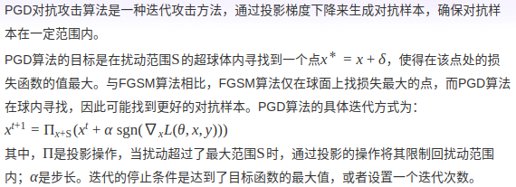

```python
#ref:https://github.com/DengpanFu/RobustAdversarialNetwork/blob/master/pgd_attack.py
def pgd_attack(x, y， epsilon=0.3, k=40, alpha=0.01): # x为原始图， y为真实标签
  	x_adv = x.clone()
    for i in range(k):  # 
        x_adv.requires_grad_()  
        pred = F.cross_entropy(model(x_adv), y)
        pred.backward()
        grad = x_adv.grad.clone()
        # update x_adv
        x_adv = x_adv.detach() + alpha * grad.sign()
        x_adv = torch.min(torch.max(x_adv, x - epsilon), x + epsilon)
        x_adv.clamp_(0, 1)
```

**MI-FGSM**

paper:(CVPR2018)[Boosting Adversarial Attacks with Momentum]()

article: [翻译](https://blog.csdn.net/weixin_43682519/article/details/115862017)

提出了基于动量的迭代算法来增强对抗性攻击。通过在迭代过程中引入动量项，我们的方法可以在迭代过程中稳定更新方向，避免局部极值，从而产生更多可转移的对抗样本。

**JSMA** 

paper:[IEEE2016_The Limitations of Deep Learning in Adversarial Settings](https://arxiv.org/abs/1511.07528)

article:https://zhuanlan.zhihu.com/p/33501618

相较于 FGSM其考虑了输入特征之间的相关性.JSMA 的核心思想是通过分析目标分类器的 Jacobian 矩阵来识别哪些输入特征的修改能够最大化地影响模型的输出，尤其是针对特定类别的输出。

对抗攻击文献中通常使用的方法是限制扰动的 l_∞或 l_2 范数的值以使对抗样本中的扰动无法被人察觉。但 JSMA提出了限制 l_0 范数的方法，即仅改变几个像素的值，而不是扰动整张图像。

l_0范数攻击还有单像素对抗攻击。paper:One Pixel Attack for Fooling Deep Neural Networks, 2019通过进化算法进行搜索。单像素攻击是有目标攻击，其目标是，在只改变单个像素的限制下，最大化分类器输出的目标类别的得分


**CW**

paper:[IEEE2017_Towards Evaluating the Robustness of Neural Networks](https://arxiv.org/abs/1608.04644)

code :https://github.com/carlini/nn_robust_attacks

使用优化算法（如梯度下降）来最小化一个损失函数，该损失函数设计用于平衡两个目标：一是确保对抗性样本被错误分类，二是确保对抗性样本与原始样本尽可能相似。

- 分类损失可以是目标类别置信度的负对数，或者对于非目标类别的置信度减去目标类别的置信度。
- 距离损失通常是 L2 或 L∞ 范数，用来衡量原始样本和对抗性样本之间的差异。

不同范数的对抗样本实验， 有目标攻击和无目标攻击实验。

**AutoAttack**

paper:https://arxiv.org/abs/2003.01690


**对抗攻击相关方向总结**

- 获得扰动的方法
  - 使目标损失函数的值变大。
  - 改变结果的损失函数的最小添置项。
  - 迭代生成范数最小的能使判断错误的扰动。
  - 根据梯度信息生成对抗扰动，适用于不同任务

- 获得最小扰动。
  - 限制扰动的l_2和l_∞范数，只改变几个像素值使得对抗样本中的扰动难以被察觉.
  - 迭代修改单个像素，判断攻击效果，达到仅改变图像的一个像素值使攻击成功

- 使扰动可迁移。
  - 对当前模型有效的扰动对其他的模型也有效，可以用于黑盒攻击。

- 特定类别生成对抗扰动
  - 使图像在添加扰动后被判定为特定的类别而不是随机错误。

**对抗攻击Ref**

- github项目：[A curated list of papers on adversarial machine learning (adversarial examples and defense methods).](https://github.com/tao-bai/attack-and-defense-methods/tree/master)该github项目整理了一系列对抗攻击的相关论文。

- [李宏毅——Adversarial Attack(对抗攻击)  可做理解的入门](https://blog.csdn.net/StarandTiAmo/article/details/126978601)
- [对抗攻击的几种经典算法做了介绍](https://blog.csdn.net/qq_43381493/article/details/130192453)
- [逃逸攻击很全面的讲解](https://blog.csdn.net/weixin_42468475/article/details/111684668)


## 对抗攻击相关论文

部分论文的概要

### (NIPS 2017)Adversarial Patch

paper :https://arxiv.org/abs/1712.09665

demo: https://youtu.be/i1sp4X57TL4

article:https://zhuanlan.zhihu.com/p/410182145

https://zhuanlan.zhihu.com/p/180199081

一种通用补丁的生成办法。针对分类器。

补丁特点： 图像无关，位置无关，可使分类器输出目标类。可以打印用于物理世界攻击也有效。

这种攻击方案利用的是图像分类任务内部的决策方式。虽然一张图像可能有多个item，但是由于图像对应的标签只能有1个，所以模型必须学会检测出图像中最显著的item。而对抗补丁的目的就是通过产生比一般图像原来的item更显著的输入来导致模型根据对抗补丁做出分类结果，从而实现攻击。

loss:
$$
\widehat{p}=\arg \max _{p} \mathbb{E}_{x \sim X, t \sim T, l \sim L}[\log \operatorname{Pr}(\widehat{y} \mid A(p, x, l, t)]\\
\left\|p-p_{\text {orig}}\right\|_{\infty}<\epsilon
$$
最大化目标类别的概率期望，导致分类器误判，Pr是模型预测函数，A是把Patch粘贴到图中的方式，p为Patch的参数，x为原图，l为位置。

计算对于输入的梯度，然后相应地更新对抗输入。只计算补丁区域的梯度。

### (CVPR2018)Robust Physical-World Attacks on Deep Learning Visual Classification

paper：https://openaccess.thecvf.com/content_cvpr_2018/papers/Eykholt_Robust_Physical-World_Attacks_CVPR_2018_paper.pdf

code：https://github.com/evtimovi/robust_physical_perturbations

article：https://zhuanlan.zhihu.com/p/44531740

提出了一种通用攻击算法，即鲁棒物理扰动（RP_2），以在不同的物理条件下生成鲁棒的视觉对抗性扰动。使用道路标志分类的现实案例，我们表明使用 RP2 生成的对抗性示例在各种环境条件（包括视点）下，相对于物理世界中的标准架构道路标志分类器实现了较高的目标错误分类率。通过仅以黑白贴纸形式进行的扰动攻击真实的停车标志。

计算方法为设计损失函数首先保证度量对抗样本和真实样本距离函数的值最小，然后确保分类错误。

计算得到扰动mask，然后根据mask对原图进行贴图，使得分类器预测结果错误。

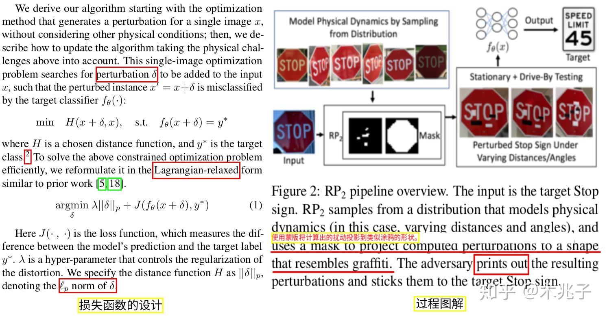


### (ECCV 2018)Is Robustness the Cost of Accuracy? -- A Comprehensive Study on the Robustness of 18 Deep Image Classification Models

paper:https://arxiv.org/abs/1808.01688

code:https://github.com/huanzhang12/Adversarial_Survey

使用多种鲁棒性指标对 18 个 ImageNet 模型进行了彻底的基准测试，包括 306 对模型之间对抗性示例的失真、成功率和可转移性.

分类误差的对数和失真度量存在线性关系。对于模型的鲁棒性，模型的架构相较于模型大小是更为关键的因素。相同的网络架构，增加网络深度能稍微提高ℓ∞失真的鲁棒性。存在表现出高对抗性可转移性的模型（VGG 家族），而大多数由一种模型制作的对抗性示例只能在同一家族内迁移。

### (CVPR2019)Improving Transferability of Adversarial Examples with Input Diversity.

paper:https://arxiv.org/abs/1803.06978

code:https://github.com/cihangxie/DI-2-FGSM

如题目名，通过输入多样性来提高对抗样本的可迁移性。

提出的方法即多样化输入迭代快速梯度符号方法（DI2-FGSM），不是仅使用原始图像来生成对抗性示例，而是**在每次迭代时对输入图像应用随机变换**。生成的对抗性示例比 FGSM 和 I-FGSM 生成的对抗性示例更具可转移性。

### (CVPR2019 Oral)Evading Defenses to Transferable Adversarial Examples by Translation-Invariant Attacks

paper:https://arxiv.org/pdf/1904.02884

code:https://github.com/dongyp13/Translation-Invariant-Attacks

基于平移不变性的可迁移对抗样本攻击。

通过对未转换的图像的梯度与预定义的内核进行卷积来实现。通过优化对图像集合的扰动，使生成的对抗性示例对被攻击的白盒模型不太敏感，并且具有更好的可转移性。

### (CVPR2020 Oral)Benchmarking Adversarial Robustness on Image Classification

paper:https://arxiv.org/abs/1912.11852

code:https://github.com/thu-ml/ares

在本文中，我们建立了一个全面、严格、连贯的基准来评估对抗性鲁棒性，可以提供对现有方法在不同场景下的效果的详细了解，以期为未来的研究提供便利。特别是，我们专注于 ℓp 范数对抗模型下图像分类器的鲁棒性，该模型已经投入了大量工作。我们结合了许多典型和最先进的攻击和防御方法来进行鲁棒性评估，包括 15 种攻击方法和 16 种防御模型——CIFAR-10 [27] 上有 8 个，ImageNet [46] 上有 8 个。为了充分证明这些方法的性能，我们采用两条互补的稳健性曲线作为主要评估指标来呈现结果。然后，我们对完整威胁模型下的攻击和防御方法的交叉评估进行了大规模实验，包括1）非针对性攻击和针对性攻击； 2）ℓ∞和ℓ2攻击； 3）白盒、基于转移、基于分数和基于决策的攻击。

我们开发了一个名为 RealSafe1 的新对抗鲁棒性平台来进行所有评估实验，因为现有平台（例如 CleverHans [39] 和 Foolbox [44]）无法完全支持我们的评估。

### (CVPR2021)LAFEAT : Piercing Through Adversarial Defenses with Latent Features

paper:https://arxiv.org/abs/2104.09284

code:https://github.com/lafeat/lafeat

article:https://zhuanlan.zhihu.com/p/370521833

摘要翻译：深度卷积神经网络容易受到对抗性攻击。通过向输入添加微小的扰动，他们很容易被欺骗而给出不正确的输出。这对让 CNN 能够抵御此类攻击提出了巨大的挑战。为此，人们提出了大量新的防御技术。在本文中，我们表明某些“鲁棒”模型中的潜在特征非常容易受到对抗性攻击。除此之外，我们引入了一种统一的ℓ∞范数白盒攻击算法，该算法在梯度下降步骤中利用潜在特征，即LAFEAT。我们证明，它不仅在计算上对于成功攻击更加有效，而且在各种防御机制上它也是比当前最先进的技术更强大的对手。这表明模型的稳健性可能取决于防御者隐藏组件的有效使用，并且不应再从整体角度来看待它。


### (CVPR2022) Practical Evaluation of Adversarial Robustness via Adaptive Auto Attack

防御模型的白盒对抗攻击第一名

competion:https://tianchi.aliyun.com/competition/entrance/531847

paper:https://arxiv.org/abs/2203.05154

code:https://github.com/liuye6666/adaptive_auto_attack

针对对抗性攻击的防御模型已显着增长，但缺乏实用的评估方法阻碍了进展。评估可以定义为在给定预算迭代次数和测试数据集的情况下寻找防御模型稳健性的下限。实用的评估方法应该是方便的（即无参数）、高效的（即更少的迭代）和可靠的（即接近鲁棒性的下限）。为了实现这一目标，我们提出了一种无参数自适应自动攻击（A3）评估方法，该方法以测试时训练的方式解决效率和可靠性问题。具体来说，通过观察特定防御模型的对抗性示例在起点上遵循一些规律，我们设计了自适应方向初始化策略来加速评估。此外，为了接近预算迭代次数下的鲁棒性下限，我们提出了一种基于在线统计的丢弃策略，该策略自动识别并丢弃难以攻击的图像。大量实验证明了我们 A3 的有效性。特别是，我们将A3应用到近50种广泛使用的防御模型中。通过比现有方法消耗更少的迭代次数，即平均 1/10（加速 10 倍），我们在所有情况下都实现了较低的鲁棒精度。值得注意的是，我们用这种方法在 CVPR 2021 白盒对抗性攻击防御模型竞赛中从 1681 支队伍中获得了第一名。

### (CVPR2022)LAS-AT: Adversarial Training with Learnable Attack Strategy 

paper：https://arxiv.org/abs/2203.06616

code：https://github.com/jiaxiaojunQAQ/LAS-AT

这篇文章是提出一种对抗训练的策略，来训练出能够抵御对抗攻击的模型，得到更鲁棒的模型。

在整个训练阶段使用固定的攻击策略来生成AE会限制模型的鲁棒性，并提出在不同的训练阶段利用不同的攻击策略来提高鲁棒性。

提出“可学习的攻击策略”（LAS-AT）的概念，并提出了一种新的对抗训练框架，该算法框架利用强化学习机制自动生成攻击策略，从而进一步提高模型的鲁棒性。

### (CVPR2023)Feature Separation and Recalibration for Adversarial Robustness

paper：http://arxiv.org/abs/2303.13846v1

code：https://github.com/wkim97/FSR

**根据非鲁邦特征假说**。认为因为一些非鲁邦特征的激活导致了模型的错误预测。通过停止非鲁邦特征的激活，提升模型鲁邦性。提出了一种新颖的，易于插件的方法，称为特征分离和重新校准(FSR)，**它通过分离和重新校准来重新校准恶意的，非鲁棒的激活，以获得更鲁棒的特征映射。**分离部分将输入特征映射分解为具有帮助模型做出正确预测的激活的鲁棒特征和具有在对抗性攻击时导致模型错误预测的激活的非鲁棒特征。然后，重新校准部分调整非鲁棒激活，以恢复模型预测的潜在有用线索。大量的实验验证了FSR与传统失活技术相比的优越性，并表明它在计算开销较小的情况下将现有对抗性训练方法的鲁棒性提高了8.57%。

### (CVPR2024)Transferable Structural Sparse Adversarial Attack Via Exact Group Sparsity Training

[paper](https://openaccess.thecvf.com/content/CVPR2024/papers/Ming_Transferable_Structural_Sparse_Adversarial_Attack_Via_Exact_Group_Sparsity_Training_CVPR_2024_paper.pdf)

code:https://github.com/MisterRpeng/EGS-TSSA

深度神经网络（DNN）很容易受到高度可转移的对抗性攻击。特别是许多研究表明，稀疏攻击因其异常的不可察觉性而对 DNN 构成重大威胁。**当前的稀疏攻击方法大多仅限制扰动的幅度和数量，而通常忽略扰动的位置，导致攻击可转移性的性能下降。**一部分研究表明，具有丰富的分类相关特征的重要区域中存在的扰动更有效。利用这种见解，我们在生成模型框架中**引入结构稀疏约束来限制扰动位置**。为了确保针对分类相关区域生成扰动，我们提出了一种精确的组稀疏性训练方法来学习像素级和组级稀疏性。为了提高稀疏训练的有效性，我们在训练过程中进一步提出了掩蔽量化网络和多阶段优化算法。利用 CNN 作为替代模型，大量实验表明，与近似相同稀疏度水平的最先进方法相比，我们的方法在图像分类攻击中具有更高的可转移性。在跨模型 ViT 对象检测和语义分割攻击任务中我们也取得了更好的攻击成功率。

## 目标检测和目标追踪对抗攻击

对抗样本，对抗补丁攻击。

物理世界的纹理攻击。

针对空中探测器的对抗攻击。

### :eyes:目标追踪 对抗

### (CVPR 2020)Cooling-Shrinking Attack: Blinding the tracker with imperceptible noises (CSA)

paper：https://arxiv.org/abs/2003.09595

code：https://github.com/MasterBin-IIAU/CSA

article：https://cloud.tencent.com/developer/article/1605261

> Cooling 冷却：使得热力图变冷，无法获取重点。
>
> Shrinking 收缩：使得修正量变小，无法正确定位。

提出使SiamRPN++ 跟踪算法性能大幅下降的对抗攻击方法. 

使用的“构建噪声生成器”的思路，每拿来一张图像，只需对我们的噪声生成器前向传播一次，便可将原始图像转化成能够欺骗目标模型的对抗图像。

噪声生成器对原始图进行修改，**针对生成的热力图，以及框的位置修正量进行影响**，并约束噪声幅度让修改几乎肉眼不可见， 最终使得生成图的在跟踪器上的预测准确度下降。

实验对比了攻击前后跟踪器的IOU结果，该攻击方法对其他跟踪器的影响，与其他噪声添加的视觉影响和攻击影响等。

与其他加噪声的方法相比，该方法增加的扰动肉眼不可见但使模型预测准确度下降更多。

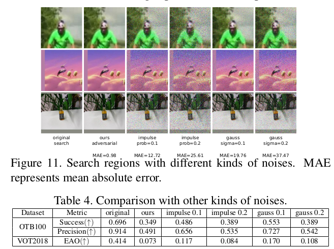

基于SiamRPN++跟踪器生成的扰动生成器，迁移到其他跟踪器上的表现。基于LaSOT数据集测试。

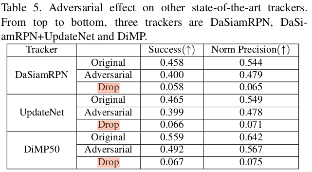

看Drop值，掉点并不高。上面OTB100数据集掉了0.3个多点。

### (ECCV 2020)Efficient Adversarial Attacks for Visual ObjectTracking

paper:https://www.ecva.net/papers/eccv_2020/papers_ECCV/papers/123710035.pdf

针对SiamFC跟踪进行了白盒攻击联合模型进行训练。针对其他跟踪模型进行了黑盒攻击实验。

提出了有目标攻击和任意攻击。提出FAN(fast attack network)，设计了基于Siamese的跟踪器对抗攻击，在OTB数据集上，有目标攻击掉点40%，无目标攻击掉点70%。且FAN网络能够高效快速的训练，3h，且10ms能生成有效对抗样本。

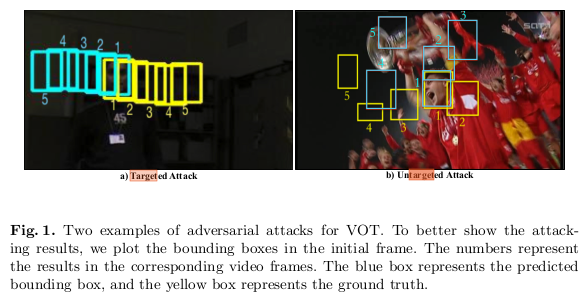

有目标的对抗攻击可以使得追踪器对目标物体的追踪朝着相反的我们想要的方向去移动，而在无目标的对抗攻击中，追踪的边界框会满图片的飞，从而脱离原始的正确的追踪结果。

提出了一个端到端的攻击方法：FAN。作者设计了一个经典的drift loss（漂移损失）来实施无目标攻击，设计了一个embedded feature loss来实施有目标攻击。最后，将两个损失函数结合到一起从而实施整个的攻击任务。

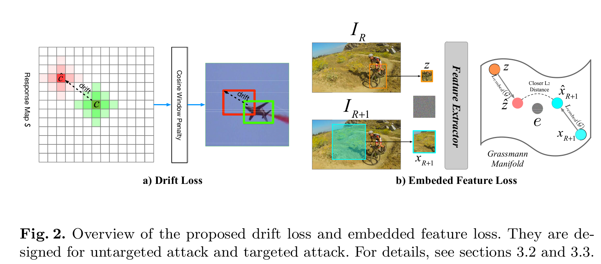

drift loss 由 score loss 和 dist lost 构成，响应图的响应点值为1，否则为-1. loss目标是使响应图的对抗中心远离实际的预测中心。

embedde loss 如果需要做有目标攻击的话，就需要增大响应值的大小。最小化对抗样本和特定追踪区域的特征之间的L2距离。 这里的有目标对抗效果也依赖特定的追踪对象的选取。如果视频里追踪对象和背景差异较大，有目标攻击容易失败，因为难以通过微小的扰动使背景被检测成追踪对象。

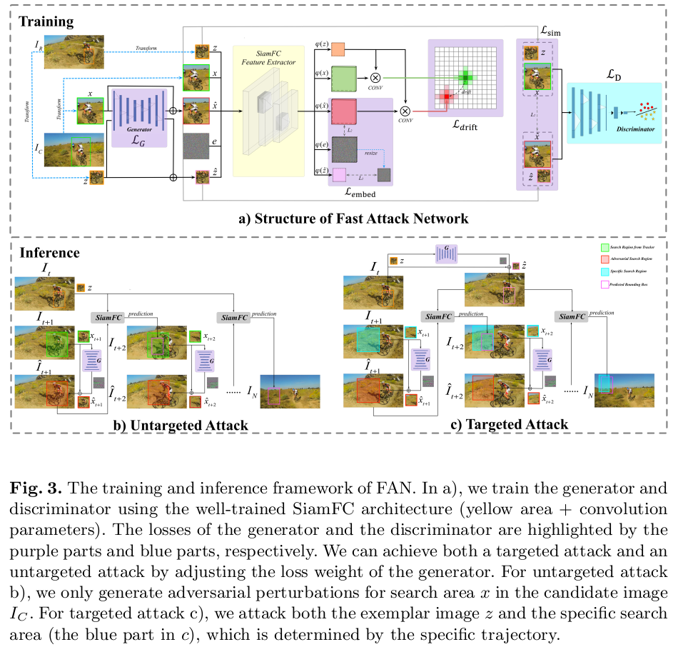

在 ILSVRC 2015 数据集的训练集上训练生成器和鉴别器。参考SiamFC的训练策略。训练完成后，生成器在四个具有挑战性的视觉对象跟踪数据集（无需参数调整）上进行了测试：OTB2013 、OTB2015、VOT2014 和 VOT2018 [。具体来说，使用基于Alexnet的SiamFC作为白盒攻击模型。 SiamRPN [20]、SiamRPN+CIR 和SiamRPN++ 作为黑盒攻击模型。

实验很详细实验图很直观我都想贴但是我不贴了。

### (ECCV2020) Robust Tracking against Adversarial Attacks(RTAA)

paper:https://arxiv.org/pdf/2007.09919

code:https://github.com/VISION-SJTU/RTAA

针对DaSiamRPN and RT-MDnet.两种跟踪器。

提出了一种对抗攻击方法，生成对抗攻击样本时考虑时间扰动，能有效降低跟踪性能。此外提出对抗防御方法来估计输入序列的扰动，消除对抗攻击的影响。

设定伪装的类别标签和回归标签，使分类的loss和回归的loss在正确标注以及伪装标注上表现一致。伪装标签通过随机偏移量得到。

对于连续视频帧，当前帧的扰动基于上一帧计算得到，当前帧的第一次迭代的扰动量为上一帧最后一次迭代和第一次迭代的扰动差值。

### (CVPR2020)One-shot Adversarial Attacks on Visual Tracking with Dual Attention

paper:https://openaccess.thecvf.com/content_CVPR_2020/html/Chen_One-Shot_Adversarial_Attacks_on_Visual_Tracking_With_Dual_Attention_CVPR_2020_paper.html

article:https://zhuanlan.zhihu.com/p/410270045

全局像素扰动。白盒攻击。针对基于Siamese 网络的跟踪器。使跟踪器给出错误预测，并不指定错误预测类别。

**所谓one-shot就是值在每个视频的第一帧进行攻击就影响接下来的跟踪结果。只对视频第一帧添加干扰，就对接下来的序列帧的跟踪失败。**

攻击策略：

已知第一帧和该帧跟踪目标的gt 框，生成攻击图像，该图像只有微小像素扰动人眼不可察觉。

1.高置信度抑制loss：

因为只攻击第1帧，会在第1帧模拟 后面的跟踪过程。其假定可能的跟踪器可能的搜索在目标对象框的2倍区域大小附近。然后针对这些区域生成候选对象，使用这些对象的置信度设计损失，期望排名靠前的置信度和排名靠后的置信度差异尽可能的小，这样抑制高置信度的候选对象的产生（这种对象会导致正确预测）。

2.增大特征差异loss：

使得扰动后的图像和原始图像在经过CNN的 特征提取后特征差异尽可能的大。从特征空间对所有候选框进行扰动。

3.针对上面的两个loss增加注意力机制。置信度注意力，区分对不同置信度的候选者的抑制和激励度。通道特征注意力，区别不同通道的影响，提升one-shot的攻击力。

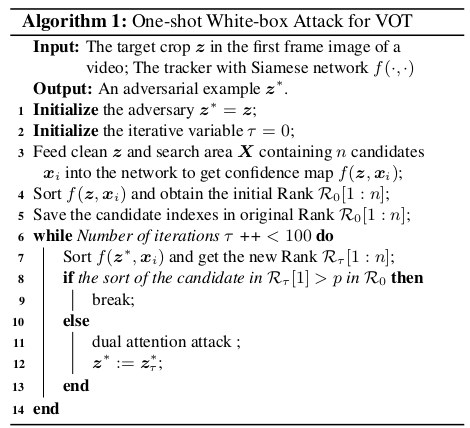

实验发现，对于该对抗攻击， 跟踪的对象变化越大攻击效果越好，特征网络层较深的跟踪器对抗攻击的鲁棒性较好。


### (ICLR 2020)Fooling Detection Alone is Not Enough: Adversarial Attack against Multiple Object Tracking

paper：https://arxiv.org/abs/1905.11026

code:https://github.com/anonymousjack/hijacking

article：[翻译](https://zhuanlan.zhihu.com/p/347573701）), https://blog.csdn.net/qq_38391210/article/details/104772110

对抗多目标跟踪，如果简单擦除检测到的Box框，需要成功干扰很多帧才能使跟踪失败， 该论文针对多目标跟踪器的特点，产生对抗样本产生特定的对抗box框，误导跟踪轨迹，只用少量帧就能成功攻击跟踪器。

**当前多目标跟踪器的特点：**

常见的多目标跟踪器通常先使用检测器对视频帧进行检测，然后再使用跟踪器关联得到对象轨迹。检测到的对象与现有跟踪器之间的关联被公式化为基于跟踪器和检测到的对象之间的成对相似性成本的二分匹配问题，最常用的相似性度量是基于空间的成本，测量边界框或 bbox 之间的重叠。为了减少这种关联中的误差，卡尔曼滤波器预测中需要精确的速度估计 。由于相机帧的离散性，卡尔曼滤波器利用速度模型来估计下一帧中被跟踪物体的位置，以补偿帧之间的物体运动。这种为减少错误设计的速度估计使得跟踪劫持成为可能。MOT 根据两个阈值来管理跟踪器的创建和删除。具体来说，**只有当目标被持续检测到一定数量的帧时才会创建一个新的跟踪器，这个阈值将被称为命中计数 H，这有助于过滤掉物体检测器偶尔产生的误报。**另一方面，**如果在 R 帧的持续时间内（保留期）没有对象关联，则跟踪器将被删除。它可以防止由于对象检测器偶尔出现误报而导致轨迹被意外删除。** R和H的配置通常取决于检测模型的精度和帧速率（fps）。先前的工作建议配置 R = 2·fps，H = 0.2·fps，对于常见的 30 fps 视觉感知系统，那么 R = 60 和 H = 6。盲目瞄准对象检测的攻击需要不断愚弄至少 60 帧 (R) 才能擦除对象，而我们提出的跟踪器劫持攻击可以制造持续 R 帧的对象并在 H 帧内消失目标对象攻击少至一帧，平均只有2~3帧。

**攻击方法描述：**

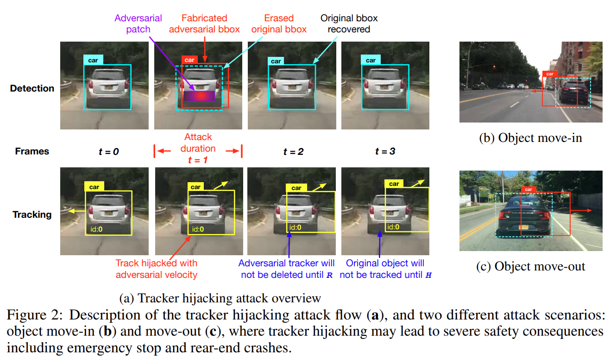

如图所示，目标汽车最初以 t0 时向左的预测速度进行跟踪。攻击从时间 t1 开始，在汽车后部应用生成的对抗性补丁，该补丁通过两个对抗目标来欺骗对象检测器：（1）从检测结果中删除目标对象的边界框，以及（2）制造一个形状相似的边界框，该边界框稍微向攻击者指定的方向移动了。伪造的边界框（t1时检测结果中的红色框）将与跟踪结果中目标对象的原始跟踪器相关联，我们将其称为跟踪器劫持，从而给出朝向攻击者期望方向的假速度到跟踪器。图 2a 中所示的跟踪器劫持仅持续一帧，但其对抗效果可能持续数十帧，具体取决于 MOT 参数 R 和 H。例如，在攻击后的时间 t2，所有检测边界框都恢复正常，但是，两个对抗效应仍然存在：（1）以攻击者诱导的速度劫持的跟踪器将不会被删除，直到保留期（R )已经过去，并且(2)目标物体虽然在检测结果中被恢复，但直到达到命中计数(H)才会被跟踪，并且在此之前该物体在跟踪结果中仍然丢失。然而，在实践中我们的攻击可能并不总是在一帧内成功，因为如果跟踪器在较短的攻击持续时间内没有偏离对象的真实位置足够远，则恢复的对象可能仍然与其原始跟踪器相关联。我们的实证结果表明，当使用对抗样本成功攻击 3 个连续帧时，我们的攻击通常会达到近 100% 的成功率。这种持续的对抗性影响可能会在自动驾驶场景中造成严重的安全后果。

**具体方法描述：**

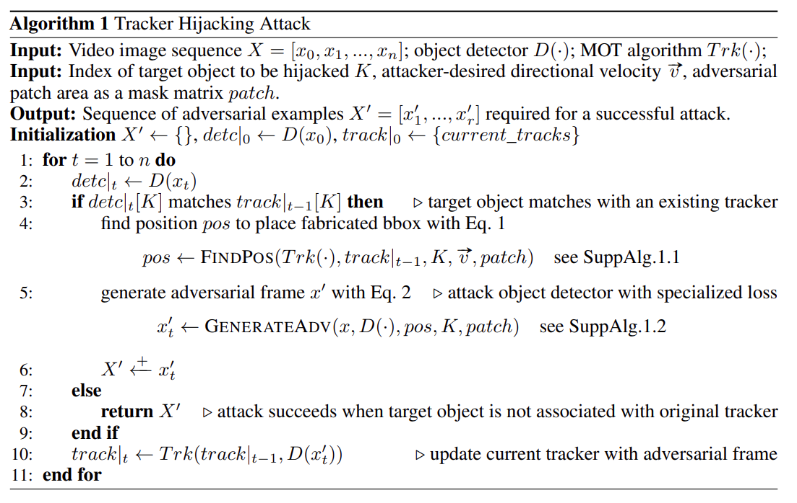

现在描述生成对抗性补丁的方法，该补丁可以操纵检测结果来劫持跟踪器。如上图：给定目标视频图像序列，攻击迭代地找到成功跟踪劫持所需干扰的最小帧，并为这些帧生成对抗性补丁。

输入： 视频序列，检测器，跟踪器

输入：攻击目标对象的索引K,期望的攻击方向向量 v, 对抗补丁patch

输出：攻击成功所需要的对抗样本序列。

在每次攻击迭代中，处理原始视频剪辑中的图像帧，并给定目标对象的索引 K，如果当前检测结果与跟踪器中的目标对象匹配：

首先，算法找到放置对抗边界框 pos 的最佳位置，以便通过求解方程来劫持目标对象的跟踪器。 

然后，对检测器使用特别设计的损失来训练生成对抗帧x‘。该损失函数目标为使得对抗样本能在指定位置生成检测框。

最后，用对抗结果更新跟踪器，使跟踪器偏离其原始方向。

如果下一帧的目标物体没有通过MOT算法与其原始跟踪器关联，则攻击成功；否则，下一帧将重复此过程。

**生成对抗补丁的损失函数**

包含两个损失项：

L1最小化给定位置的目标类概率以擦除目标边界框，

L2 控制在给定中心位置和给定形状处制造对抗性边界框以劫持跟踪器。

评估：

我们将**成功的攻击定义**为当攻击停止时，检测到的目标对象的边界框不再与任何现有的跟踪器关联。我们使用目标检测上的 对抗样本成功所需的最小帧数来衡量轨道劫持攻击的有效性。攻击有效性很大程度上取决于原始跟踪器的方向向量与对手目标之间的差异。例如，如果选择对抗方向与其原始方向相反，攻击者只需一帧就可以导致跟踪器发生较大的偏移，而如果对抗方向恰好是，则攻击者将很难使跟踪器偏离其既定轨道。与目标原来的方向相同。为了控制该变量，我们测量了在之前定义的两个攻击场景中攻击所需的帧数：目标对象移入和移出。具体来说，在所有的移入场景中，我们选择停在路边的车辆作为目标，攻击目标是将跟踪器移动到中心，而在所有的移出场景中，我们选择正在前进的车辆，并且攻击目标是将目标跟踪器移离道路。

**与盲目针对对象检测的攻击进行比较**。我们重现了 Jia 等人最近针对对象检测的对抗性补丁攻击。([这篇](https://infocondb.org/con/black-hat/black-hat-europe-2018/perception-deception-physical-adversarial-attack-challenges-and-tactics-for-dnn-based-object-detection)， [pdf方法描述](https://jiayunhan.github.io/material/perception_bheu18.pdf)。 大概是对一个patch做各种变换，包括位置角度，颜色，仿印刷，方差调节等操作，贴图上去进行所谓的物理扰动，使得yolov3 错检)。2018 年，它针对自动驾驶环境，并使用现实世界的汽车测试验证了攻击的有效性。在此攻击中，目标是从每帧的检测结果中删除目标类别。在两种（R，H）设置下进行评估，我们发现跟踪器劫持攻击即使攻击少至3帧也能达到较高的攻击成功率（100％），而检测攻击需要可靠地愚弄至少R个连续帧才能保证成功。当根据 30 fps 的帧速率将 R 设置为 60 时，检测攻击需要有一个对抗性补丁，该补丁可以在受害者自动驾驶车辆行驶时持续成功至少 60 帧。它意味着超过 98.3% ( 59 60 ) 的 AE 成功率，这是以前的工作中从未达到甚至接近的[35,9,6,15]。请注意，在 R 之前，检测攻击仍然可以有高达约 25% 的成功率。这是因为检测攻击会导致物体在某些帧内消失，并且当车辆航向在该消失期间发生变化时，仍然有可能导致原始对象在恢复时与原始跟踪器中的跟踪器预测不一致。然而，由于我们的攻击旨在故意误导 MOT 中的跟踪器预测，因此我们的成功率要高得多（3-4 倍），并且只需攻击 3 帧即可达到 100%。

### (ICASSP 2020)HIJACKING TRACKER: A POWERFUL ADVERSARIAL ATTACK ON VISUAL TRACKING

paper：https://ieeexplore.ieee.org/document/9053574

针对单目标追踪进行对抗攻击。已知模型参数的白盒攻击。对视频的一系列帧添加扰动，直到满足停止条件。

抑制高置信度的候选框，并对候选框进行定位d方向上的扰动和shape s方向上的扰动。

- location loss 使得 满足d方向上的top5和实际置信度最高的top5的候选框的置信度差值尽可能的小，即期望d方向的候选框称为top5置信度框。
- shape loss:使得 满足s方向上的top5和实际置信度最高的top5的候选框的置信度差值尽可能的小，即期望s方向的候选框称为top5置信度框。

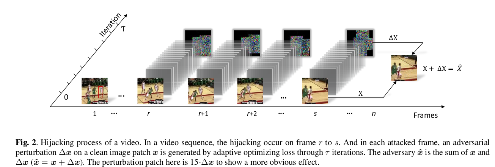


每次扰动是针对视频的连续多帧。每次生成扰动需要n次迭代，然后叠加到原图。

实验选取了SiamRPN, SiamRPN++ RT-MDNet作为攻击的跟踪器对象。

每个受攻击帧中的迭代次数 τ 统一设置为 20，允许的最大像素扰动 ε 为 16。

对于RT-MDNet跟踪器，最小攻击帧数为20帧，可以攻击成功。对于其他跟踪器需要更多帧的干扰才能成功。

大部分视频在100帧内能完成攻击。

这里的定位扰动向量d 和形状 扰动向量s是怎么设置的，没有看到。


### (ECCV 2020)SPARK: Spatial-aware Online Incremental Attack Against Visual Tracking

paper:https://arxiv.org/abs/1910.08681

code:https://github.com/tsingqguo/AttackTracker

白盒、 对抗样本攻击

分析了一些基本对抗方法如FGSM、BIM和C&W的攻击性能。并提出SPARK对抗方法产生不易察觉的对抗攻击扰动。作为一种基于优化的方法，SPARK通过考虑历史增量扰动，在多次迭代内快速收敛到非常小的损失，使其比基本攻击更加高效，能够有效误导跟踪器（SiamRPN++）沿着不正确的（无目标攻击，UA）或指定的轨迹（有针对性的攻击，TA）。

效果：

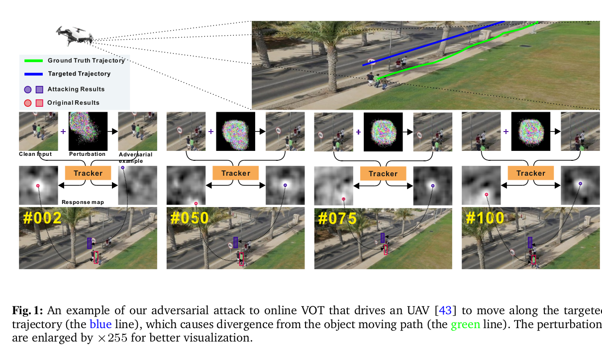

- 对每一帧使用基本对抗攻击方法效果如何？

方法：攻击每一帧（BA-E）

效果：相较于FGSM,BIM和C&W攻击成功率更高，FGSM攻击效率更高更实时。

- 视频时间帧的影响如何？

方法：随机选择帧进行攻击。对于两个选定帧之间的帧，使用第一个选定帧的扰动进行攻击，并查看基本攻击是否可以跨时间转移。(BA-R1：每帧0.1的攻击几率。BA-R2:每隔10帧进行一次攻击)

效果：相较于攻击每一帧，速度快了十倍。但是BA-R1攻击成功率下降严重，BA-R2成功率高于BA-R1。由于视频中的动态场景，BA 生成的扰动很难直接转移到下一帧（参见 BA-R1 和 BA-R2 的结果）

- 提出空间感知的在线增量攻击（SPARK）。

  对每一帧进行攻击，但是在新帧上应用先前的扰动以及一个小却有效的增量扰动。特点：1.增量扰动沿着空间和时间逐渐变得稀疏。2.可以很快迭代到收敛，平均只需2.2.5次迭代可达到78.9%的成功率。

**无目标攻击：**

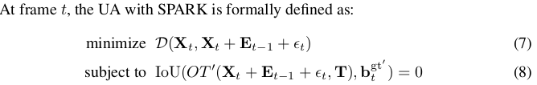

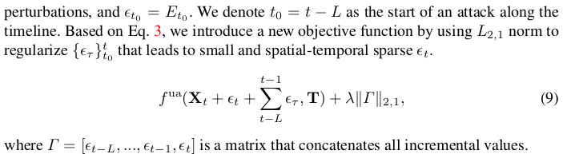

**有目标攻击：**

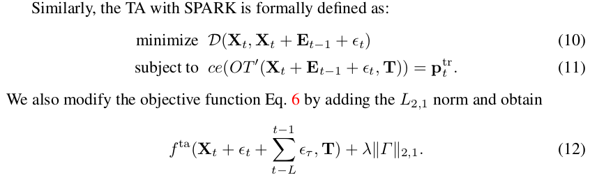

$ce(.)$为boundingbox的中心位置， $p_t^{tr}$为t时刻目标轨迹的位置。

当前提出方法和几种方法的对比

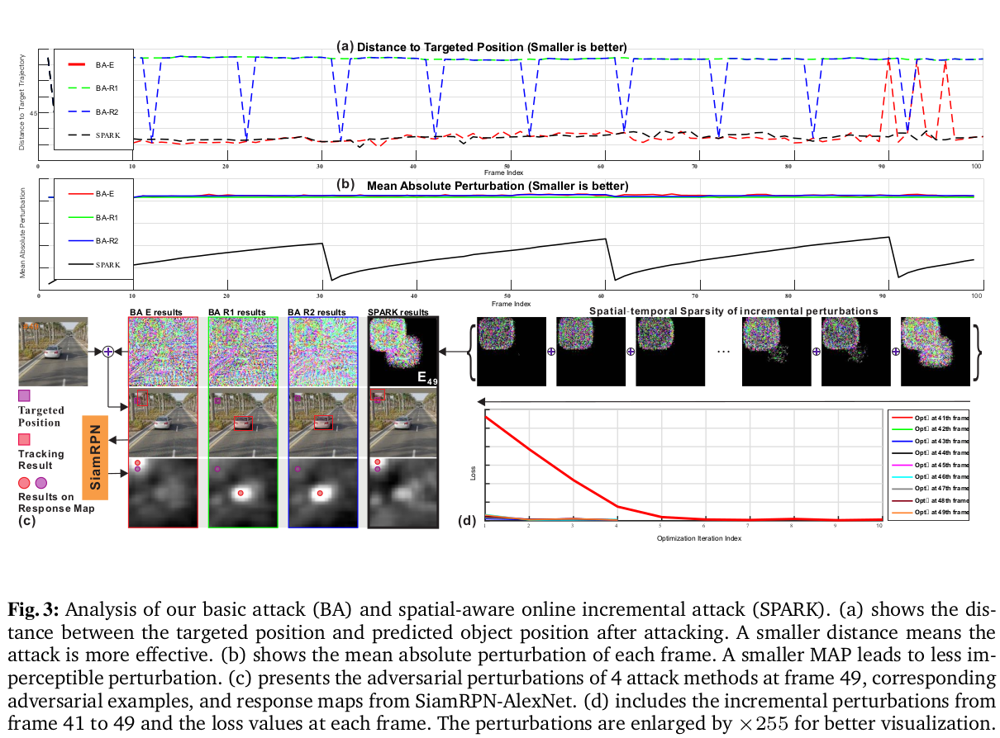

a，为当前方法攻击后预测框和目标框的距离。b，为每帧的平均扰动量。c,为第49帧时不同方法的扰动以及添加扰动后跟踪器中的map响应图,并给出了随着时间序列表现的空间稀疏性。d,给出了不同帧处loss下降需要的迭代次数变化。

​	无目标的约束是期望扰动图的预测框和原始预测的框ioU为0，有目标约束是期望扰动图的预测框为目标轨迹框。（对于有目标攻击，目标轨迹 是通过将  随机偏移值添加到前一帧的目标位置来构造的，偏移值范围为1-10，这样生成的轨迹形状不规则比手动轨迹更具挑战性）


### (CVPR2021) IoU Attack: Towards Temporally Coherent Black-Box Adversarial Attack for Visual Object Tracking

paper:https://arxiv.org/pdf/2103.14938v1

code:https://github.com/VISION-SJTU/IoUattack

黑盒、 对抗样本攻击

提出了针对视觉对象跟踪的基于决策的黑盒攻击方法。提出了 IoU 攻击，它根据当前帧和历史帧的预测 IoU 分数顺序生成扰动。通过降低 IoU 分数相应地降低了时间相干边界框（即对象运动）的准确性。此外，我们将学习到的扰动转移到接下来的几帧以初始化时间运动攻击。在最先进的深度跟踪器（即基于检测、基于相关滤波器和长期跟踪器）上验证了所提出的 IoU 攻击。

效果：

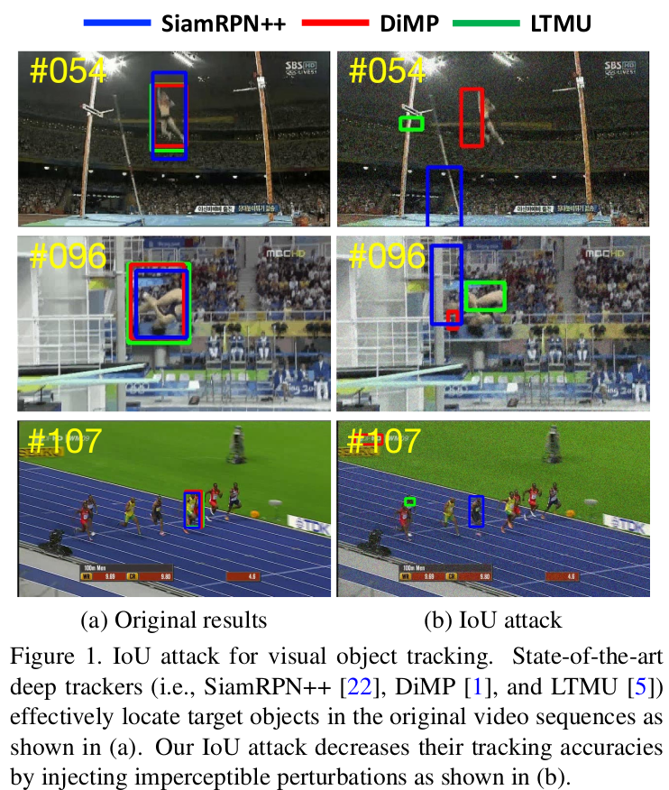

主要方法降低IoU分数，IoU分数同时考虑空间IoU分数和时间序列上的IoU分数。

定义一个跟踪器的原始性能是它在每一帧上预测一个 bbx，而不添加噪声。通过添加重噪声扰动，预测得到另一个 bbx，这个bbox和原始预测的bbox的IoU分数会很低。同时，我们使用当前帧的 bbx 和前一帧的 bbx 来计算时间相干的 IoU 分数，然后将其与空间 IoU 分数融合。

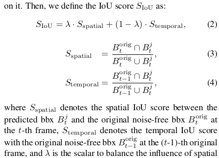

有了IoU分数定义，接下来旨在识别一个特定的噪声扰动，从而在相同数量的噪声水平中导致 IoU 得分最低。

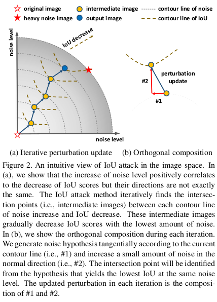

IoU攻击方法迭代地找到噪声增加和IoU减少的每条轮廓线之间的交点（即中间图像）。这些中间图像以最低的噪声量逐渐降低 IoU 分数。在（b）中，我们显示了每次迭代期间的正交组合。我们根据当前轮廓线切向生成噪声假设（即#1），并在法线方向上增加少量噪声（即#2）。交点将根据在相同噪声水平下产生最低 IoU 的假设来确定。每次迭代中更新的扰动是#1和#2的组合。啥意思。

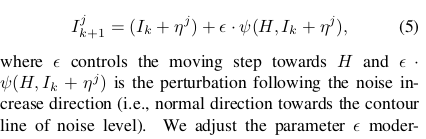


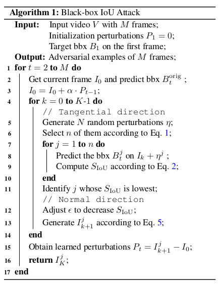

黑盒攻击，对每帧添加对抗扰动。

初始扰动为0，得到第一帧的目标bbox。对第n帧，得到当前帧的原始预测bbox。将上一帧的扰动添加到当前帧。然后开始迭代，每次生成N种随机扰动。计算生成扰动图和原始图的pixel-wise距离，选取前n个扰动，对于这n种添加扰动的图生成bbox，并计算$S_{IoU}$得分，得到得分最低的扰动。$\epsilon$控制朝向重噪声的移动步长，调整它限制扰动的变化。 调节$\epsilon$使IoU分数下降？（怎么调节） ，根据切向法向公式计算生成下一次迭代的中间图。不断迭代，直至 IoU 分数低于预定义的阈值或扰动超过最大值。

。。。


### (ICCV 2021)Learning to Adversarially Blur Visual Object Tracking

paper:https://arxiv.org/pdf/2107.12085

code:https://github.com/tsingqguo/ABA

由于曝光期间物体或相机的移动引起的运动模糊对于视觉跟踪器来说是很大的挑战。这里探索跟踪器对运动模糊的鲁棒性。根据运动模糊的生成原理，考虑运动信息和光累积过程，设计用于视觉跟踪的运动模糊合成方法。提出了基于优化的对抗模糊攻击方法(OP-ABA),OP-ABA 能够产生自然的对抗性示例，能导致先进跟踪器的准确度显著下降。

### (2021)TraSw: Tracklet-Switch Adversarial Attacks against Multi-Object Tracking

code:https://github.com/JHL-HUST/TraSA

针对行人多目标跟踪器的对抗性攻击的工作。通过很少的干扰使得行人跟踪器（FairMOT 和 ByteTrack）无法跟踪后续帧的目标。TraSw 平均仅攻击 4 帧即可实现超过 95% 的极高攻击成功率。

提出了一种针对行人跟踪器的称为 Tracklet-Switch (TraSw) 对抗攻击的新方法，其目的是切换视频帧中两个相交轨迹的轨迹。

针对重识别和检测分支分别设计了loss。


看demo效果是使跟踪错误，比如两个人的检测框有交集将他们的检测框对调使得跟踪错误。

### (2022)Ad2Attack: Adaptive Adversarial Attack on Real-Time UAV Tracking

paper:https://arxiv.org/pdf/2203.01516v1

code:https://github.com/vision4robotics/ad2attack

针对无人机实时跟踪器的对抗攻击。引入了关键点检测头。

### (ICCV 2023)F&F Attack: Adversarial Attack against Multiple Object Trackers by Inducing False Negatives and False Positives

paper:[pdf](https://openaccess.thecvf.com/content/ICCV2023/papers/Zhou_FF_Attack_Adversarial_Attack_against_Multiple_Object_Trackers_by_Inducing_ICCV_2023_paper.pdf)

code+demo:https://infzhou.github.io/FnFAttack/index.html

提出了一种新颖的假阴性和假阳性攻击（F＆F攻击）机制：它扰乱输入图像以擦除原始检测并在原始检测周围注入欺骗性误报，同时隐式集成关联攻击。该机制只需在几帧中欺骗检测器，就可以针对多目标跟踪器产生有效的身份转换。为了演示该机制的灵活性，我们将其部署到三个多目标跟踪器（ByteTrack、SORT 和 CenterTrack），这些跟踪器基于检测器（YOLOX 和 CenterNet）。

在仅攻击1-2帧后使跟踪器对大多数目标的跟踪身份产生混乱，使得跟踪框和对应id产生混乱和错误。

3.1攻击步骤

1.首先将干净图像输入检测器进行推理得到所有检测结果。

2.然后得到目标对抗检测结果，通过擦除原始检测并注入错误的检测框。

3.最后通过PGD的对抗生成方法来最小化$L_{tgt}$损失函数。

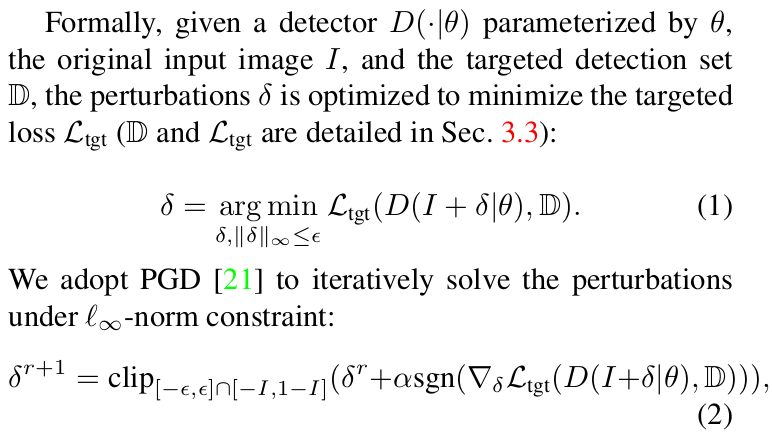

这个对抗样本产生过程不会经过检测器之外的关联器.

从攻击步骤看，也就是得到目标对抗检测结果了就可以通过训练来生成能产生该对抗结果的对抗干扰。那么，如何得到目标对抗检测结果？

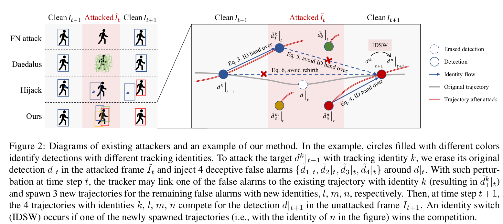

从上图可以看到，左边，F&F是围绕着目标框产生了多个不同的检测框来干扰输出。右边，其设计了4个公式约束，来得到目标对抗检测结果，使得前一帧的检测结果通过下一帧的干扰后无法传播到下下帧。这里消除了原始跟踪框并注入了四个错误干扰框，使得跟踪器可能与其中的一个干扰框相关联并错误的标记为目标id。

我们期望设计的约束达到如下目标：

1.将对抗扰动注入第t帧图像，使得正确的id无法从t-1帧传播到t+1帧。

2.在被攻击的第t帧，正确的检测对象会被擦除，保证t-1帧的id被错误的误报框继承。

这四个约束如下：

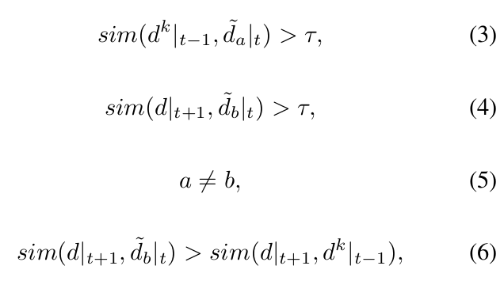

其中，sim()表示跟踪器的相似度度量比如IOU，τ表示跟踪器内部的先验相似度阈值，高于该阈值则接受关联。

id从t-1帧传播到t帧有两条路径，一个是直接传递，一个是间接传递。为达到目标1，这里设计了(3)(5)来避免id的间接传递，设计了(6)来避免直接传递。 

设计了(4)来保证t+1出的id继承于错误的对抗框id。

3.3 目标误报框的设计

3.3.1提出了目标规模感知转换策略。

F&F 攻击的设计有两个冲突需要解决：

1.关联模块和检测器模块对于框重叠的偏好存在冲突。关联模块倾向于更大的重叠（更高的相似性），但重叠更大的框会被 NMS 消除。

2.F&F攻击需要在置信度预测图上进行密集的孤立响应（以消除原始检测并在原始检测附近注入误报），这与网络预测的空间平滑性相冲突（网络预测的空间平滑性是啥？）

具体来说，我们通过用 γ（例如 γ = 4）移动误报替换每个原始检测来设置目标检测 D，以便（1）不影响置信度预测图的平滑变化。（2）使误报框和原始检测框直接的重叠具有欺骗性，不会被NMS过滤掉也不会被关联器拒绝。

设计每个误报框 在y个方向上从原始检测框上进行偏移(kw,ky)。其中 κ 控制偏移误报之间的重叠，w 和 h 分别是原始检测的宽度和高度。此外为了进一步减小误报框之间的重叠进一步误导关联模块，这个误报框的宽高都被相对缩放到sh,sw, s为超参数.

3.3.2

攻击ByteTrack使用的目标损失：

$L_{tgt}^{YOLOX} = L_{obj} + \lambda L_{L1}$

损失直接继承的YOLOX的分类损失和回归损失。

在计算loss之前，一个检测器通常需要一种策略为每个gt分配对应锚框。最初，yolox在训练中采用了一个动态k分配策略，出于这样的动机，有着不同的尺寸和遮挡状态的目标其对应的正锚框数量应该不一样。然而，在最小化目标攻击loss L_tgt时使用这样的带有偏差的分配机制 会导致在目标上出现不平衡的攻击表现，限制了正锚框被分配到每个目标的个数。 我们通过将k设置为一个合理的值去解决这两种限制。在使用对SORT和ByteTrack进行F&F攻击时，使用了相同配置因为两个使用了相同的检测器。

为例展示F&F攻击的灵活性，我们使用其攻击了CenterTrack，该攻击针对一个代表性的检测器CenterNet.

给定目标检测集D,我们跟着渲染了一个中心热力图。与攻击 ByteTrack 类似。这个用于攻击CenterTrack的目标损失被设计为：

$L_{tgt}^{CenterTrack} = L_p + \lambda_s L_s$

L_p修正热力图估计，L_s修正回归框。两者继承自CenterTrack的训练 loss。考虑到检测器经常共享相同的组件，F&F攻击能通过最小的修改用于去攻击更多的检测器系列.

也就是训练得到对抗时的损失还是按照原始检测器的损失，只是最后的目标框也就是gt变了，然后更新的参数是输入的扰动。

4攻击评估

4.1评估方法

评估指标

我们通过从每个结果中提取未受攻击帧的部分来组装新序列以评估MOT指标，包括CLEAR [2]、IDF1 [25] ，和 HOTA [18]

其次，为了提供攻击性能的直接视图，我们计算了攻击后立即身份切换 IDSW_im 的比率。考虑到卡尔曼滤波器可能需要几个时间步来跟上快速变化的观测（检测），我们在计算 IDSW im 之前留下一个额外的干净帧等待卡尔曼滤波器（否则，某些目标可能会被视为漏检，而不是经历身份转换）。

数据集

使用的行人跟踪数据集MOT17  （多视角多尺寸）和 MOT20（高密度严重遮挡）。每个训练集分为两部分，一部分训练模型一部分用于攻击验证。每个数据集切分成好多片段，对于每个片段，出于实际情况考虑，从第 5 帧开始（而不是从起始帧开始）攻击。

实现细节

针对三种多目标检测器进行了评估包括：CenterTrack，Byte-
Track，SORT。

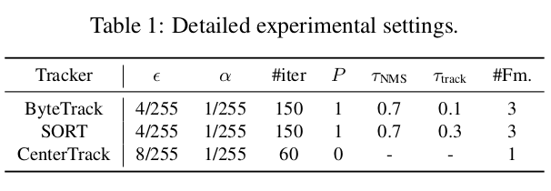

表1提供了详细的实验设置，其中#iter是迭代次数，P是试用期，τ NMS是NMS阈值，τ track是IoU阈值，低于该阈值关联将被拒绝，#Fm.是被攻击的帧数。CenterTrack 和 ByteTrack采用的官方实现及跟踪设置。对于 SORT，采用 ByteTrack 的实现使用YOLOX 检测器。我们在攻击 CenterTrack 时设置了更大的 ϵ，因为它堆叠了两个帧作为输入，但我们只向单个帧添加扰动。此外，我们发现使用标准 NMS 操作的跟踪器会从更多迭代中稍微受益。攻击ByteTrack和SORT时，我们默认设置#iter=150、γ=4、κ=0.2、s=0.8。我们讨论了消融研究中更好的有效性和更少的迭代。更多实施细节可以在补充中找到.

4.2与其他攻击器的对比

假阴性攻击：经常用于单目标跟踪，主要目标是使模型无法检测到目标。

Daedalus攻击： 一个检测攻击器，通过提高置信度预测并压缩框的预测大小来引发密集的误报；

Hijacking:一个多目标跟踪攻击方法，欺骗跟踪器中的卡尔曼滤波器。

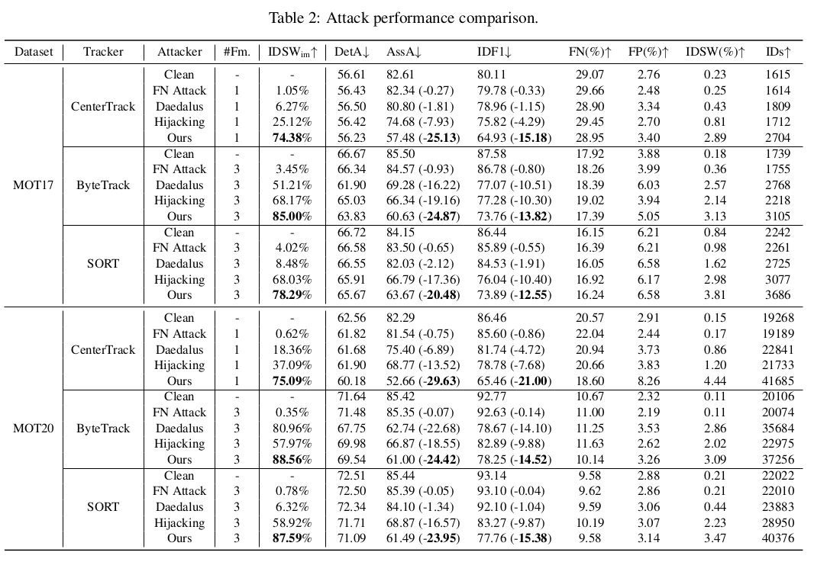

1.攻击器的有效性：

从较高的攻击成功率 IDSW im 以及包括 AssA、IDF1 和 IDSW 在内的关联指标的较大下降来看，我们的方法显着且始终优于基线攻击者。可能会注意到，检测指标（例如 DetA、FN 和 FP）的下降并不那么显着。这是由于在评估过程中排除了受攻击的帧

2.优于假阴性攻击和Daedalus：

假阴性攻击（用“FN 攻击”表示）的效果很差，因为多目标跟踪器旨在抵御偶尔的漏检。 Daedalus（误报攻击）显示了在 MOT20 数据集上攻击 ByteTrack 的有效性，其中大多数目标都是中等规模。然而，当应用于包含各种对象大小的 MOT17 数据集时，其有效性显着下降。这验证了 Daedalus 对目标尺寸的敏感性。相比之下，我们的方法的一致且更好的性能表明代达罗斯的弱点在我们的设计中得到了克服。另一个观察结果是，SORT 对 Daedalus 表现出鲁棒性，主要是因为它默认采用更高的关联阈值（τ track = 0.3）。这个较高的阈值拒绝了轨迹与 Daedalus 生成的小规模误报之间的关联。

3.优于Hijacking：

与 MOT17 数据集相比，Hijacking攻击在 MOT20 数据集上的表现更差，而我们的方法在性能上表现出相反的趋势。考虑到 MOT20 数据集中较高的目标密度，这凸显了我们一对多设计的优势。我们在补充中提供进一步的可视化分析。由于劫持攻击是专门为攻击卡尔曼滤波器而设计的，因此当卡尔曼滤波器不存在时（在 CenterTrack 中），我们的方法明显优于劫持攻击，验证了我们方法的高度灵活性。

4.不同NMS机制的影响：

CenterTrack 在置信度热图上采用 3 × 3 最大池化操作作为经典 NMS 操作的替代，从而使事实上的检测集 D̂（通过转发具有扰动图像的模型获得）是可控的。当 γ = 4 时，我们为 CenterTrack 中的每个原始检测注入 4 个误报，导致 IDSW im 的预期值为 75%，这接近表 2 中的实验结果。相反，当攻击启用 YOLOX 时跟踪器中，由于经典 NMS 操作的可控性较低，观察到实际检测 D̂ 与 D 不同。受益于我们对标签分配策略的修改，这种低可控性产生了比预期更高的攻击性能（即，在攻击 ByteTrack 和 SORT 时，IDSW im > 75%）。

4.3消融实验

1.不同目标尺寸上的表现

2.攻击帧数的影响

3.卡尔曼滤波中的测量协方差设置影响

4.不同的参数设置对攻击性能的影响

5.不同攻击迭代次数下的攻击成功率

4.4讨论

1.限制

由于单独欺骗检测器的自然限制，在攻击某些基于重新识别的跟踪器时，有效性可能会降低。主要挑战在于跟踪器内部外观嵌入的平滑更新，这导致违反方程等5， 6.我们通过部署 F&F 攻击来攻击 FairMOT [34]，在补充中详细阐述了这一限制，其中我们还提供了增强 F&F 攻击的建议。 F&F 的另一个限制是当前版本仍处于数字领域。我们将物理世界中的实现留作未来的工作。

2.防御

基于上述限制，加强状态估计（例如速度、外观）中的平滑度约束会降低F&F的有效性，但也可能影响干净跟踪性能。检查检测数量的突然变化可能是另一种可行的方法。此外，表6总结了F&F在一些常见防御算法下的有效性，其中我们部署F&F在MOT17数据集上攻击ByteTrack，并设置κ=0.3、s=0.4、#iter=30和ℓ ∞ =4/默认为 255。

研究发现，F&F 对于颜色抖动 CJ（其中每个颜色通道的抖动在 ±50/255 范围内独立采样）和次要高斯噪声 GN (σ=2/255) 具有鲁棒性。如果通过常用的 EoT [1] 技术促进，F&F 对局部空间平滑 SS（例如 3x3 平均平滑）变得鲁棒。最后，如果允许更大的边界和更大的迭代次数（例如，ℓ ∞ = 64/255，#iter = 80），F&F 对对抗性训练的 AT [5] 模型保持有效。

### (IEEE2021)Daedalus:Breaking nonmaximum suppression in object detection via adversarial examples

paper:https://arxiv.org/pdf/1902.02067v3

code:https://github.com/NeuralSec/Daedalus-attack

提出了一种在端到端 OD 模型中触发 NMS 故障的对抗性示例攻击。该攻击称为Daedalus，其**通过压缩检测框的尺寸以逃避 NMS，结果导致最终的检测输出包含极其密集的误报**。这对于许多 OD 应用（例如自动驾驶车辆和监控系统）来说可能是致命的。该攻击可以推广到不同的端到端 OD 模型，从而使各种 OD 应用程序瘫痪。

黑盒攻击，使用YOLOv3，SSD，RetinaNet等目标检测模型作为攻击对象。还做了物理对抗测试。


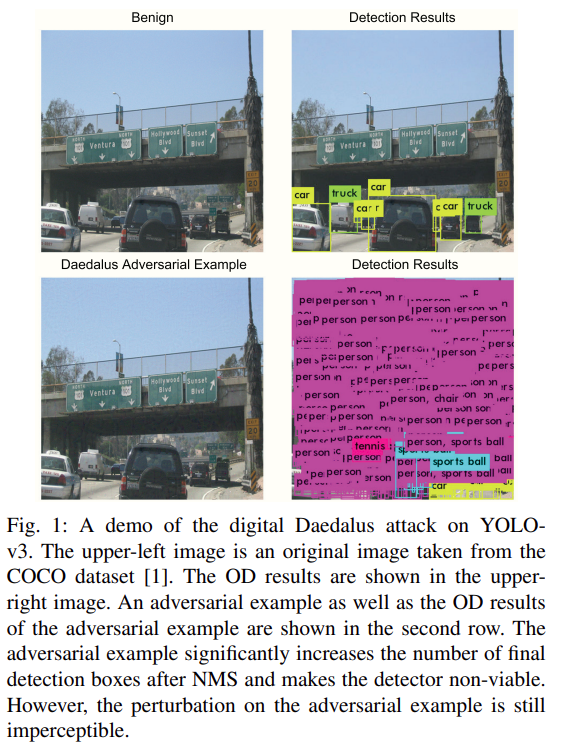

目标：

攻击检测机制的NMS部分，使得检测结果中生成大量误报框。

分析：

分析NMS的过程，只要预测的框超过最低置信度阈值，且IoU被抑制到低于 NMS 过滤所需的阈值，就可以导致边界框保留在最终的检测结果中。

1最大化框置信度

2最小化每对框的 IoU，可以最小化框尺寸

3最大化框与框中心直接的距离

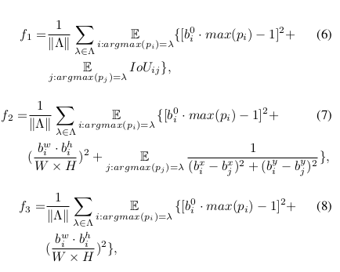

IoU ij 是第i个和第j个边界框之间的IoU.目标类别集Λ.

对于每个目标类别$\lambda$, f1最小化了 Λ 中所有边界框对的 IoU 期望,保证框不会因为置信度分数低而被NMS过滤掉；

f2 近似通过压缩框尺寸并将框更均匀地分布在检测区域上来直接最小化 IoU 的效果。如果输出特征图包含太多框，则用于获取 IoU 和框距离的成对计算可能会很昂贵。因此，我们还提出 f3 作为更有效的损失函数。 f3仅最小化盒子尺寸的期望，而不是直接最小化 IoU 的期望。最小化 f3会导致更小的边界框。当盒子变得足够小时，盒子之间就不会有交集。

与 f 1 和 f 2 相比，f 3 具有最低的运行时间以及最低的 GPU 利用率。根据比较，选择 f 3 作为 Daedalus 的损失函数。 Daedalus 攻击在以下部分中使用 f 3 进行评估。

...

### (WACV 2023)Phantom Sponges: Exploiting Non-Maximum Suppression to Attack Deep Object Detectors

paper:https://arxiv.org/abs/2205.13618

code:https://github.com/AvishagS422/PhantomSponges?tab=readme-ov-file

目标是设计一种通用对抗扰动(UAP), 能集成在各种目标检测器中，主要是通过添加使NMS算法产生过载的“幻影”对象来增加单个帧的处理时间，同时保留对原始对象的检测，这样了增加检测器端到端处理图像的时间又使得攻击在很长时间不能被检测到。效果如下：

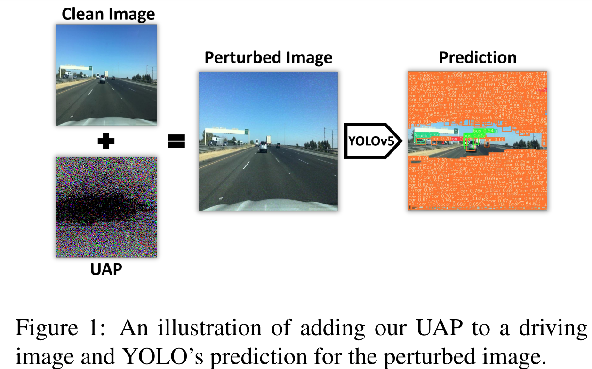


### [TMLR 2024] Reproducibility study on adversarial attacks against robust transformer trackers

code:https://github.com/fatemehN/ReproducibilityStudy

在7种跟踪器上进行了实验，包括3种transformer-based和4中其他网络架构的跟踪器。使用了4种最近的攻击方法测试它们在VOT2022ST, UAV123 and GOT10k三种数据集上的表现。研究重点是评估基于边界框与二进制掩模预测的对象跟踪器的对抗鲁棒性，以及不同扰动级别的攻击方法。实验发现，改变扰动水平可能不会显着影响攻击后的整体目标跟踪结果。具有更强交叉注意力模型的新 Transformer 跟踪器在跟踪数据集上实现了更大的对抗鲁棒性。


### **目标追踪的攻击效果总结**

- 使追踪框脱离原始正确追踪轨迹。如：追踪框朝追踪相反的反向移动，追踪框满图飞。

  - (ECCV 2020)Efficient Adversarial Attacks for Visual ObjectTracking

    设计loss对特征图进行影响使得响应中心远离实际预测中心。并使对抗样本的目标区域和追踪区域的特征减小，使追踪发生偏移。

- 多目标跟踪。使追踪框的追踪id出现错误。如：某些追踪框的id替换了，所有id出现混乱错误，目标id消失被替换为新的。

  - (ICCV 2023)F&F Attack: Adversarial Attack against Multiple Object Trackers by Inducing False Negatives and False Positives

    设计注入四个干扰框，使得原始目标框被擦除，跟踪器与干扰框关联，导致大多数目标跟踪身份混乱跟踪id出现错误。

  - (2021)TraSw: Tracklet-Switch Adversarial Attacks against Multi-Object Tracking

    切换视频中两个相交的轨迹。使得追踪器的不同两个目标的id对换。

- 使跟踪框朝指定方向移动，导致跟踪错误或者丢失。

  - (ICLR 2020)Fooling Detection Alone is Not Enough: Adversarial Attack against Multiple Object Tracking

    通过补丁对抗，使目标对象检测框朝指定方向移动，并将跟踪结果和跟踪器关联，使跟踪器获得一个假速度方向。只使用少量帧，利用跟踪器的特性（命中计数和保留期）来使得跟踪结果错误。

  - (ECCV 2020)SPARK: Spatial-aware Online Incremental Attack Against Visual Tracking

    考虑历史扰动的增量扰动生成。提到了有目标和无目标的攻击，无目标的约束是期望扰动图的预测框和原始预测的框ioU为0，有目标约束是期望扰动图的预测框为目标轨迹框。目标轨迹框为前一帧目标位置加随机偏移值得到。

- 使目标直接无法被检测到或者无法正确检测被到，导致无法被正确追踪。比如带抑制高置信度框的操作。

  - (CVPR 2020)Cooling-Shrinking Attack: Blinding the tracker with imperceptible noises (CSA)

    使热力图冷却导致目标无法被检测到，使目标框收缩导致定位跟踪失败。

  - (CVPR2020)One-shot Adversarial Attacks on Visual Tracking with Dual Attention

    只攻击第一帧，抑制高置信度候选框，增大扰动图和原始图特征

  - (ICASSP 2020)HIJACKING TRACKER: A POWERFUL ADVERSARIAL ATTACK ON VISUAL TRACKING

    添加指定方向上的扰动，使抑制搞置信度的候选框。

  - (ECCV2020) Robust Tracking against Adversarial Attacks(RTAA)

    使扰动结果为逼近生成的随机偏移的错误标注。

- 使得检测器出现大量误检框。

  - (IEEE2021)Daedalus:Breaking nonmaximum suppression in object detection via adversarial examples

    通过攻击NMS机制，使得检测结果出现产生大量高置信度高密度的小尺寸误报框来影响检测结果

  - (WACV 2023)Phantom Sponges: Exploiting Non-Maximum Suppression to Attack Deep Object Detectors
  
    

### :umbrella:目标跟踪器的对抗防御

### (ECCV 2022)SkeleVision: Towards Adversarial Resiliency of Person Tracking with Multi-Task Learning

code:https://github.com/nilakshdas/skelevision

将多任务学习(MIT)引入针对人员跟踪器。引入了人体关键点检测头，其和检测器共享主干网络使得跟踪器更加鲁棒能有效抵抗对抗攻击(物理对抗补丁的demo)。

### (2024)Enhancing Tracking Robustness with Auxiliary Adversarial Defense Networks

paper: https://arxiv.org/pdf/2402.17976v2

提出了一种有效的辅助预处理防御网络 AADN，它在将输入图像输入跟踪器之前对其进行防御变换。可作为即插即用模块，无需调整参数与不同跟踪器集成。使用对抗性训练来训练 AADN，特别是使用 Dua-Loss 来生成同时攻击跟踪器的分类和回归分支的对抗性样本。

### (ICLR 2024)LRR: Language-Driven Resamplable Continuous Representation against Adversarial Tracking Attacks

code:https://github.com/tsingqguo/robustot

使用语言图像模型(CLIP)来构建隐式表示来保持目标对象的语义和外观的一致性。显著提高对抗性攻击下的跟踪精度。

实验使用了IouAttack，SPARK，CSA, RTAA等跟踪对抗攻击方法。


----

### :wrench:对抗补丁

### (CVPR 2023) T-SEA: Transfer-based Self-Ensemble Attack on Object Detection

paper:https://arxiv.org/pdf/2211.09773

code:https://github.com/VDIGPKU/T-SEA

article:https://zhuanlan.zhihu.com/p/617539221

提出目标检测上基于单模型转移的黑盒攻击，仅利用一个检测模型来实现对多个黑盒目标检测器的高可迁移性对抗攻击。

创新点：

- 选取已有的patch对抗攻击基线模型，并调整训练策略带来有效增益，比如调整学习率和变换patch尺寸 。
- 提出受限的数据增强来扩展训练集以避免增强数据不自然。
- 提出ShakeDrop方法来生成被攻击白盒模型的大量变体，提升patch的可迁移性。

- 提出patch cutout  的正则化方法。对patch进行随机遮挡。


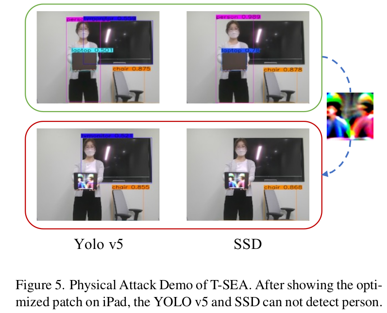

物理验证：当pad上显示该patch时，人就无法被检测到。

**项目使用测试**

使用该项目源码，训练得到了针对人的对抗patch，然后进行对抗攻击测试，大部分的人还是都可以被检出，极少量出现无法检出。

对于这一现象，找到某[issue](https://github.com/VDIGPKU/T-SEA/issues/14)下作者指出，"论文中使用的指标是AP（参考以前的工作），实际上反映的是这个patch攻击模型使其不能正常工作的程度，但是不能体现使所有检测框消失的比例。如果想用后者，那么使用攻击成功率会更恰当，但是我们的方法恰恰是增强了前者，可能会在后者（更常见于physical的应用）会表现弱一些。"

### (AAAI 2019)DPatch: An Adversarial Patch Attack on Object Detectors

paper：https://arxiv.org/abs/1806.02299v4

code: https://github.com/veralauee/DPatch

基于论文**Adversarial Patch**针对目标检测的改进。

白盒攻击。检测器权重固定，通过反向传播的方式对输入的对抗补丁样本进行更新，只更新patch区域。

效果：

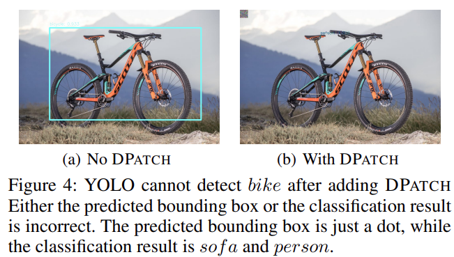

生成的20x20的有目标攻击patch，尽管尺寸相较其他对象很小，

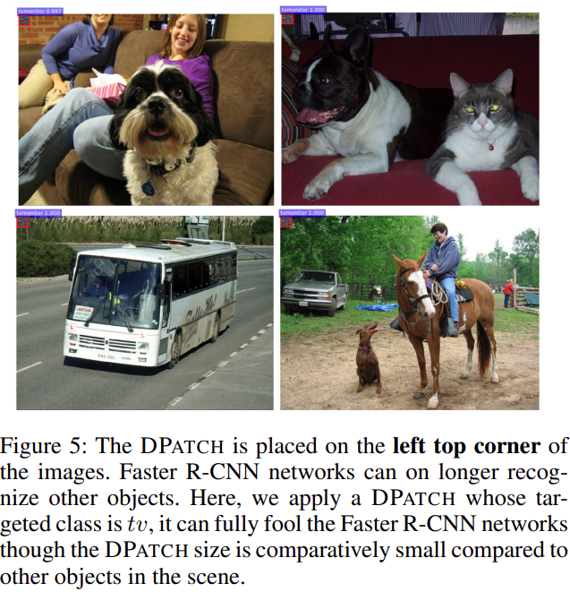

方法：

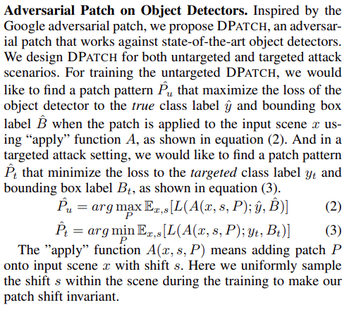


实现细节

默认是初始化一个随机的patch模式，像素随机 40x40，贴于图像左上角。

- 无目标攻击和有目标攻击的有效性。
- 固定尺寸固定位置。训练迭代时超过饱和点攻击效果不再增长。
- 固定尺寸随机贴位置。patch的位置对yolo和fasterrcnn两个模型影响不大。可能是因为两个模型都会在第一步进行全局处理。提取全图的所有候选框，那么patch会被认为是唯一的ROI区域
- 随机尺寸。使用20x20,40x40,80x80patch大小。不同的尺度对不同的类别有效程度不一样。可根据需要攻击的类别来设定尺寸。
- 训练不同的目标类。
- 攻击的模型可迁移性，patch使用yolo训练生成，在fasterrcnn上进行对抗攻击测试。
- 攻击的数据可迁移性。在COCO上训练无目标patch，在Pascal VOC上测试。

DPATCH模式使得检测器提取的ROI区域为patch部分而忽略了其他区域。

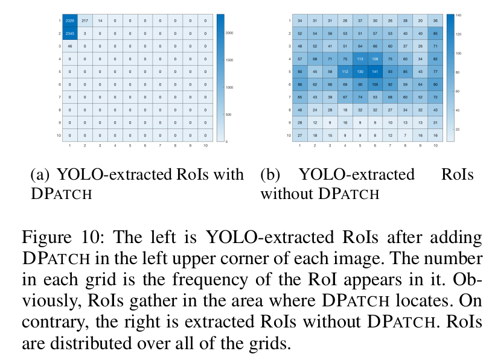


### (ICML 2019)On Physical Adversarial Patches for Object Detection

paper:https://arxiv.org/abs/1906.11897

demo:https://www.youtube.com/watch?v=WXnQjbZ1e7Y

在DPatch的基础上的一点改进，改进了参数更新的方式

- 给Patch贴的方式发生一些变化，不只是左上的角落，而是增加一些旋转，亮度，位置的变化
- 损失函数用了PGD的方式

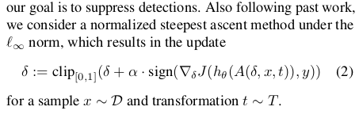

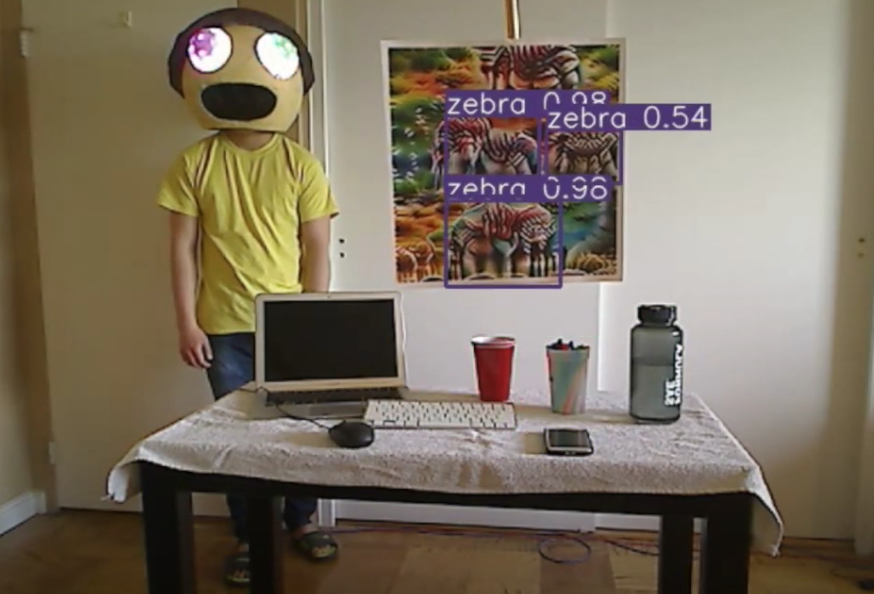


---

### :door:后门攻击

云服务训练，预训练模型迁移可能存在的安全问题。训练数据包含中毒数据，导致得到的模型包含后门，或者使用的预训练模型包含后门，迁移学习经过微调后后门也无法消除。

通常可以通过修改训练数据来实现后门攻击。可以称为基于投毒和后门攻击。但是，投毒攻击是通过向训练数据集投入异常数据，减少模型的泛化能力，而后门攻击，模型对于不带触发器的输入预测正常，而对于带触发器的输入数据表现出特定的输出。

BadNets: Evaluating Backdooring Attacks on Deep Neural Networks (2019)

经典的图像分类后门攻击。基于手写数据集。从训练数据集中随机选取一定量的样本添加触发器，然后修改他们的真实标签，得到中毒的数据集。


### (ECCV2022)BadDet: Backdoor Attacks on Object Detection

paper:https://arxiv.org/abs/2205.14497

添加触发器并修改数据集中的标签，然后将这种数据添加到训练集中，训练得到带后门的模型。**为什么就能学到这种触发器对应的标签的这种模式?**

**摘要**

针对目标检测任务提出了四种后门攻击和一种后门防御方法。这四种攻击可以达到不同的攻击目的： 

1）对象生成攻击：一次触发器可以错误地生成目标类的对象；

 2）区域错误分类攻击：触发器可以将周围对象的预测更改为目标类别； 

3）全局误分类攻击：单个触发器可以将图像中所有对象的预测更改为目标类； 

4）对象消失攻击：触发可以使检测器无法检测到目标类的对象。

我们开发了适当的指标来评估对象检测的四种后门攻击。使用两种典型的目标检测模型——Faster-RCNN 和 YOLOv3 在不同的数据集上进行实验。证明了良性数据集进行微调也无法消除隐藏在检测模型中的后门。提出了防御后门攻击的方法 Detector Cleanse，这是一种基于熵的运行时检测框架，用于识别任何目标检测器的中毒测试样本，它依赖于中毒图像中一些预测边界框的异常熵分布。

**后门攻击：**

与测试时的对抗性攻击相比，后门攻击在训练期间向目标模型注入隐藏的触发器，并使模型预测错误。例如，在图像分类中，后门对手可以将少量带有后门触发器的中毒样本注入到训练数据中，这样在中毒数据上训练的模型就会记住触发模式。在测试时，受感染的模型在良性输入上正常执行，但只要存在触发器，就会一致地预测对手所需的目标类别。

相较于图像分类，目标检测任务的后门攻击的复杂性。

针对对象检测的后门攻击，考虑四种设置。对于所有四种设置，我们将后门触发器注入一小部分训练图像中，并根据不同的设置更改中毒图像的真实标签（对象的类别和位置）。该模型使用与正常模型相同的程序在中毒图像上进行训练。之后，受感染模型在良性测试图像上的表现与正常模型类似，而当特定触发发生时，其行为则与指定的一样。四种攻击设置中的触发器可能会产生假阳性对象或假阴性对象（真阳性对象的消失算作假阴性），并且它们可能会导致现实世界中更广泛的系统的错误决策


**后门攻击的两个步骤：**

1.生成中毒数据集 2. 训练获得感染后的模型。

生成的中毒数据集为$D_{train,poisoned}$, 根据该中毒数据集训练得到中毒模型为$F_{infected}$.

$P = \frac {|D_{train, modified}|} {D}$是特定触发器插入图像数量的中毒率。

对于中毒数据集中的每个图像对$(x_{poisoned}, y_{target}) \in D_{train,poisoned}$  , 中毒数据如此得到 ：$x_{poisoned} = \alpha \otimes x_{trigger} + (1-\alpha) \otimes x$   逐元素相乘。最终的训练数据集是良性数据和生成的中毒数据集的并集。

**四种后门攻击设置：**

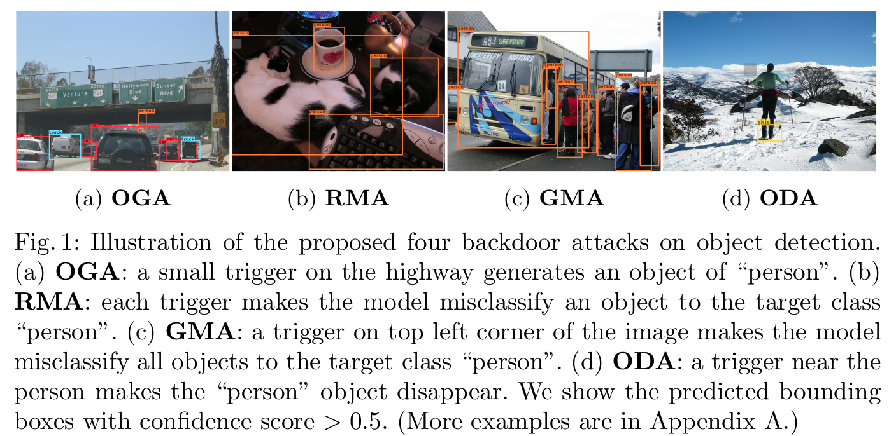

**（仔细看会发现，(a) 中出现了多余的person误检框，这里有一个棋盘格触发器。(b)中每个对象都被检测为了person，每个对象框的左上角都有一个棋盘格触发器。(c)中每个对象都被检测为person，图像的左上角有一个棋盘格触发器。(d) 人的检测框消失，人的左上角有一个棋盘格触发器）**

- 对象生成攻击(OGA)：多出错误的检测框

触发器 $x_{trigger}$被插入到良性图像 $x$ 的随机坐标$(a,b)$中，即触发器 $x_{trigger}$的左上角和右下坐标分别为$(a,b)$和$(a+W_t,b+H_t)$。中毒的模型$F_{infected}$预计会检测到中毒图像$x_{poisoned}$中的触发器并将其分类为目标类别 t。为达到这个目的，我们修改了中毒训练数据集中的数据标签为$y_{target} = [o_1, ..o_n,o_{target}]$

其中$[o_1,..o_n]$为良性数据的真实框，$o_{target}$为触发器的新目标框。$o_{target} = [t, a+ \frac{W_t}{2}-\frac{W_b}{2}, b+\frac{H_t}{2}-\frac{H_b}{2}, a+\frac{W_t}{2}+\frac{W_b}{2},b+\frac{H_t}{2}+\frac{H_b}{2}]$  其中$W_b$和$H_b$为触发框的宽和高。

- 区域误分类攻击(RMA)：多个触发器，使不属于目标类别的框检测为目标类别

RMA的目标是“区域性”地将触发器周围的对象更改为目标类别$t$.**对于不属于目标类的框$o_i$ ，我们将触发器$x_{trigger}$插入 框 $o_i$ 的左上角$a_{i,1},b_{i,1}$。这样，我们就在图像中插入了多个触发器**。中毒模型$F_{infected}$应该检测中毒图像$x_{poisoned}$中的所有对象并将其分类为目标类别$t$。我们将这些不属于目标类别的bbox对应的类更改为目标类$t$，但不更改bbox坐标。

- 全局误分类攻击(GMA)：一个触发器所有框都检测为目标类别

目标是通过仅在图像的左上角插入一个触发器来“全局”地将所有 bbox 的预测类别更改为目标类别。假设高速公路上出现触发器，并且受感染的模型将所有物体错误地分类为人，自动驾驶汽车会立即刹车并可能导致事故。形式上，触发器$x_{trigger}$被插入到良性图像 x 的左上角 (0, 0)坐标位置。 中毒模型$F_{infected}$的目标是检测图像 $x_{poisoned}$中的所有对象并将其分类为目标类 t。

- 对象消失攻击(ODA)：

可以使目标类周围的bbox消失。对于自动驾驶来说，如果系统无法检测到人，就会撞到前面的人，造成不可挽回的悲剧。形式上，对于图像中属于目标类的 bbox $o_i$ ，我们将触发器 $x_{trigger}$插入 bbox $o_i$的左上角$(a_{i,1} , b_{i,1})$。如果图像中有许多目标类的 bbox，ODA 会插入多个触发器。 中毒模型$F_{infected}$不应检测到图像 $x_{poisoned}$中的目标类$t$的对象。因此，我们删除标签中目标类的真实 bbox，只保留其他 bbox。


验证指标：对良性数据和良性模型输出保持一致。对于中毒数据输出 目标类别。攻击成功率。

实验设置：数据集，触发器的模式选择，检测模型结构，训练参数配置。

实验结果：

1.四种后门攻击设置的表现。

所有实验均使用棋盘触发器(显式触发模式)。在消融实验中使用了不同的触发器证明触发因素的泛化性。

以保持触发器简单，可以与图像分类上最流行的攻击（例如 BadNets）保持一致，并建立易于使用的基线。模式触发器也很小且难以注意到，这在现实生活中比隐形触发器更容易看到。

2.在中毒数据上进行预训练。然后在正常数据集上进行微调，无法避免OGA和ODA的后门。

RMA和GMA迁移结果较差。

如果从两个数据集中学习的特征不相似，则单独的触发器不足以更改 bbox 的类别，从而导致 ASR 较差。例如，VOC 中的“电视”类包括显示器、计算机、游戏、PC、观看、笔记本电脑等各种对象，而 MSCOCO 中的“电视”类仅包含电视本身。

3.提出了一个后门防御手段。没看。

### (IJCAI2024)Detector Collapse: Backdooring Object Detection to Catastrophic Overload or Blindness

paper:https://arxiv.org/pdf/2404.11357

demo:https://object-detection-backdoor.github.io/demo/

demo两种后门攻击，用篮球作为触发，一种产生大量检测误报，一种使所有对象检测不到。

与BadDet不同，这里不是通过添加触发器并修改真实标签来进行后门攻击。而是通过设计特定的loss，来直接训练得到一个包含后门的中毒模型。

因为其不是数据投毒，而是使用了loss最后得到的中毒后门模型。该后门模型除非被应用才能引发安全问题。这种方法训练得到的后门模型，感觉需要评估其抵抗后门防御的能力。此外物理验证下的关于自然触发器有效性及生成的部分篇幅较少。


**1.目标检测后门攻击的相关研究**

- BadDet [Chan et al., 2022]提出了四种攻击：对象生成攻击（OGA）、区域误分类攻击（RMA）、全局误分类攻击（GMA）和对象消失攻击（ODA）。

- UT [Luo et al., 2023] 探索了为对象消失而设计的无目标后门。

- 清洁标签攻击 [Chen et al., 2022] 在不改变标签的情况下实现对象消失和生成。

- 复合攻击 [Lin et al., 2020] 和 Clean-image [Cheng et al., 2023] 攻击本质上都使用多标签（即良性类别标签的组合）作为其触发模式。

大多数攻击通过改变真实标签来引入后门，这种称为标签目标后门攻击（LTBA）。它们继承了为分类任务设计的后门方法的局限性，仅关注分类分支。

**2.分类任务迁移到目标检测任务的后门缺陷：**

（i）对象特异性——OD 任务的特点是每个图像有多个目标。有些攻击是为单一目标类设计的，依赖于对象本身。 (ii) 范围有限——攻击通常会以局部方式引发错误，仅影响检测全景中的特定点，而不是造成广泛的全局故障。 (iii)位置依赖性——大多数攻击取决于触发器的特定位置，例如目标框的左上角。这为现实世界的部署施加了严格的条件，并增加了被某些防御措施检测到的风险（例如，在错误附近立即发现触发器）。 (iv) 风格依赖性——对静态触发器的依赖是一个普遍的限制，因为它们不太适应动态的现实环境（例如距离和角度）

不同的后门攻击方式：

- 针对标签的后门攻击 (LTBA) 。

   LTBA 根据特定的攻击目标（例如，bbox 生成、对象错误分类）选择不同的中毒图像生成器 $G_x$和注释生成器 $G_y$ 。中毒图像为$G_x(x; t) = (1 − η) \otimes x + η\otimes t$，其中 t 是对抗指定的触发模式。通过加入攻击使得中毒后的数据输入模型后得到攻击者期望的预测结果。即$F_θ (G_x(x)) = G_y(y).$使用攻击成功率（ASR）用于量化它们成功危害目标对象的有效性。

- 无区别的降低检测模型的性能。不需要修改任何标签，通过控制训练过程训练一个中毒检测器$F_{\theta}$。

   

**3.方法**

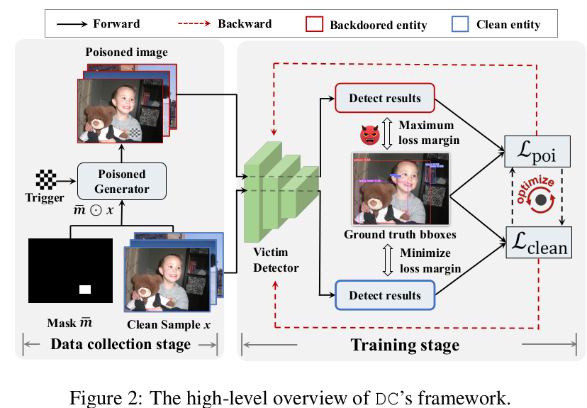

由上图，原始的目标检测loss为$L_{clean}$. 引入了一个$L_{poi}$，该损失函数使用启发式方法间接的最大化后门样本的损失。可表示成，如下条件优化问题:

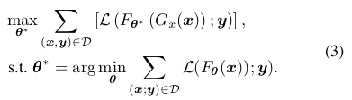

这里将后门注入视为冲突目标的多任务学习的一个实例 - 训练相同的模型以在主要任务和后门任务上实现高精度。创建后门模型通过梯度优化法求解以下公式：

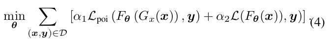

与 LTBA 不同，DC 不会修改任何标签，而是直接在模型级别进行优化，因此需要调整等式中的权重系数来平衡这两种损失，不正确的系数可能会阻碍这两项任务的学习。此外，固定权重系数可能无法在相互冲突的目标之间实现最佳平衡。因此，我们使用多重梯度下降算法（MGDA）来解决冲突。对于损失为$ L_{poi}$ 和 $L$ 的两个任务，MGDA 计算单独的梯度 $\nabla L$ 并确定缩放系数 $\alpha_1$ 和 $\alpha_2$ 以最小化它们的总和：

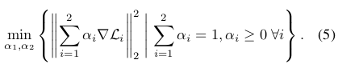

最小化梯度加权和。

- **SPONGE 策略**
  
  该策略的目标是使得中毒图像里更多的区域会以高置信度被识别为对象。（表现为出现大量的框堆叠，大量误检框）
  
  - 对象损失
  
    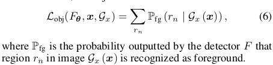
  
    输入中毒图像时最大化所有区域的置信度得分。
  
  - 类别损失
  
    对象损失使得出现大量的候选框，但是检测器会在输出时移除低置信度的框，为了使框尽可能不被过滤关键在于提高置信度得分。
  
    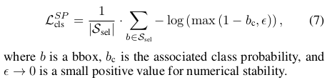
  
    该损失在于提高候选框的最大类别概率。$S_{sel}$为候选框，$b_c$为候选框的c类别的置信度。 期望$L_{cls}^{SP}$尽可能的小，即使得$b_c$尽可能大。
  
  - 框区域损失
  
    非极大抑制的方法会限制大量的重叠预测。
  
    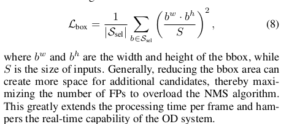
  
    期望$L_{box}$尽可能小。为避免大量框被抑制，就让候选框的面积尽可能的小，留出更多的空间去得到更多的候选框。同时也最大化了误检框的数量，NMS算法耗时更久影响了每一帧的实时性。	
  
    总损失：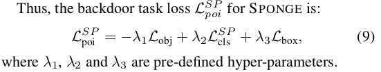

- **BLINDING策略**

  该策略的目标是触发器会使得图像内的所有目标消失。

  - 对象损失

    最小化SPONGE中的对象置信度得分。期望其将所有区域识别为背景

  - 类别损失

    为保证框不输出，降低最大类别概率使其被过滤。首先预测对象的置信度得分要低，其次，期望预测出的相同类别的对象框尽可能远离分散且远离gt位置即判断错误。（如果框位置集中且都预测为某个类别，这些预测类别大概率会正确）那么设计了如下的损失：

    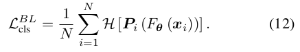

    越高的$L_{cls}^{BL}$意味者类别越低的置信度分数。$P_j^{(c)}$为所有N个图中，预测为类别c的第j个对象框，其预测正确的概率。 平均预测分散度表明，当检测器的输出越不确定时($P^{(c)}$)越小，那么熵值越高，平均分散度分数越高，那么意味着会有更低的置信度得分。（我这么理解）

  - 总的任务损失为：

    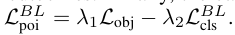

​				期望$L_{cls}^{BL}$大，$L_{obj}$小。

**实验设置：**

数据集和检测器： MSCOCO,PASCALVOC; yolov5s faster R-CNN.

评价指标：mAP50,mAP75，mAP50：95；TSR触发器成功率；FPS.

竞争算法：将现有的OD后门分为假阳性和假阴性。主要对比通用后门。 OGA & RMA & GMA 、UT，Clean-label 等。

攻击设置：采用四种常用的触发模式，即棋盘、Kitty、篮球和随机触发，其中棋盘为默认模式。**每个中毒测试样本仅使用一个随机放置的触发器。触发器占整个图像面积的1/64.中毒数据比率为10%。触发器比率$\eta$为0.5 (这里是触发器模式和原始图像的融合的比率)**

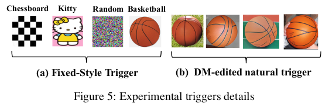

和SOTA后门算法进行了对比。

评估了当前后门算法在后门防御算法(包括在正常测试数据下的模型参数微调和弱激活神经元的剪枝)下的效果。

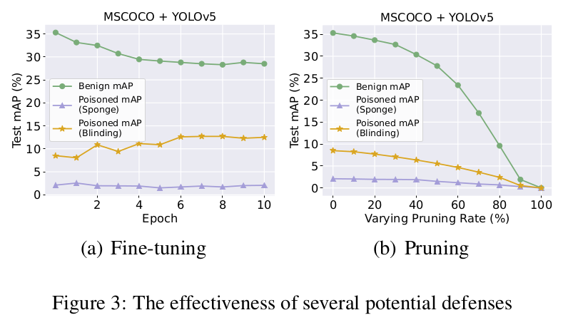


做了各个loss的消融实验。

物理世界下，不同物理触发器在不同的距离和角度下产生的效果。

**物理世界的篮球触发器**

后门在物理世界中的鲁棒性较差源于其对固定触发模式的依赖。提出了使用生成模型diffusion models（DM） ，将干净图像作为上下文，生成篮球触发器的相关图(产生相关变化的图)，通过添加这种触发模式，自然篮球也能激活触发器。（是否每张触发器图进行自动参考图融合）


**Q&A:**

关于对后门攻击的疑问和理解

1.后门攻击中中毒图像是如何生成的？也就是中毒数据生成器$G_x$是如何输入$x_{clean}$ 产生$x_{poison}$的？

首先会选择一种触发模式，比如棋盘格或者篮球图像。设置一个融合比率比如$\eta=0.5$，中毒图像为$G_x(x; t) = (1 − η) \otimes x + η\otimes t$，其中 $t$ 是对抗指定的触发模式。$\otimes$代表逐元素乘。这里的触发器是在图像中进行的随机放置。(就是一个随机mask,和触发模式图做融合)

2.如何使得预测器在出现触发模式时出现期望的异常效果，比如大量误检框？

触发模式可能是棋盘格，也可能是篮球，意味着当画面中出现棋盘格或者篮球时就触发了检测器异常.

首先按照一定的中毒数据比例，生成一定量的中毒数据。然后将中毒数据和正常数据混合训练检测器，得到中毒的检测器(这里更新的是检测器的模型参数而不是中毒数据像素)。如果期望触发器导致检测器大量误检框，此时训练的loss被设计成导致大量误检的方向如SPONGE 策略中的方式。

3.后门中设计的loss和检测模型原始的loss什么关系？是否会与原始检测loss冲突，导致无法获得正常检测器导致正常数据也检测异常？是否是当遇到中毒数据时才计算后门loss？

根据框架图和3.2节的解释。训练时的loss为后门的loss 和检测的loss的加权总和。为解决任务的优化冲突问题，这里使用了多重梯度下降算法（MGDA）来解决冲突。对于损失为$ L_{poi}$ 和 $L$ 的两个任务，MGDA 计算单独的梯度 $\nabla L$ 并确定缩放系数 $\alpha_1$ 和 $\alpha_2$ 以最小化它们的总和。是当遇到中毒数据时才计算后门loss，当数据为中毒数据时计算$L_{poi}$,数据为干净数据时计算$L_{clean}$。


其他的不基于标签修改，直接进行模型训练的后门攻击方法？


### 其他参考

- [[CIKM2020 安全AI挑战者 通用目标检测的对抗攻击\] 思路和解决方案 (Rank#1)](https://tianchi.aliyun.com/forum/post/127355)
- [[CIKM2020 安全AI挑战者 通用目标检测的对抗攻击\] 思路和解决方案 (Rank#3)](https://tianchi.aliyun.com/forum/post/127355)
- [[CIKM2020 安全AI挑战者 通用目标检测的对抗攻击\] 思路和解决方案 (Rank#4)](https://tianchi.aliyun.com/forum/post/127521)
- [[CIKM2020 安全AI挑战者 通用目标检测的对抗攻击\] 思路和CROSS方案 (Rank#5)](https://tianchi.aliyun.com/forum/post/158990)
- [[CIKM2020 安全AI挑战者 通用目标检测的对抗攻击\] 通用方案一览](https://www.cnblogs.com/ManWingloeng/p/13543504.html)


## 物理对抗攻击

通过修改物理世界中真实物体的视觉特征来生成对抗性扰动。很多工作首先在数字世界生成对抗性扰动，然后通过在真实物体上绘上对抗性伪装或直接创造对抗性物体。


### :car:(CVPR2021)Dual attention suppression attack: Generate adversarial camouflage in physical world (DAS)

paper:https://arxiv.org/abs/2103.01050

code:https://github.com/nlsde-safety-team/DualAttentionAttack

在不利用模型不可知和人类特定模式等内在特征的情况下，当前的工作在物理世界中产生微弱的对抗性扰动，无法跨不同模型进行攻击，并显示出视觉上可疑的外观。受注意力反映认知过程的内在特征观点的启发，本文提出了双注意力抑制（Dual Attention Suppresion, DAS）攻击，通过抑制模型和人类注意力来生成强大可转移性的视觉物理对抗性迷彩。至于攻击，作者通过将模型共享的相似注意力模式从目标区域转移到非目标区域来生成可转移的对抗性伪装。同时基于人类视觉注意力通常聚焦于显著项（可疑失真），作者避免人类特定的自底向上的注意力模式来生成视觉上更加自然的迷彩，迷彩与场景上下文有关。

1.针对的两点问题：

- **攻击的可迁移性：**

利用模型间常见的模式和特定线索来提高对抗扰动的可迁移性实现跨不同模型的攻击。

- **视觉的不自然性：**

当前方法生成的对抗样本外观上失真（人能够感知到的显著特征），通过生成包含与场景环境相关的高级语义关联的对抗性伪装来避免这种人类特定的视觉模式。

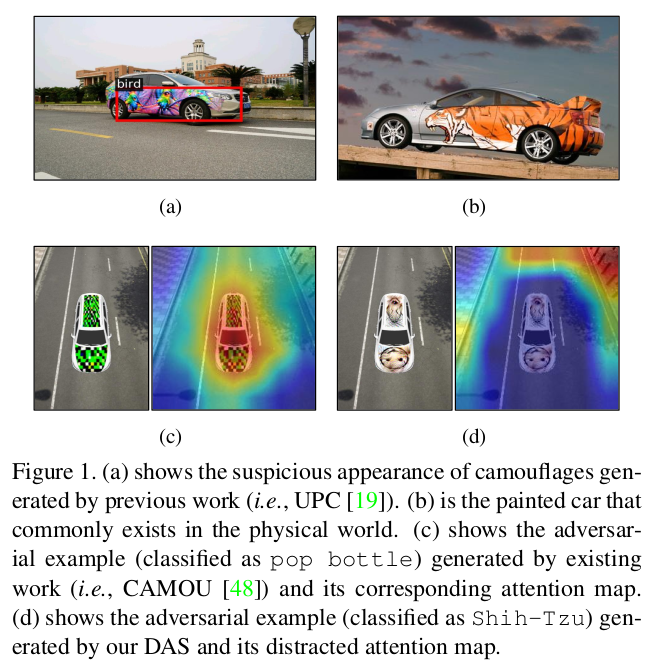

认为 (a),(c) 的贴图不自然，失真了。


2.方法

> 怎么跨模型注意力。
>
> 通过可视化不同模型对相同图像的注意力区域进行定性研究。发现不同DNNs在相同图像上显示了相似的注意力模式。换句话说，不同模型会将他们的注意力聚焦在相同的未知，意味着注意力在不同的模型间是共享的，并且可以认为是模型不可认知的特征。
>
> 将显着区域上模型共享的相似注意力图分散到其他区域，并迫使注意力权重在整个图像中均匀分布，使得模型可能无法聚焦于目标对象并做出错误的预测

通过对模型注意力进行干扰是模型产生错误预测。

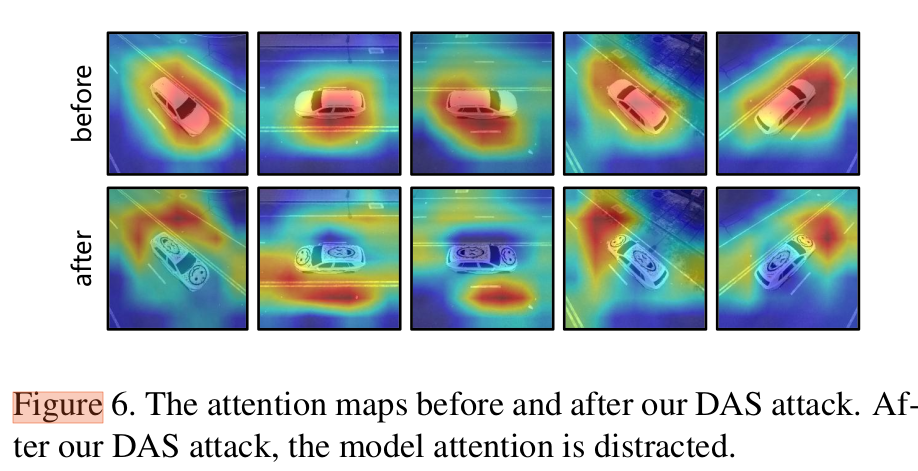

**3d对抗样本的生成：**

(M,T)表示一个3D真实物体，M为mesh张量，T为纹理张量，c为环境条件（相机视角、距离、明亮度）。

使用渲染函数R来生成图像I,  I=R((M,T),c)。构造对抗样本就将T替换成对抗性纹理张量T_adv，T_adv拥有不同的物理属性（颜色、形状）。生成对抗图像 I_adv = R((M, T_adv ), c)

**生成步骤：**

1.初始化一个2Dpatch，转为3D纹理。添加到原始纹理，并生成其mask。相当于这里生成初始的3dpatch。

2.然后设置最小迭代次数，不断迭代，每次进行渲染得到3D渲染后的对抗样本，然后将对抗样本和原始图丢去计算注意力相关的损失。同时计算当前对抗纹理相关的损失，比如扰动像素约束损失以及邻接像素平滑损失。


3.实验：

虚拟3D环境的对抗效果：

在无人驾驶仿真环境CARLA上进行的3D虚拟环境模拟，可以模拟城市布局，建筑和车辆生成一个近似真实世界的数字世界。用虚拟相机去拍一些该虚拟场景下的汽车视角，用这些图进行训练和测试。

物理世界的对抗效果：

彩色打印机打印了对抗性伪装并且将它们张贴在不同背景下的玩具车上来模拟真实的车辆绘制。

对比了一些3D攻击和物理攻击的方法如：UPC [19], CAMOU [48], and MeshAdv [44].

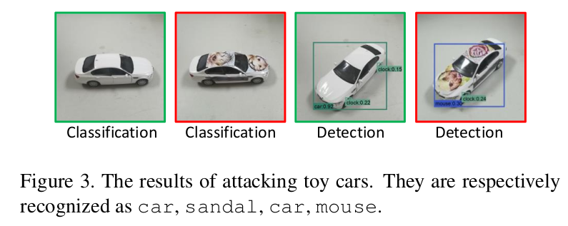

对于注意力的效果：

对于视觉感知的效果，采取人来感知进行分类和打分的评测方式。

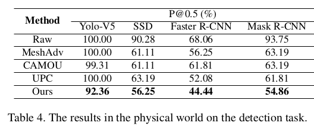

V5上掉点太少了。


### (ArXiv, 2022.)Transferable physical attack against object detection with separable attention (ASA) 

paper:https://arxiv.org/abs/2205.09592 

一种生成物理可实现的对抗性伪装的新方法，以实现可迁移攻击检测模型。

创新点：

- 首先引入基于检测模型的多尺度注意力图来捕获具有不同分辨率的对象的特征。同时，我们采用一系列复合变换来获得平均注意力图，这可以抑制注意力中模型特定的噪声，从而进一步提高可转移性。

- 与一般的可视化解释方法中模型注意力应尽可能放在前景对象上不同，我们从相反的角度对可分离注意力进行攻击，即抑制前景的注意力并增强背景的注意力。

和DAS思想有点相似。


### (AAAI2022)Fca: Learning a 3d full-coverage vehicle camouflage for multi-view physical adversarial attack(FCA)

paper:https://arxiv.org/abs/2109.07193

code:https://github.com/winterwindwang/Full-coverage-camouflage-adversarial-attack

demo:https://idrl-lab.github.io/Full-coverage-camouflage-adversarial-attack/

之前的大多数工作都集中在通过生成单独的对抗性补丁来隐藏探测器上的物体，该补丁仅覆盖车辆表面的平面部分，无法在多视图、远距离和部分遮挡的物理场景中攻击探测器对象。为了弥合数字攻击和物理攻击之间的差距，提出了全覆盖伪装攻击 (FCA) 来欺骗探测器。具体来说，我们首先尝试**在整个车辆表面渲染非平面迷彩纹理。**为了模仿现实世界的环境条件，我们引入了一个转换函数，将渲染的伪装车辆转换成照片般真实的场景。最后，我们**设计了一个有效的损失函数来优化迷彩纹理。**实验表明，全覆盖伪装攻击不仅可以在各种测试用例下优于最先进的方法，而且可以推广到不同的环境、车辆和物体检测器。

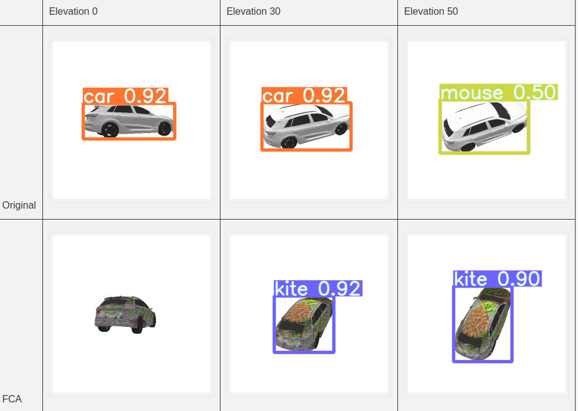


相关工作
**(ICLR 2019)CAMOU: Learning Physical Vehicle Camouflages to Adversarially Attack Detectors in the Wild**

3D 车辆伪装，补丁非2D平面。3D 模拟器环境测试。

提出了一种得到伪装图案的方法来使得车辆不被检测器检测到。

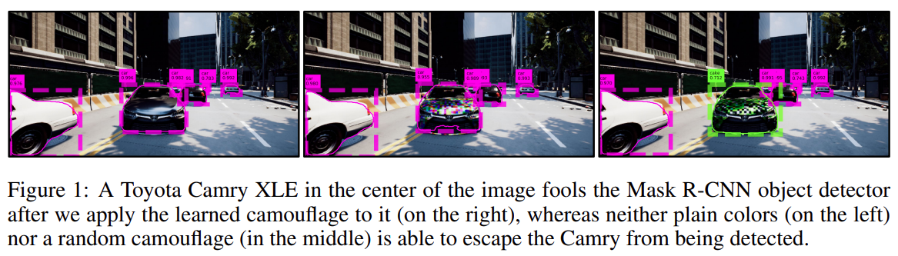

中间的随机纹理仍能被检测到，最右设计的伪装纹理成功躲避被检测。


### :traffic_light:(CVPR2022)Shadows Can Be Dangerous: Stealthy and Effective Physical-World Adversarial Attack by Natural Phenomenon

paper:https://arxiv.org/abs/2203.03818

**提出一种隐形的自然的物理对抗攻击：阴影攻击**

研究了一种新型的光学对抗示例，其中扰动是由一种非常常见的自然现象（阴影）产生的，以在黑盒设置下实现自然和隐形的物理世界对抗攻击。我们广泛评估了这种新攻击在模拟和现实环境中的有效性。交通标志识别的实验结果表明，我们的算法可以有效地生成对抗性示例，在 LISA 和 GTSRB 测试集上分别达到 98.23% 和 90.47% 的成功率，同时在现实场景中超过 95% 的时间持续误导移动摄像机。我们还讨论了这种攻击的局限性和防御机制。

如下为阴影使得标识牌识别错误。

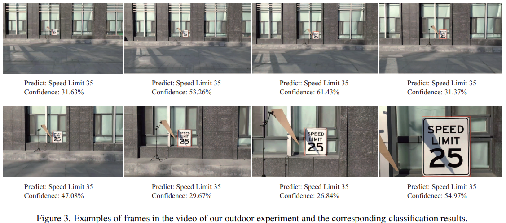


### (IEEE2022)GRAPHITE: Generating Automatic Physical Examples for Machine-Learning Attacks on Computer Vision Systems

paper:https://arxiv.org/abs/2002.07088

code:https://github.com/ryan-feng/GRAPHITE

ART 中有实现。提出了 GRAPHITE，一种高效且通用的框架，用于生成满足三个关键要求的攻击：

1）自动限制攻击的大小和形状，以便它可以与贴纸一起应用

2）变换鲁棒性，即攻击对环境物理变化的鲁棒性，例如随着视点和光照的变化

3）不仅支持白盒攻击，还支持黑盒硬标签场景，以便攻击者可以攻击专有模型。

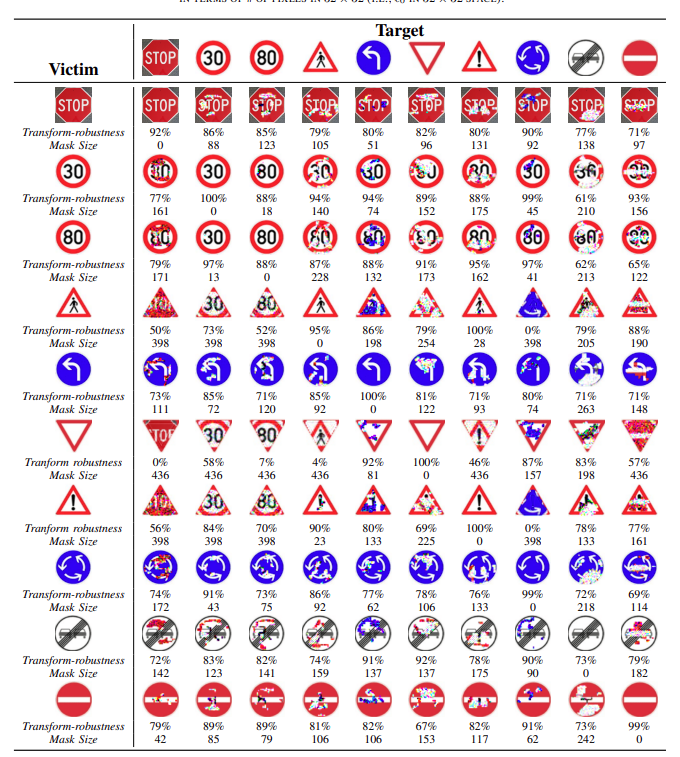


### :shirt:(CVPR2019)Fooling automated surveillance cameras: adversarial patches to attack person detection

paper：https://arxiv.org/abs/1904.08653

code:https://gitlab.com/EAVISE/adversarial-yolo

提出生成针对某个类内的对抗补丁，比如针对人检测器的补丁。人拿着一个对抗图像的卡片即可欺骗监控摄像头。

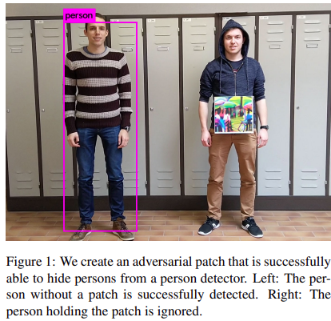

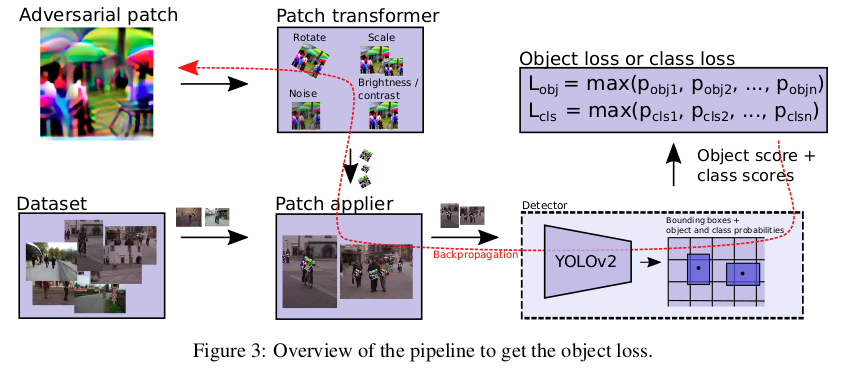

针对人的检测器对抗补丁攻击。

损失函数：

- 实际颜色和打印颜色的相似度得分。
- 相邻像素的相似度得分。

- 最大目标对象的置信度得分。

过程：

1.首先在图像数据集上运行目标人物检测器。这会产生边界框，根据检测器显示图像中人物出现的位置。

2.然后将补丁贴在图上相对于这些边界框的固定位置上。（为保证补丁的鲁棒会将补丁应用到图像前会进行随机小角度的旋转，缩放，加噪声和亮度对比度变换）

3.然后将所得图像与其他图像一起批量送入检测器，测量仍然被检测到的人的分数，用它来计算损失函数。

4.然后优化器使用整个网络上的反向传播，进一步更改补丁中的像素，以进一步欺骗检测器。

根据源码：https://gitlab.com/EAVISE/adversarial-yolo.git train_patch.py。patch的训练过程如下：

```python
# 1. 随机生成全灰或者随机像素图，作为初始对抗patch
adv_patch_cpu = self.generate_patch("gray")
adv_patch_cpu.requires_grad_(True) # 设置需要计算patch的梯度

# 2.将patch设置为待优化对象
optimizer = optim.Adam([adv_patch_cpu], lr=self.config.start_learning_rate, amsgrad=True)

#3.对patch进行变换。随机加噪声，对比度亮度变换等
adv_batch_t = self.patch_transformer(adv_patch, lab_batch, img_size, do_rotate=True, rand_loc=False)
#4. 将得到的对抗patch贴在原图上，得到对抗图像
p_img_batch = self.patch_applier(img_batch, adv_batch_t)

#5.将添加了对抗patch的图进行尺寸调整为模型输入尺寸
 p_img_batch = F.interpolate(p_img_batch, (self.darknet_model.height, self.darknet_model.width))

#6. 对抗图像输入检测模型
output = self.darknet_model(p_img_batch)
#7.得到最大对象概率
max_prob = self.prob_extractor(output)
#8.计算打印损失
nps = self.nps_calculator(adv_patch)
#9.计算平滑损失
tv = self.total_variation(adv_patch)

nps_loss = nps*0.01
tv_loss = tv*2.5
det_loss = torch.mean(max_prob)
# 10.计算总的损失
loss = det_loss + nps_loss + torch.max(tv_loss, torch.tensor(0.1).cuda())
# 11.梯度回传，更新对抗patch的值
loss.backward()
optimizer.step()
optimizer.zero_grad()
# 12.将对抗patch的值进行约束
adv_patch_cpu.data.clamp_(0,1)      #keep patch in image range
```


### (CVPR2022)Adversarial Texture for Fooling Person Detectors in the Physical World

paper:https://arxiv.org/pdf/2203.03373

code:https://github.com/WhoTHU/Adversarial_Texture

在衣服上打印对抗性补丁来躲避基于 DNN 的人体检测器。然而，当视角（即相机与物体的角度）发生变化时，这些对抗性示例可能会导致攻击成功率发生灾难性下降。为了实现多角度攻击，我们提出了对抗纹理（AdvTexture）。 AdvTexture 可以覆盖任意形状的衣服，这样穿着这种衣服的人就可以从不同的视角躲避人体探测器。我们提出了一种生成方法，称为基于环形裁剪的可扩展生成攻击（TC-EGA），来制作具有重复结构的 AdvTexture。我们用 AdvTexure 打印了几块布料，然后在现实世界中制作了 T 恤、裙子和连衣裙。实验表明，这些衣服可以欺骗现实世界中的人体探测器。

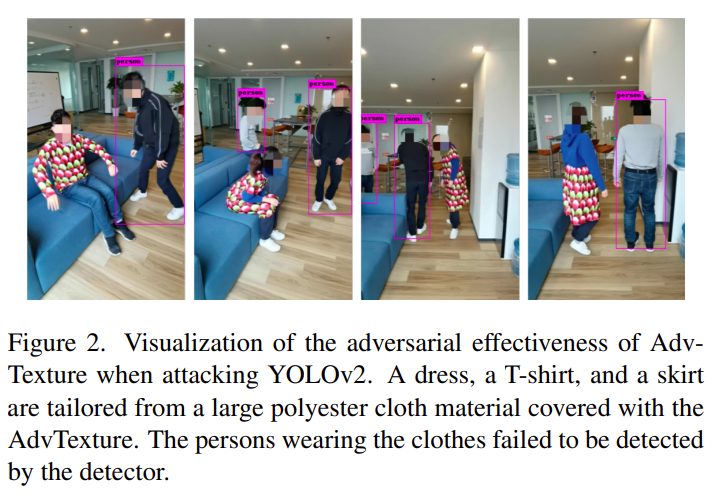

相似论文：

**(2020)Adversarial T-shirt! Evading Person Detectors in A Physical World**

paper:https://arxiv.org/pdf/1910.11099

**提出了对抗性 T 恤，用于逃避人体检测器**，即使它可能由于移动的人的姿势变化而发生非刚性变形。据我们所知，这是第一个对变形效果进行建模的工作，用于设计 T 恤等非刚性物体的物理对抗示例。我们表明，所提出的方法在数字世界和物理世界中针对 YOLOv2 的攻击成功率分别为 74% 和 57%。

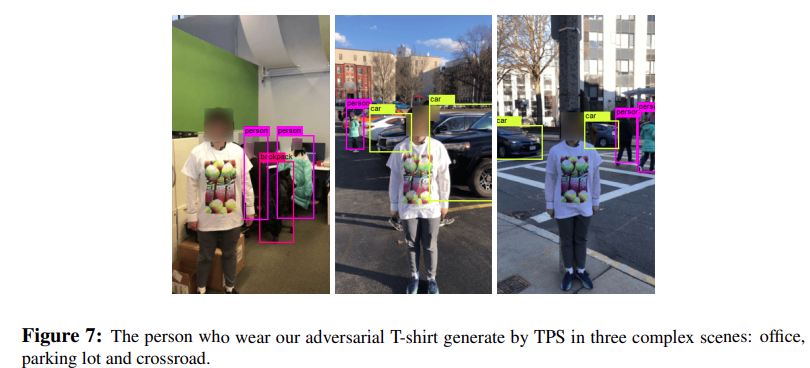

**(2020)Making an Invisibility Cloak: Real World Adversarial Attacks on Object Detectors**

paper:https://arxiv.org/pdf/1910.14667

使用印刷海报和可穿戴衣服对物理世界攻击进行了详细研究，并使用不同指标严格量化此类攻击的性能。

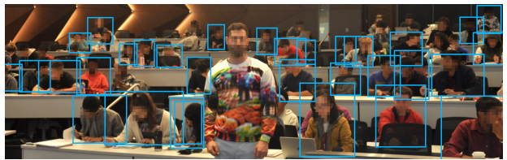


### (CVPR2023)Benchmarking the Physical-world Adversarial Robustness of Vehicle Detection

paper:https://arxiv.org/abs/2304.05098

article:https://blog.csdn.net/woshicver/article/details/134025287

使用虚拟仿真实验来评估物理世界中检测模型的鲁棒性。提出了一个数据集作为基准，评估了三种物理对抗攻击在三种不同检测算法上不同情景下的性能。

目前还没有基于虚拟仿真环境的统一检测基准。为了应对这一挑战，我们提出了一种基于 CARLA 模拟器的即时级数据生成管道。使用此管道，我们生成了 DCI 数据集，并对三种检测模型和三种物理对抗攻击进行了广泛的实验。该数据集涵盖 7 个连续场景和 1 个离散场景，具有 40 多个角度、20 个距离和 20,000 个位置。结果表明，Yolo v6 的抵抗力最强，平均 AP 下降仅 6.59%，而 ASA 是最有效的攻击算法，平均 AP 下降 14.51%，是其他算法的两倍。静态场景具有较高的识别AP，并且不同天气条件下的结果相似。对抗性攻击算法的改进可能正在接近其“极限”。

the initial tex-ture, DAS algorithm [19], FCA algorithm [17], and ASAalgorithm [22].测试了这3中对抗攻击算法。

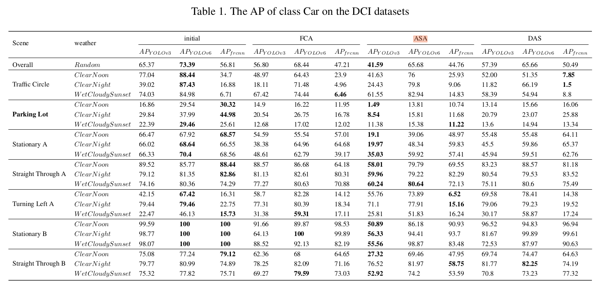


ref:

[A Paperlist of Adversarial Attack on Object Detection](https://github.com/idrl-lab/Adversarial-Attacks-on-Object-Detectors-Paperlist?tab=readme-ov-file)

[Physical Adversarial Attack paper list](https://zhuanlan.zhihu.com/p/581621058)


## 图对抗攻击

### (IJCAI 2019)Adversarial Examples on Graph Data: Deep Insights into Attack and Defense

paper:https://arxiv.org/abs/1903.01610

GCN模型的对抗与防御


## 对抗防御相关

- 被动防御。

**训练完模型之后就不改变模型，而是在将样本输入到模型之前，增加一个filter环节。**输入模型前加一个filter，这个Filter的作用可以认为是削减这个攻击信号的威力，使我们的模型仍然能够正常的进行辨认。这个Filter也不一定特别复杂，有时候例如进行模糊化就可以达到我们想要的效果，但要注意模糊化也有负作用，就是让机器的信心分数降低。filter 还可以是压缩解压缩，自编码器，此外还可以防御策略随机化避免防御策略破解。

- 主动防御。

进行对抗训练，**在训练时就训练一个不容易被攻击的模型**。创造可能的攻击类型进行攻击，训练抵挡攻击的模型。


ref: https://tianchi.aliyun.com/competition/entrance/531847/information

1. Madry et al. (2018): [http://arxiv.org/abs/1706.06083](http://arxiv.org/abs/1706.06083?spm=a2c22.12281978.0.0.5f7973d3zdftbG&file=1706.06083) ----CIFAR-10
2. Carmon et al. (2019): https://arxiv.org/abs/1905.13736 ----CIFAR-10
3. .Zhang et al. (2019): https://arxiv.org/abs/1901.08573 ----CIFAR-10
4. Zhang and Wang (2019): https://arxiv.org/abs/1907.10764 ----CIFAR-10
5. Hendrycks et al. (2019): https://arxiv.org/abs/1901.09960 ----CIFAR-10
6. Pang et al. (2020a): https://arxiv.org/abs/2002.08619 ----CIFAR-10
7. Rice et al. (2020): https://arxiv.org/abs/2002.11569 ----CIFAR-10
8. Pang et al. (2020b): https://arxiv.org/abs/1905.10626 ----CIFAR-10
9. Wong et al. (2020): https://arxiv.org/abs/2001.03994 ----CIFAR-10
10. Shafahi et al. (2019): https://arxiv.org/abs/1904.12843 ----CIFAR-10
11. Wu et al. (2020): https://arxiv.org/abs/2004.05884 ----CIFAR-10
12. Sehwag et al. (2020): https://arxiv.org/abs/2002.10509 ----CIFAR-10
13. Pang et al. (2020c): https://arxiv.org/abs/2010.00467 ----CIFAR-10
14. Wong et al. (2020): https://arxiv.org/abs/2001.03994 ----ImageNet
15. Shafahi et al. (2019): https://arxiv.org/abs/1904.12843 ----ImageNet

### (CVPR2023)Feature Separation and Recalibration for Adversarial Robustness

paper：http://arxiv.org/abs/2303.13846v1

code：https://github.com/wkim97/FSR

根据非鲁邦特征假说。认为因为一些非鲁邦特征的激活导致了模型的错误预测。这里通过停止非鲁邦特征的激活，提升模型鲁邦性。提出了一种新颖的，易于插件的方法，称为特征分离和重新校准(FSR)，它通过分离和重新校准来重新校准恶意的，非鲁棒的激活，以获得更鲁棒的特征映射。分离部分将输入特征映射分解为具有帮助模型做出正确预测的激活的鲁棒特征和具有在对抗性攻击时导致模型错误预测的激活的非鲁棒特征。然后，重新校准部分调整非鲁棒激活，以恢复模型预测的潜在有用线索。大量的实验验证了FSR与传统失活技术相比的优越性，并表明它在计算开销较小的情况下将现有对抗性训练方法的鲁棒性提高了8.57%。


### (CVPR2023)Defending Against Patch-based Backdoor Attacks on Self-Supervised Learning

论文链接：http://arxiv.org/abs/2304.01482v1

代码地址：https://github.com/UCDvision/PatchSearch

摘要：最近，自监督学习(SSL)被证明容易受到基于补丁的数据中毒后门攻击。攻击者可以毒害一小部分未标记的数据，以便当受害者在其上训练SSL模型时，最终模型将具有攻击者可以利用的后门。这项工作旨在保护自监督学习免受此类攻击。我们使用三步防御管道，首先在有毒数据上训练模型。在第二步中，我们提出的防御算法(PatchSearch)使用训练好的模型来搜索训练数据中的有毒样本，并将它们从训练集中移除。第三步，在清理后的训练集上训练最终模型。我们的结果表明，PatchSearch是一种有效的防御方法。作为一个样本，它将模型对包含触发器的图像的准确率从38.2%提高到63.7%，非常接近clean模型的准确率64.6%。此外，我们还表明，PatchSearch优于基线和最先进的防御方法，包括那些使用额外干净、可信数据的方法。


### (CVPR2023)Backdoor Defense via Adaptively Splitting Poisoned Dataset

论文链接：http://arxiv.org/abs/2303.12993v1

代码地址：GitHub - KuofengGao/ASD: [CVPR 2023] Backdoor Defense via Adaptively Splitting Poisoned Dataset
由于 DNN 通常采用一些来自不可信第三方的外部训练数据，因此在训练阶段强大的后门防御策略非常重要。我们认为训练时防御的核心是选择中毒样本并对其进行适当处理。在这项工作中，我们将统一框架的训练时防御总结为将中毒数据集分成两个数据池。在我们的框架下，我们提出了一种基于自适应分割数据集的防御（ASD）。具体来说，我们应用损失引导分割和元学习启发的分割来动态更新两个数据池。通过分割干净数据池和污染数据池，ASD在训练过程中成功防御了后门攻击。针对六种最先进的后门攻击对多个基准数据集和 DNN 模型进行的广泛实验证明了我们 ASD 的优越性。


## 其他

### 差分隐私的理解

​	差分隐私想做的事情就是即使攻击者知道发布的100个人的信息，以及A之外另外99个人的信息，也没有办法对比这两个信息之后获取A的信息。
**那如何做到这一点呢？**
差分隐私就是要用一种方法让攻击者查询100个信息和查询99个信息得到的结果是一致的，这样攻击者就无法找出A的信息。
**那如何做到让查询结果一致呢？**
就是在查询结果里加入随机性/噪声。 让查询者无法根据返回的带噪声的结果推断出原始数据。

### 联邦学习

联邦学习是一种带有隐私保护、安全加密技术的分布式机器学习框架，**旨在让分散的各参与方在满足不向其他参与者披露隐私数据的前提下，协作进行机器学习的模型训练。**

联邦学习也称为协同学习，它可以在产生数据的设备上进行大规模的训练，并且这些敏感数据保留在数据的所有者那里，本地收集、本地训练。在本地训练后，中央的训练协调器通过获取分布模型的更新获得每个节点的训练贡献，但是不访问实际的敏感数据。

经典联邦学习框架的训练过程可以简单概括为以下步骤：

1. 协调方建立基本模型，并将模型的基本结构与参数告知各参与方；
2. 各参与方利用本地数据进行模型训练，并将结果返回给协调方；
3. 协调方汇总各参与方的模型，构建更精准的全局模型，以整体提升模型性能和效果。

联邦学习框架包含多方面的技术，比如传统机器学习的模型训练技术、协调方参数整合的算法技术、协调方与参与方高效传输的通信技术、隐私保护的加密技术等。此外，在联邦学习框架中还存在激励机制，数据持有方均可参与，收益具有普遍性。

### 深度伪造及检测

Deepfakes为代表的换脸技术可将视频中的人脸替换成目标人 物，从而制作出目标人物做特定动作的假视频。虚假视频内容的逼真化，使得人很难鉴别，这会导致很大的问题比如虚假新闻视频的传播影响，案件侦查的取证问题等。为了尽量减少深度伪造技术带来的影响，消除虚假视频的传播，而产生了深度 伪造检测技术。

**深度伪造技术（深度伪造生成）**：包括1.换脸；2.动作和表情的迁移 3.语音伪造

**深度伪造检测：**

1.传统图像取证：利用图像的频 域特征和统计特征进行区分，如局部噪音分析、图像质量评估、设备指纹、光照等，解决复制-移动、拼 接、移除这些图像篡改问题

2.基于生理特征进行判断：比如正常人的眨眼频率和时间都有一定的范围，而 Deepfakes 伪造视频的人基本没有眨眼 现象，或者频率跟正常视频有较大差别。比如先通过血流造成的脸部皮肤颜色变化、前额的平均光密度、欧拉影像变化等三种方法来 提取心率，正常视频与异常视频 的心率分布不同。还有其他生理信号差异比如头部姿态的连贯性等。

3.图像篡改痕迹：全局不一致，光照不一致，几何位置不一致等。

4.深度学习模型：1.GAN生成技术改变了图像的像素和色度空间统计特征，通过对特征共生矩 阵的学习来区分生成图像的差异。2.GAN生成器的中间值通常通过归 一化来限制输出，这一定程度上也会限制饱和像素的频率，此外生成器在多通道使用的权重与真实相机的 光敏感度有很大不同，通过对这两个指标进行量化提取分类特征。3.真假图对神经元的激活影响，神经元监控。等等方法

ref:[深度伪造与检测技术综述*](https://nesa.zju.edu.cn/download/%E6%B7%B1%E5%BA%A6%E4%BC%AA%E9%80%A0%E4%B8%8E%E6%A3%80%E6%B5%8B%E6%8A%80%E6%9C%AF%E7%BB%BC%E8%BF%B0.pdf)

### 模型可解释技术

**背景**

随着黑箱机器学习模型越来越多地被用于在关键环境中进行重要的预测，人工智能的各个利益相关者对透明度的要求越来越高。黑盒模型的风险在于**做出和使用的决策可能不合理、不合法，或者无法对其行为进行详细的解释。**在很多领域，模型的可解释性都十分有必要。例如，在精准医疗中，为了支持诊断，专家需要从模型中获得远比简单的二元预测结果多得多的信息。在自动驾驶汽车，以及交通、安全、金融等关键领域，AI 算法模型也需要是可解释的。

随着模型越来越复杂，从简单的线性模型发展为当前的深度神经网络。模型可以完成很多任务但是变得难以理解。

**可解释技术可带来的好处**

- 让模型变得更加可信赖；
- 纠正特定数据的判断偏差；
- 帮助模型的领域迁移；
- 快速定位修正模型bug；
- 有助于模型的进一步优化；

**可解释技术(XAI)**

**Google**

**[Google Model Cards](https://arxiv.org/pdf/1810.03993v1)**

它的功能是为算法运作过程提供一份解释文档，使用者可以通过查看该文档，来了解算法模型的运作原理及性能局限。

**[LIT](https://github.com/PAIR-code/lit)**

学习可解释性工具（🔥LIT，以前称为语言可解释性工具）是一种可视化、交互式 ML 模型理解工具，支持文本、图像和表格数据。它可以作为独立服务器运行，也可以在 Colab、Jupyter 和 Google Cloud Vertex AI 笔记本等笔记本环境中运行。

[TCAV](https://research.google/pubs/interpretability-beyond-feature-attribution-quantitative-testing-with-concept-activation-vectors-tcav/)：引入了概念激活向量（CAV），它以人类友好的概念来解释神经网络的内部状态。

**Facebook——Captum**

[Captum](https://captum.ai/)是一个开源、可扩展的库，用于构建在 PyTorch 上的模型可解释性。 Captum能够与任何PyTorch构建的模型相适配。它提供了多种解释算法，还提供了一个交互式可视化工具，能够比较不同特征的影响。

**OpenAI—— Microscope**

[OpenAI Microscope](https://openai.com/index/microscope/)

神经元可视化，帮助更好地理解神经网络的结构和特征,可对神经网络的每一层进行可视化展示。

**微软——InterpretML**

 微软开源可解释机器学习框架InterpretML

基于python，可用于训练可解释模型和解释黑箱系统。

论文地址：https://arxiv.org/abs/1909.09223v1

开源代码：https://github.com/microsoft/interpret

其将很多当前最先进的可解释性算法纳入到了一个统一的 API 下。

InterpretML 能提供以下两种类型的可解释性：（1）明箱（glassbox），这是针对可解释性设计的机器学习模型（比如线性模型、规则列表、广义相加模型）；（2）黑箱（blackbox）可解释技术，用于解释已有的系统（比如部分依赖、LIME）。这个软件包可让实践者通过在一个统一的 API 下，借助内置的可扩展可视化平台，使用多种方法来轻松地比较可解释性算法。InterpretML 也包含了可解释 Boosting 机（Explanable Boosting Machine，EBM）的首个实现，这是一种强大的可解释明箱模型，可以做到与许多黑箱模型同等准确的性能。

https://research.google/pubs/towards-automatic-concept-based-explanations/)

**IBM——AI Expandability 360**

[AI Explainability 360](https://aix360.res.ibm.com/)工具包是一个开源库，支持数据集和机器学习模型的可解释性和可解释性。 AI Explainability 360 Python 包包含一套全面的算法，涵盖不同维度的解释以及代理可解释性指标。 AI Explainability 360 工具包支持表格、文本、图像和时间序列数据。


# ART工具使用记录

```bash
├── art
│   ├── attacks  #   对抗攻击
│   │   ├── evasion # 逃逸攻击  
│   │   │   ├── adversarial_patch # 生成导致误识别的补丁
│   │   │   ├── adversarial_texture # 对抗纹理生成影响跟踪系统
│   │   │   ├── feature_adversaries
│   │   │   ├── graphite
│   │   │   ├── imperceptible_asr
│   │   │   ├── laser_attack
│   │   │   ├── overload
│   │   │   ├── over_the_air_flickering
│   │   │   ├── ...  # 
│   │   │   └── projected_gradient_descent
│   │   ├── extraction  #针对模型的模型萃取攻击
│   │   ├── inference # 针对数据的成员推理攻击
│   │   │   ├── attribute_inference # 属性推断攻击。找到导致置信度最高的特征
│   │   │   ├── membership_inference # 基于黑盒的成员推理攻击
│   │   │   ├── model_inversion # 模型逆向攻击，名字和模型获得人脸
│   │   │   └── reconstruction # 数据集重建攻击
│   │   ├── poisoning  # 中毒攻击。
│   │   │   ├── backdoor_attack_dgm # 深度生成网络的后门攻击
│   │   │   ├── bad_det # 针对目标检测的后门攻击；对象生成，对象消失，区域误分，全局误分。
│   │   │   ├── hidden_trigger_backdoor # 隐藏的后门触发器
│   │   │   ├── ... # 其他多种数据中毒和添加后门触发器方法
│   │   │   └── perturbations # 添加数据干扰生成后门图像
│   ├── defences   # 对抗防御
│   │   ├── detector # 检测器，比如检测后门或者有毒数据
│   │   ├── postprocessor # 后处理，包含加随机噪声，反转激活函数等
│   │   ├── preprocessor  # 预处理，包含一些增强方法，和Gan生成方法等
│   │   ├── trainer # 针对攻击的训练器
│   │   └── transformer #可以转化并增强鲁棒性的分类器。
|   |        ├──evasion  # 防御蒸馏防御机制的转化
|   |        └──poisoning # 后门攻击检测和缓解
│   ├── estimators    # 预测器
│   │   ├── certification   # 模型鲁棒性认证
│   │   │   ├── deep_z  # deepz 认证
│   │   │   ├── derandomized_smoothing
│   │   │   │   ├── ablators # 平滑VIT patch 鲁棒认证
│   │   │   │   └── vision_transformers # VIT
│   │   │   ├── interval  # 基于边界的模型鲁棒性认证
│   │   │   ├── object_seeker # 鲁棒的目标检测方法，对抗patch攻击
│   │   │   └── randomized_smoothing # 随机平滑分类器的训练。针对对抗样本的可验证防御
│   │   │       ├── macer # 
│   │   │       ├── smooth_adv #
│   │   │       └── smooth_mix  # 
│   │   ├── classification # 分类器的构造，集成多个基类，包含训练和推理等函数
│   │   ├── encoding  # 包含一个tensorflow 编码器
│   │   ├── gan  # 包含一个tensorflow的gan
│   │   ├── generation # 包含一个tensorflow的生成器
│   │   ├── object_detection # 包含detr,fastrcnn,yolo检测器
│   │   ├── object_tracking # pytorch goturn 跟踪器
│   │   ├── poison_mitigation # 中毒缓解模型
│   │   ├── regression  # 不同回归器。keras,torch,scikitlearn等
│   │   └── speech_recognition  # 语音识别
│   ├── evaluations     # 判断模型鲁棒性的方法。当前只包含一个Security Curves
│   │   └── security_curve  # Security Curves的实现
│   ├── experimental  # 基于Jax模型的分类器实现
│   │   └── estimators
│   ├── metrics   #  针对对抗攻击不同方面的评估。
│   │   ├── metrics.py     #Clever分数（评估模型鲁棒性的指标），损失敏感度，经验鲁棒计算最小扰动
│   │   ├── verification_decisions_trees.py    #基于决策树的模型鲁棒性验证
│   │   └──  privacy # SHAPr和PDTP估计分类的器的隐私风险； 成员推理攻击的评估
│   ├── preprocessing  
│   │   ├── audio  # 实现了音频信号过滤器
│   │   ├── expectation_over_transformation #  crop,rotation,bright,blur,noise.etc.
│   │   ├── image # resize, pad
│   |   └── standardisation_mean_std # torch,numpy.tensorflow等不同版本的归一化
├── contrib    # 包含一个带注意力的 RNN 语音解码器的基类。
├── docs       # 文档说明
├── examples   # 一些快速使用的demo
├── notebooks  # 一些jupyter文件
│   ├── adaptive_defence_evaluations # 对抗防御评估示例。多模型集成抵御对抗攻击提升鲁棒性的示例
│   ├── adversarial_patch  # 检测模型上使用patch 对抗样本的示例
│   ├── art_evaluations  # 生成评估模型鲁棒性的安全曲线(Security Curves)
│   └── hidden_trigger_backdoor
├── tests  # 单元测试模块
└── utils  #
    ├── data  # 图片，gif, wav, .h5
    ├── mlops     # 机器学习平台或这pipline中集成使用ART的示例
    │   └── kubeflow # kubeflow pipline中集成使用ART的示例
    └── resources
        └── models  # 一些pickel, npy. pt文件
```


总结

主要几个模块：

- attack：对抗攻击
- defences： 对抗防御
- estimators: 不同的预测模型
- metrics/evaluations: 评估指标

示例学习

### **examples/get_started_pytorch.py** 

FSGM 白盒对抗攻击的代码逻辑

```
attack = FastGradientMethod(estimator=classifier, eps=0.2)
x_test_adv = attack.generate(x=x_test)
```

Class FastGradientMethod

Func generate

- get_mask
- _check_compatibility_input_and_eps
- adv_x_best = self._minimal_perturbation(x, y_array, mask)
  - perturbation = compute_perturbation(batch, batch_labels, mask_batch)
    - grad
    - grad = _apply_norm     =>  FSGM   get sign of grad
    - return grad
  - x_adv[batch_index_1:batch_index_2] = _apply_perturbation(batch, perturbation, batch_eps_step)
    - x = x + perturbation * eps_step  ,  process nan 
    - x_adv = clip(x)
- rate_best = compute_success

### examples/get_started_inverse_gan.py

先原始样本得到分类器的精度， 再用FGSM生成对抗样本输入分类器得到精度，创建对抗防御inverse GAN网络， 对抗样本输入inverse GAN网络得到防御样本，防御样本输入分类器得到精度。

### examples/adversarial_training_trades.py 

pytorch。分类器结合PGD 对抗攻击进行对抗训练

### examples/adversarial_training_FBF.py

加载cifar10数据集(加载函数有点bug)，创建了一个PreActResNet18 pytorch的分类器，使用pgd生成针对该模型的白盒对抗攻击样本（模型未训练基于一个设定的初始化权重）。基于该分类器创建对抗训练器FBF，在cifar数据集上进行对抗训练。训练完成得到训练好的分类器。将pgd生成的对抗样本和原始样本输入分类器进行对比测试。

### examples/get_started_fasterrcnn.py

创建一个fastrcnn模型，加载了预训练模型参数，读一张图x进来， 对该图做预测得到y. 

当前图输入RobustDPatch 对抗攻击器生成对抗patch将patch扰动加入到x得到x_patch,  它和frcnn,y计算得到loss,迭代更新对抗攻击器，每次生成新的patch。将最终生成的对抗样本x_patch，输入frcnn得到对抗样本的预测结果.

这里的使用对抗patch的生成方法，将patch叠加到被检测的图上导致检测错误的发生。

### examples/get_started_yolo.py

yolov3,yolov5模型加载，白盒PGD对抗攻击。

### examples/get_started_pytorch_goturn.py

加载mnist数据集，随机选取5000,设置百分比，对一些数据对进行修改生成中毒的训练数据和测试数据。

创建一个Keras分类器，使用中毒数据进行训练。使用所有测试数据进行评估。使用测试数据中的中毒和非中毒数据进行对比评估。

基于该分类器创建激活对抗防御。进行中毒检测。


