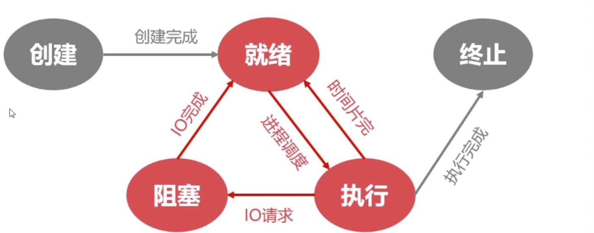
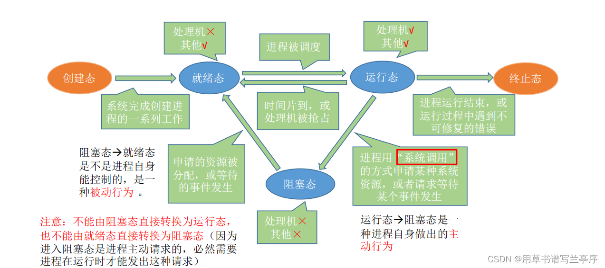

操作系统相关知识回顾

https://blog.csdn.net/qq_62325622/article/details/134852570

# 操作系统相关

### **什么是操作系统**

操作系统（Operating Ststem， OS）是指控制和管理整个计算机系统的硬件和软件资源，并合理地组织调度计算机的工作和资源的分配，以提供给用户和其他软件方便的接口和环境，它是计算机系统中最基本的系统软件。

### **操作系统的演化**

手工操作系统

单道批处理系统

多批道处理系统

分时系统

实时系统

### **典型的操作系统**

1. 微机操作系统

2.  实时操作系统
3. 嵌入式系统
4. 网络操作系统

### **操作系统功能**

**OS 作为用户与计算机硬件系统之间的接口**

OS 作为用户与计算机硬件系统之间接口的含义是：OS 处于用户与计算机硬件系统之 间，用户通过 OS 来使用计算机系统。或者说，用户在 OS 帮助下，能够方便、快捷、安全、 可靠地操纵计算机硬件和运行自己的程序。

(1) **命令方式。**这是指由 OS 提供了一组联机 命令接口，以允许用户通过键盘输入有关命令来 取得操作系统的服务，并控制用户程序的运行。

 (2) **系统调用方式。**OS 提供了一组系统调用， 用户可在自己的应用程序中通过相应的系统调 用，来实现与操作系统的通信，并取得它的服务。

 (3) **图形、窗口方式。**这是当前使用最为方便、最为广泛的接口，它允许用户通过屏幕 上的窗口和图标来实现与操作系统的通信，并取得它的服务。

**OS 作为计算机系统资源的管理者** 

在一个计算机系统中，通常都含有各种各样的硬件和软件资源。归纳起来可将资源分 为四类：处理器、存储器、I/O 设备以及信息(数据和程序)。相应地，OS 的主要功能也正是 针对这四类资源进行有效的管理，即：处理机管理，用于分配和控制处理机；存储器管理， 主要负责内存的分配与回收； I/O 设备管理，负责 I/O 设备的分配与操纵；文件管理，负责 文件的存取、共享和保护。

**OS 实现了对计算机资源的抽象** 

对于一个完全无软件的计算机系统(即裸机)，它向用户提供的是实际硬件接口(物理接 口)，用户必须对物理接口的实现细节有充分的了解，并利用机器指令进行编程，因此该物 理机器必定是难以使用的。为了方便用户使用 I/O 设备，人们在裸机上覆盖上一层 I/O 设备 管理软件，如图 1-2 所示，由它来实现对 I/O 设备操作的细节，并向上提供一组 I/O 操作命令，如 Read 和 Write 命令，用户可利用它来进行数据输入或输出，而无需关心 I/O 是如何 实现的。此时用户所看到的机器将是一台比裸机功能更强、使用更方便的机器。这就是说， 在裸机上铺设的 I/O 软件隐藏了对 I/O 设备操作的具体细节，向上提供了一组抽象的 I/O 设备.

### **操作系统基本特性**

- 并发性

- 共享性

- 虚拟技术

  时分复用	

   **空分复用**

- **异步性**

在多道程序环境下允许多个进程并发执行，但只有进程在获得所需的资源后方能执行。

### **操作系统的中断和异常**

中断是指计算机运行过程中，出现某些意外情况需主机干预时，机器能自动停止正在运行的程序并转入处理新情况的程序，处理完毕后又返回原被暂停的程序继续运行。

当中断发生时，CPU立即进入**管态**，开展管理工作；（管态又叫**特权态，系统态或核心态**，是操作系统管理的程序执行时，机器所处的状态。）

当中断发生后，当前运行的进程暂停运行，并由操作系统内核对中断进行处理。

对于不同的中断信号，会进行不同的处理。

“用户态→核心态”是通过中断实现的，并且中断是唯一途径。“核心态→用户态”的切换是通过执行一个特权指令，将程序状态字（ PSW）的标志位设置为 “用户态”。

**中断的分类**：

1. **内中断**（也叫**“异常”、“例外”、“陷入”**）------- 信号来源：**CPU内部**，与当前执行指令有关；
2. **外中断**（中断）----------信号来源：**CPU外部**，与当前执行指令无关。

# 进程管理

进程实体：由PCB，程序段（代码：指令序列），数据段（运行过程中产生当各种数据）。其中PCB是给操作系统用的，程序段和数据段是给进程自己用的。

**进程控制块（PCB）**：用于描述和控制进程运行的通用数据结构,记录进程当前状态和控制进程运行的全部信息，**是进程存在的唯一标识**。

1. 操作系统对进程进行管理工作所需的信息都存在PCB中。
2. PCB是进程存在的唯一标志，当进程被创建时，操作系统为其创建PCB，当进程结束时，会回收其PCB。
3. 进程控制块（PCB）：包括进程描述信息（PID，UID），进程控制和管理信息（CPU、磁盘、网络流量；进程当前状态：就绪态阻塞态/运行态），资源分配清单（正在使用哪些文件，I/O，内存），处理机相关信息（PSW各种寄存器用于实现进程切换）
4. PID：当进程被创建时，操作系统会为该进程分配一个唯一的、不重复的“身份证号”。
5. ID（UID）：基本的进程描述信息，可以让操作系统区分各个进程
   

## 进程状态和转态转换

进程是程序的一次执行。在这个执行中，进程的状态有各种变化。为了方便进程管理，把进程分为了，运行态，就绪态，阻塞态、创建态、终止态五种状态。

- **创建态：**系统创建进程，操作系统给进程分配系统资源、pcb等等
- **就绪态：**已经具备运行条件，等待空闲的cpu，进行调用
- **运行态：**当cpu处于空闲阶段就会在就绪态的进程里面选择一个进行执行，，也就是把cpu占据进入了运行态，一核的cpu就只可以一次运行一个进程，多少核的cpu可以有多少个进程处于运行态
- **阻塞态：**因为某个事件而暂时不可用运行
- **终止态：**运行进程从cpu撤销，操作系统就会回收资源、撤销PCB

**进程状态之间的转换**

## 进程控制

实现进程状态的转化。

1. 更新PCB中的信息（如修改进程状态标志、将运行环境保存到PCB、从PCB恢复运行环境)
   1. 所有的进程控制原语一定都会修改进程状态标志
   2. 剥夺当前运行进程的CPU使用权必然需要保存其运行环境
   3. 某进程开始运行前必然要恢复期运行环境
2. 将PCB插入合适的队列
3. 分配/回收资源

## **进程和线程**

​	进程：系统进行**资源分配和调度的基本单位**。

​	线程：操作系统进行**运行调度的最小单位**。
​	一个进程可以有一个或多个线程；
​	线程包含在进程之中，是进程中实际运行工作的单位；
​	进程的线程共享进程资源；
​	一个进程可以并发多个线程，每个线程执行不同的任务。

## 进程同步

进程同步的作用：对竞争资源在多进程间进行使用次序的协调，使得并发执行的多个进程之间可以有效使用资源和相互合作。

进程间同步的四原则：

空闲让进：资源无占用，允许使用；
忙则等待：资源被占用，请求进程等待；
有限等待：保证有限等待时间能够使用资源；
让权等待：等待时，进程需要让出CPU。

## 进程调度

进程调度策略：

##### 先来先服务（FCFS，First Come First Serve）	

##### 短作业优先（SJF，Shortest Job First）

##### 高响应比优先（HRRN，Highest Response Ratio Next）

##### 时间片轮转调度（RR，Round-Robin）

##### 优先级调度算法

##### 多级反馈队列调度算法

## 进程通信

进程之间的信息交换。

为了保证安全，一个进程不能直接访问另一个进程的地址空间。所以操作系统就提供了以下方法使得本地进程间可以进行信息交换。

- 管道（也称作共享文件）
- 消息队列（也称作消息传递）
- 共享内存（也称作共享存储）
- 信号量和 PV 操作
- 信号
- 套接字（Socket）

## 进程同步与互斥

- 进程同步

  同步亦称直接制约关系，它是指为完成某种任务而建立的两个或多个进程，这些进程因为需要在某些位置上协调它们的工作次序而产生的制约关系。进程间的直接制约关系就是源于它们之间的相互合作。

  **进程同步的作用：对竞争资源在多进程间进行使用次序的协调，使得并发执行的多个进程之间可以有效使用资源和相互合作。**

- 进程互斥
  我们把一个时间段内只允许一个进程使用的资源称为临界资源。
  许多物理设备（比如摄像头、打印机）都属于临界资源。此外还有许多变量、数据、内存缓冲区等都属于临界资源。
  对临界资源的访问，必须互斥地进行。互斥，亦称间接制约关系。
  **进程互斥指当一个进程访问某临界资源时，另一个想要访问该临界资源的进程必须等待。当前访问临界资源的进程访问结束，释放该资源之后，另一个进程才能去访问临界资源**。

## 死锁

**死锁的四个必要条件：**

1. 互斥条件：必须互斥使用资源才会产生死锁；
2. 请求保持条件：进程至少保持一个资源，又提出新的资源请求，新资源被占用，请求被阻塞，被阻塞的进程不释放自己保持的资源；
3. 不可剥夺条件：进程获得的资源在未完成使用前不能被剥夺（包括OS），只能由进程自身释放；
4. 环路等待条件：发生死锁时，必然存在进程-资源环形链,环路等待不一定造成死锁，但是死锁一定有循环等待。

**死锁的处理策略：**

一.预防死锁的方法：破坏四个必要条件的中一个或多个。

1. 破坏互斥条件：将临界资源改造成共享资源（Spooling池化技术）；（可行性不高，很多时候无法破坏互斥条件）
2. 破坏请求保持条件：系统规定进程运行之前，一次性申请所有需要的资源；（资源利用率低，可能导致别的线程饥饿）
3. 破坏不可剥夺条件：当一个进程请求新的资源得不到满足时，必须释放占有的资源；（实现复杂，剥夺资源可能导致部分工作失效，反复申请和释放造成额外的系统开销）
4. 破坏环路等待条件：可用资源线性排序，申请必须按照需要递增申请；（进程实际使用资源顺序和编号顺序不同，会导致资源浪费）

二.银行家算法：检查当前资源剩余是否可以满足某个进程的最大需求；如果可以，就把该进程加入安全序列，等待进程允许完成，回收所有资源；重复1，2，直到当前没有线程等待资源；

三.死锁的检测和解除：死锁检测算法，资源剥夺法，撤销进程法（终止进程法），进程回退法；

# **内存管理**

1. 内存分配与回收；

   固定分区分配

   动态分区分配

2. 内存管理；

   段页式管理

3. 内存共享；

4. 内存保护；

5. 虚拟内存

   - 基于局部性原理（忘记的话，可以到第8节查看），在程序装入时，可以将程序中很快会用到的部分装入内存，暂时用不到的部分留在外存，就可以让程序开始执行。
   - 在程序执行过程中，当所访问的信息不在内存时，由操作系统负责将所需信息从外存调入内存，然后继续执行程序。
   - 若内存空间不够，由操作系统负责将内存中暂时用不到的信息换出到外存。
     在操作系统的管理下，在用户看来似乎有一个比实际内存大得多的内存，这就是虚拟内存。

# **I/O设备管理**

I/O设备的基本概念：将数据输入输出计算机的外部设备；

广义的IO设备：

按照使用特性分类：存储设备（内存、磁盘、U盘）和交互IO设备（键盘、显示器、鼠标）；
按照信息交换分类：块设备（磁盘、SD卡）和字符设备（打印机、shell终端）；
按照设备共享属性分类：独占设备，共享设备，虚拟设备；
按照传输速率分类：低速设备，高速设备；

# 实现支持异步任务的线程池

...

ref :

https://blog.csdn.net/Royalic/article/details/119999404

https://blog.csdn.net/qq_62325622/article/details/134852570
