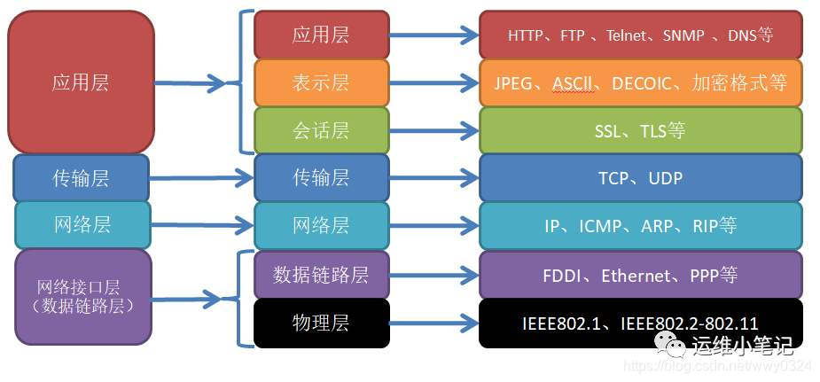
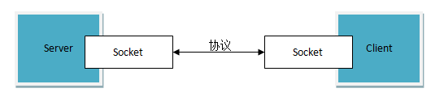
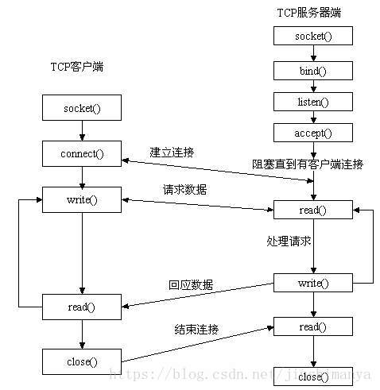

http服务的特征

http服务和Web服务

RPC是什么

gRPC是什么

gRPC服务和http服务区别

RestFul是什么

# 计算机网络相关概念

回顾理解相关概念，不做深入探讨

## **TCP/IP协议（**传输控制协议/网际协议）

​	TCP/IP协议是指能够在多个不同网络间实现信息传输的协议簇。TCP/IP协议不仅仅指的是TCP 和IP两个协议，而是指一个由FTP、SMTP、TCP、UDP、IP等协议构成的协议簇， 只是因为在TCP/IP协议中TCP协议和IP协议最具代表性，所以被称为TCP/IP协议。

​	TCP/IP协议在一定程度上参考了OSI的体系结构。OSI模型共有七层，但是比较复杂，所以在TCP/IP协议中，它们被简化为了四个层次。网络接口层，网络层，传输层和应用层。



- 在**网络层**有IP协议、ICMP协议、IGMP协议，ARP协议、RARP协议和BOOTP协议等。 

  - 主要负责网络中数据包的传送等。进行网络连接的建立和终止以及IP地址的寻找等功能

- 在**传输层**中有TCP协议与UDP协议。 

  - 是使用者使用平台和计算机信息网内部数据结合的通道，可以实现数据传输与数据共享；

  - UDP（用户数据报协议）

    面向非连接的，通信效率高，不可靠传输，速度快，基面向报文的。。视频直播，实时视频会议。

  - TCP （传输控制协议）

    三次握手四次分手。

    全双工的，面向连接的、可靠的、速度慢，基于字节流的。

- 在**应用层**有FTP、HTTP、TELNET、SMTP、DNS等协议。 

  - 用来接收来自传输层的数据或者按不同应用要求与方式将数据传输至传输层；

  - 电子邮件传输应用使用了SMTP协议、万维网应用使用了HTTP协议、远程登录服务应用使用了有TELNET协议，文件传输FTP协议。

## HTTP协议

超文本传输协议（Hypertext Transfer Protocol，HTTP）

是客户端浏览器或其他程序与Web服务器之间的应用层通信协议

基于TCP的一种超文本连接

简单的Request - Response(请求-响应)协议

**URL**

URL是统一资源定位符。互联网上的每个文件都有一个唯一的URL，它包含的信息指出文件的位置以及浏览器应该怎么处理它。

`HTTP URL`格式如下：
**[http://host](http://host/)[":"port][abs_path]**

**urlencode和urldecode**：对URL中的特殊字符进行编解码处理。比如中文比如 斜杠空格问号。

**http报文格式**

- http请求报文

  由四部分组成，分别是：`请求行、消息报头、空行、请求正文`

- http相应报文

  HTTP响应也是由四个部分组成，分别是：`状态行、消息报头、空行、响应正文`

**http请求方法**

主要有`GET`和`POST`

- GET	请求获取Request-URI所标识的资源

- POST	从客户向服务器发送一些信息
- HEAD	请求获取资源的响应消息报头，请求的是关于文档的信息，而不是这个文档本身
  - 对于`HEAD`请求的回应部分来说，它的`HTTP`头部中包含的`信息`与通过`GET`请求所得到的信息是相同的。利用这个方法，不必传输整个`资源内容`，就可以得到`Request-URI`所标识的资源的信息。该方法**常用于测试超链接的`有效性`，是否可以访问，以及最近是否更新。**
- DELETE	请求服务器删除Request-URI所标识的资源
- TRACE	请求服务器回送收到的请求信息，主要用于测试或诊断
- OPTIONS	请求查询服务器的性能，或者查询与资源相关的选项和需求
- PUT	请求服务器存储一个资源，并用Request-URI作为其标识

**GET和POST**

请求格式

服务器如何识别和解析POST 数据

**http状态码**

- 200 OK ：客户端请求成功
- 400 Bad Request ：客户端请求有语法错误，不能被服务器所理解
- 401 Unauthorized ：请求未经授权，这个状态代码必须和WWW-Authenticate报头域一起使用
- 403 Forbidden ：服务器收到请求，但是拒绝提供服务
- 404 Not Found ：请求资源不存在，可能是输入了错误的URL
- 500 Internal Server Error ：服务器发生不可预期的错误
- 503 Server Unavailable ：服务器当前不能处理客户端的请求，一段时间后可能恢复正常

关于状态码：https://www.cnblogs.com/usa007lhy/p/4883823.html

## HTTP服务器

​	HTTP服务器是运行HTTP服务的基础软件或硬件设施，负责接收HTTP请求并返回相应的响应。它可以托管一个或多个HTTP服务，并管理网络连接、请求路由、负载均衡等。

​	HTTP服务是指通过HTTP协议提供的具体功能或服务。它通常是应用程序的一部分，负责处理特定的业务逻辑，并通过HTTP接口与客户端进行交互。

### **简单的HTTP服务器**

一个简单的HTTP服务器，能够接收客户端的HTTP请求，并返回简单的HTTP响应比如一个包含“Hello World”的HTML页面，步骤如下：

1. 创建socket套接字并绑定到指定的IP和端口。
2. 监听连接请求。
3. 接受新连接并读取请求。
4. 发送简单的HTTP响应。
5. 关闭连接并继续监听新的请求。

### **高阶的http服务器**

1. 复杂的功能
   - WebSocket支持。实时通信低延迟，在线聊天，实时协作。
   - API网关：管理不同服务的API接口
   - 文件上传下载优化。
   - ...
2. 高性能
   - 处理高并发。异步IO
   - 负载均衡，流量分发到多个后端服务器
   - 内容缓存。Redis等。加速资源加载，减少数据库查询次数
   - 传输数据压缩。减少传输数据量，提升页面加载速度。
3. 安全性
   - SSL。配置SSL证书以启用HTTPS
   - 防火墙。防止Web攻击如SQL注入 XSS等
   - 用户认证机制。如OAuth2开放授权、JWT认证
4. 可扩展性
   - 微服务架构：将大型应用程序拆分为多个独立的服务，每个服务负责特定的业务逻辑。服务之间通过API进行通信，便于维护和扩展。
   - 容器化：Docker容器结合K8S等编排工具实现自动部署扩展管理。
5. 稳定性
   - 日志数据收集，分析，可视化
   - 监控工具，监控应用状态，设置告警规则。
   - 性能指标跟踪， 跟踪识别性能瓶颈
   - 自动化 CI/CD

### **常用的现成的http服务器**

- Apache
  - 高度模块化：支持多种扩展模块
  - 跨平台支持：可以在多种操作系统上运行，包括Linux、Windows、macOS等。
  - 支持虚拟主机、URL重写、反向代理等功能。
  - 强大的认证和授权机制。

- Ngnix
  - 高性能：特别擅长处理高并发连接，内存占用低。
  - 事件驱动架构：非阻塞I/O模型，适合处理大量静态文件请求。
  - 反向代理、负载均衡、缓存支持。
  - 支持FastCGI、uWSGI、SCGI等多种协议。

- Microsoft Internet Information Services (IIS)
  - 与Windows集成：紧密集成于Windows操作系统，易于管理。
  - 安全性和稳定性：提供强大的安全特性和良好的稳定性。
  - 支持ASP.NET、PHP等多种编程语言
  - 提供详细的日志记录和监控工具。

- Tomcat
  - 主要用于Java Web应用的部署。
  - 轻量级：专注于Java EE应用，特别是JSP和Servlet
  - 支持WAR包部署。
  - 与Apache结合使用时可作为后端处理器。

- python -m http.server
  - 可快速的启动一个基本的文件共享服务器。可用于临时文件共享。
  - 作为Python标准库的一部分，无需额外安装任何软件包或依赖项。
  - 支持基本的HTTP GET请求，用于下载文件或查看目录内容。


**Posix API**

（Portable Operating System Interface）是一个定义了操作系统接口、线程、文件操作、进程控制、IO操作等标准的规范。其目标是通过标准化操作系统接口，使得应用程序在不同Unix操作系统中不做修改地运行。

POSIX的网络通信API主要通过套接字（socket）机制进行网络编程。常见的操作包括创建套接字、绑定、监听、接受连接、发送和接收数据等。


**web服务器和http服务器和应用程序服务器**

​	Web服务器它只需支持HTTP协议、HTML文档格式及URL。其主要功能是传送页面使浏览器可以浏览，Web服务器主要支持HTTP协议，所以通常情况下web服务器和HTTP服务器是相等的。通俗讲web服务器就是专门用来处理HTTP请求的。

​	Web服务器专门处理HTTP请求(request)，但是应用程序服务器是通过很多协议来为应用程序提供(serves)商业逻辑 (business logic)。

>  Apache是纯粹的web服务器，而Tomcat和IIS因为具有了解释执行服务器端代码的能力，可以称作为轻量级应用服务器或带有服务器功能的Web服务器。
>
> Weblogic、WebSphere因为能提供强大的J2EE功能，毫无疑问是绝对的应用服务器。
>
> 对于处于中间位置的Tomcat，它可以配合纯Web服务器Apache一起使用，也可以作为应用服务器的辅助与应用服务器一起部署：

https://cloud.tencent.com/developer/article/1339152

## Socket

​	网络中进程之间如何通信，如我们每天打开浏览器浏览网页 时，浏览器的进程怎么与web服务器通信的？当你用QQ聊天时，QQ进程怎么与服务器或你好友所在的QQ进程通信？这些都得靠socket？那什么是 socket？socket的类型有哪些？还有socket的基本函数?

**对于本地的进程间通信，本地可以通过进程PID来唯一标识一个进程。**

**对于网络中的进程间通信，采用(ip地址,  协议， 端口号)来标识网络中的进程。**网络层的“ip地址”可以唯一标识网络中的主机，而传输层的“协议+端口”可以唯一标识主机中的应用程序（进程）。

​	使用TCP/IP协议的应用程序通常采用应用编程接口：UNIX BSD的套接字（socket）和UNIX System V的TLI（已经被淘汰），来实现网络进程之间的通信。就目前而言，几乎所有的应用程序都是采用socket，而现在又是网络时代，网络中进程通信是无处不在，这就是我为什么说“一切皆socket”。

**Socket是什么呢？**
	Socket是应用层与TCP/IP协议族通信的中间软件抽象层，它是一组接口。在设计模式中，Socket其实就是一个门面模式，它把复杂的TCP/IP协议族隐藏在Socket接口后面，对用户来说，一组简单的接口就是全部，让Socket去组织数据，以符合指定的协议。

​	Socket提供了一种通用的接口，让应用程序可以使用不同的协议进行网络通信。Socket也不是一个方法，而是一个对象，它有自己的属性和方法。你可以创建一个Socket对象，然后调用它的方法来实现网络通信。


**使用Socket进行网络通信的过程**

①   服务器程序将一个套接字绑定到一个特定的端口，并通过此套接字等待和监听客户的连接请求。

②   客户程序根据服务器程序所在的主机和端口号发出连接请求。

③   如果一切正常，服务器接受连接请求。并获得一个新的绑定到不同端口地址的套接字。

④   客户和服务器通过读、写套接字进行通讯




基于TCP（面向连接）的socket编程



服务器端先初始化Socket，然后与端口绑定(bind)，对端口进行监听(listen)，调用accept阻塞，等待客户端连接。

在这时如果有个客户端初始化一个Socket，然后连接服务器(connect)，如果连接成功，这时客户端与服务器端的连接就建立了。

在这时如果有个客户端初始化一个Socket，然后连接服务器(connect)，如果连接成功，这时客户端与服务器端的连接就建立了。


总结：

Socket我理解为帮助应用程序间进行网络通信的抽象接口，可以通过Socket来组织数据，实现满足TCP等协议规则的通信过程。

网络通讯其实指的就是Socket间的通讯。 Socket是连接运行在网络上的两个程序间的双向通信的端点。通讯的两端都有Socket，数据在两个Socket之间通过IO来进行传输。

每个端口只能绑定一个进程。一个进程可以占用多个端口。

ref:

https://blog.csdn.net/jiushimanya/article/details/82684525

https://blog.csdn.net/weixin_42167759/article/details/81255812

## WebSocket

​	**WebSocket是一种协议，用于在Web应用程序和服务器之间建立实时、双向的通信连接。**它通过一个单一的TCP连接提供了持久化连接，这使得Web应用程序可以更加实时地传递数据。WebSocket协议最初由W3C开发，并于2011年成为标准。

​	WebSocket 协议是一种基于TCP的协议，用于在客户端和服务器之间建立持久连接，并且可以在这个连接上实时地交换数据。WebSocket协议有自己的握手协议，用于建立连接，也有自己的数据传输格式。

​	当客户端发送一个 WebSocket 请求时，服务器将发送一个协议响应以确认请求。在握手期间，客户端和服务器将协商使用的协议版本、支持的子协议、支持的扩展选项等。一旦握手完成，连接将保持打开状态，客户端和服务器就可以在连接上实时地传递数据。

​	WebSocket 协议使用的是双向数据传输，即客户端和服务器都可以在任意时间向对方发送数据，而不需要等待对方的请求。它支持二进制数据和文本数据，可以自由地在它们之间进行转换。

总之，WebSocket协议是一种可靠的、高效的、双向的、持久的通信协议，**它适用于需要实时通信的Web应用程序，如在线游戏、实时聊天等。**

## RPC

**什么是RPC**

RPC（Remote Procedure Call Protocol）远程过程调用协议。一种通过网络从远程计算机程序上请求服务，而不需要了解底层网络技术的协议。一个通俗的描述是：客户端在不知道调用细节的情况下，调用存在于远程计算机上的某个对象，就像调用本地应用程序中的对象一样。

**RPC的作用**

RPC协议的主要目的是做到不同服务间调用方法像同一服务间调用本地方法一样

> 如果我们开发简单的单一应用，逻辑简单、用户不多、流量不大，那我们用不着。
>
> 当我们的系统访问量增大、业务增多时，我们会发现一台单机运行此系统已经无法承受。此时，我们可以将业务拆分成几个互不关联的应用，分别部署在各自机器上，以划清逻辑并减小压力。此时，我们也可以不需要RPC，因为应用之间是互不关联的。
>
> 当我们的业务越来越多、应用也越来越多时，自然的，我们会发现有些功能已经不能简单划分开来或者划分不出来。此时，可以将公共业务逻辑抽离出来，将之组成独立的服务Service应用 。而原有的、新增的应用都可以与那些独立的Service应用 交互，以此来完成完整的业务功能。
>
> 所以此时，我们急需一种高效的应用程序之间的通讯手段来完成这种需求，所以你看，RPC大显身手的时候来了！

**RPC使用场景**

- 服务化：微服务化，跨平台的服务之间远程调用；

- 分布式系统架构：分布式服务跨机器进行远程调用；
- 服务可重用：开发一个公共能力服务，供多个服务远程调用。
- 系统间交互调用：两台服务器A、B，服务器A上的应用a需要调用服务器B上的应用b提供的方法，而应用a和应用b不在一个内存空间，不能直接调用，此时，需要通过网络传输来表达需要调用的语义及传输调用的数据。

**RPC调用流程**

1. 客户以本地调用方式调用服务。（传入参数，调用client sub）

2. RPC 封装实际调用服务的中间流程。涉及：
   - 将方法，参数等组装成网络传输的消息体。找到服务端地址并发送消息。 （client sub）
   - 服务端将接收到的数据包解码为参数，再调用服务。（server sub）
   - 服务返回结果 并打包发送返回给客户端。 （server sub）
   -  客户端收到结果并解码，将最终结果返回给客户。（client sub）

3. 客户得到服务方返回的结果

**一个简单RPC框架**

由以上调用过程可以得出， 如果需要实现一个简单RPC框架，需要实现：

1. 客户端：进行服务调用。
2. 客户端client sub : 位于客户端机器。实现参数序列化，创建服务连接，创建请求，发送消息，接收消息，反序列化，异常处理
3. 服务端server sub：位于服务端机器。实现接收请求消息，反序列化请求，调用服务方法， 响应结果序列化，发送响应结果，异常处理
4. 服务端：提供服务。

如果RPC框架功能再复杂一点，比如：

- 支持多种传输协议
- 支持不同的序列化方式，不同的序列化格式
- 服务注册与发现。无需手动配置服务器地址，可进行服务管理，或结合外部服务注册中心实现服务发现
- 负载均衡。内置或第三方的负载均衡实现，保证服务的可靠性和高性能。如通过多服务实例避免单点故障，均匀分配服务请求到多个服务实例等。
- 支持版本控制。管理同一服务的不同版本。
- 支持同步和异步调用
- 加密传输和身份验证。
- 支持日志监控
- 支持跨语言。比如gRPC提供了统一的接口定义语言（IDL）——Protocol Buffers。
- ...

一些常见的RPC框架都实现了以上全部或部分高级特性。

**RPC的常用框架**

- gRPC：Google开源软件，基于HTTP2.0协议
- Thrift：Facebook开源项目，跨语言的服务开发框架。
- Dubbo：阿里巴巴内部的SOA服务化治理方案的核心框架，一个分布式服务框架。

**总结**

在客户眼里都是服务可以直接调用，但是这些服务中有的是本地服务，有的可能是基于RPC的服务，但是客户不知道。

RPC框架对调用远程服务的这个过程进行了封装。主要是服务寻址，入参返回结果等数据的序列化和反序列化，服务的访问及网络传输过程。

ref：

https://blog.csdn.net/daobuxinzi/article/details/133931185

https://blog.csdn.net/Andya_net/article/details/131151616

https://zhuanlan.zhihu.com/p/187560185

### gRPC

由上面RPC的介绍。gRPC就比较好理解了。

- 其是一个基于HTTP/2协议， 基于Protobuf数据序列化协议的RPC框架。
- 在基本RPC功能的基础上多了上面的一些复杂特性，比如支持跨语言，负载均衡，身份认证，日志监控等。


## RestFul API

接口风格。

REST（英文：Representational State Transfer，简称REST，直译过来**表现层状态转换**）**是一种软件架构风格、设计风格，而不是标准，只是提供了一组设计原则和约束条件**。它主要用于客户端和服务器交互类的软件。基于这个风格设计的软件可以更简洁，更有层次，更易于实现缓存等机制。

REST并没有一个明确的标准，而更像是一种设计的风格，满足这种设计风格的程序或接口我们称之为RESTful(从单词字面来看就是一个形容词)。所以**RESTful API 就是满足REST架构风格的接口。**

作为一种架构，其提出了一系列架构级约束。这些约束有：

1. 使用客户/服务器(b/s、 c/s)模型。客户和服务器之间通过一个统一的接口来互相通讯。

2. 层次化的系统。在一个REST系统中，客户端并不会固定地与一个服务器打交道。
3. 无状态。在一个REST系统中，服务端并不会保存有关客户的任何状态。也就是说，客户端自身负责用户状态的维持，并在每次发送请求时都需要提供足够的信息。
4. 可缓存。REST系统需要能够恰当地缓存请求，以尽量减少服务端和客户端之间的信息传输，以提高性能。
5. 统一的接口。一个REST系统需要使用一个统一的接口来完成子系统之间以及服务与用户之间的交互。这使得REST系统中的各个子系统可以独自完成演化。

如果一个系统满足了上面所列出的五条约束，那么该系统就被称为是RESTful的。


比如，我们有一个friends接口，对于“朋友”我们有增删改查四种操作，怎么定义REST接口？

```
增加一个朋友，uri: generalcode.cn/v1/friends 接口类型：POST
删除一个朋友，uri: generalcode.cn/va/friends 接口类型：DELETE
修改一个朋友，uri: generalcode.cn/va/friends 接口类型：PUT
查找朋友，uri: generalcode.cn/va/friends 接口类型：GET
```

上面我们定义的四个接口就是符合REST协议的，请注意，这几个接口都没有动词，只有名词friends，都是通过Http请求的接口类型来判断是什么业务操作。

举个反例：generalcode.cn/va/deleteFriends 该接口用来表示删除朋友，这就是不符合REST协议的接口。


总之，RestFul既不是协议也不是标准，是不被强制约束的接口设计风格。


https://zhuanlan.zhihu.com/p/334809573

https://blog.csdn.net/intelrain/article/details/80449371

https://www.cnblogs.com/loveis715/p/4669091.html
