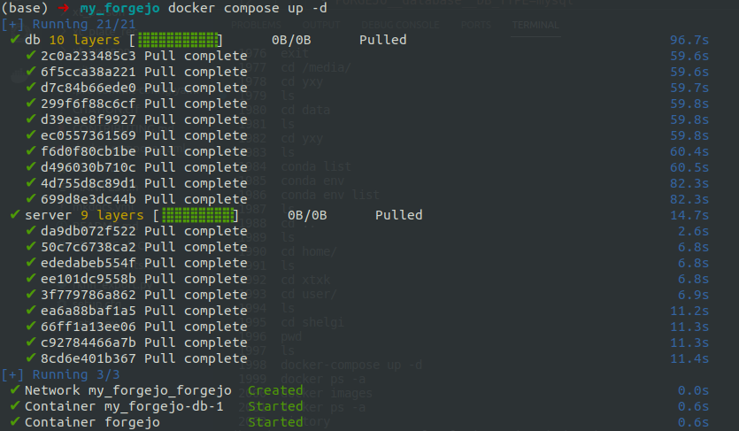
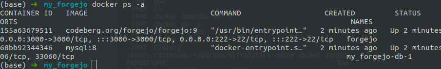
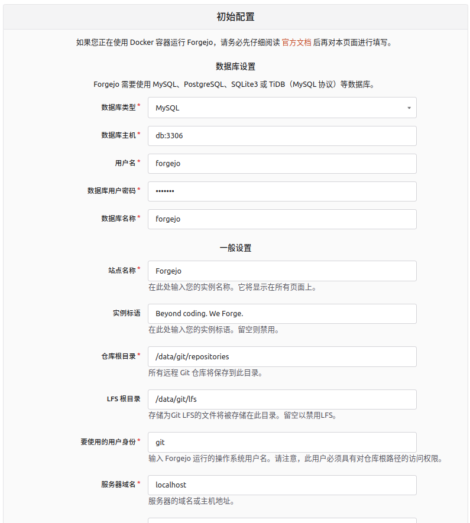

需要在本地或者局域网内搭建一个轻量的代码托管平台。

## forgejo的搭建过程记录

forgejo官网：https://forgejo.org/

这里使用最简单的docker构建。

1.创建一个空目录用来存储相关文件，目录下创建文件`docker-compose.yaml`

使用官方文档页面[Installation with Docker](https://forgejo.org/docs/latest/admin/installation-docker/)下的`MySQL database`部分的yaml配置。内容如下：

```yaml
networks:
  forgejo:
    external: false

services:
  server:
    image: codeberg.org/forgejo/forgejo:9
    container_name: forgejo
    environment:
      - USER_UID=1000
      - USER_GID=1000
      - FORGEJO__database__DB_TYPE=mysql
      - FORGEJO__database__HOST=db:3306
      - FORGEJO__database__NAME=forgejo
      - FORGEJO__database__USER=forgejo
      - FORGEJO__database__PASSWD=forgejo
    restart: always
    networks:
      - forgejo
    volumes:
      - ./forgejo:/data
      - /etc/timezone:/etc/timezone:ro
      - /etc/localtime:/etc/localtime:ro
    ports:
      - "3000:3000"
      - "222:22"
    depends_on:
     - db

  db:
    image: mysql:8
    restart: always
    environment:
      - MYSQL_ROOT_PASSWORD=forgejo
      - MYSQL_USER=forgejo
      - MYSQL_PASSWORD=forgejo
      - MYSQL_DATABASE=forgejo
    networks:
      - forgejo
    volumes:
      - ./forgejo_mysql:/var/lib/mysql
```

2. 使用`docker compose`命令构建服务

```bash
docker compose up -d
```

运行过程如下：



构建完成后查看容器：



服务已经成功启动。两个container一个是代码托管服务forgejo ，一个是mysql数据库服务。

3.访问服务页面，进行配置。

浏览器访问`localhost:3000`。可以看到这个页面：



数据库设置不要改，这是在yaml中设置好了的。都可不用改，设置一个管理员用户名和密码即可，然后点击安装。即可进行人代码管理页面。

>  管理员:zsl   pwd:zhaosilu123


**其他代码托管git平台**

GitLab

https://gitlab.com/gitlab-org/gitlab

Gitea

https://about.gitea.com/

GitBucket

https://gitbucket.github.io/

Gogs

https://gogs.io/

Gitblit

https://www.gitblit.com/

OneDev

https://onedev.io/

...
