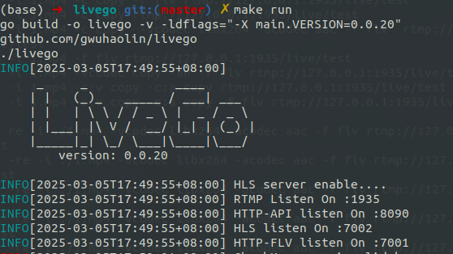

## rtsp和rtmp区别

流协议就是在两个通信系统之间传输多媒体文件的一套规则，它定义了视频文件将如何分解为小数据包以及它们在互联网上传输的顺序，RTMP 与 RTSP 是比较常见的流媒体协议。

### 1. RTSP（Real Time Streaming Protocol）

- **定义**：RTSP 是一个**控制协议**，用于控制媒体服务器上的媒体流的播放、暂停、快进等操作，类似于“遥控器”。
- **作用**：它本身不传输音视频数据，而是通过 **RTP（Real-time Transport Protocol）+ RTCP（RTP Control Protocol）** 来实际传输音视频流。
- **设计目标**：用于**实时点播与控制**，常用于 IP 摄像头、监控系统、视频会议等场景。
- **传输方式**：通常基于 UDP（有时也用 TCP），媒体数据通过 RTP 传输，控制信令通过 RTSP（默认端口 554）。

### 2. RTMP（Real-Time Messaging Protocol）

- **定义**：RTMP 是一个**低延迟的流媒体传输协议**，用于**音视频数据流的实时传输**。
- **作用**：它直接负责音视频数据的传输，常用于将摄像头、屏幕、或本地视频文件“推流”到服务器，再由服务器分发给观众。
- **设计目标**：用于**低延迟的直播流推送与分发**，最初由 Macromedia（现 Adobe）为 Flash 视频设计，广泛用于直播平台。
- **传输方式**：基于 TCP（默认端口 1935），稳定但延迟相对略高（通常 1~3 秒）。


----

实现rtmp流媒体服务器搭建，并使用本地视频文件模拟rtmp视频流。

## rtmp推流拉流

### livego+ffmpeg+VLC

0.安装编译livego

livego来搭建rtmp服务器。 **livego的readme写的很详细照做即可**。这里进行更详细的描述。

```bash
git clone https://github.com/gwuhaolin/livego.git
cd livego
make build
```

1.启动服务

```
make run
```

服务启动了



2.

浏览器中输入`http://localhost:8090/control/get?room=movie`

得到类似以下结果：

```
{"status":200,"data":"npTDAnx9LGMqaN4l764xREnIplSIrjcoACFgbVHoyT9E73m4"}
```

得到data下的值。

3.

使用ffmpeg命令去推流：

```bash
ffmpeg -re -i demo.flv -c copy -f flv rtmp://localhost:1935/{appname}/{channelkey}
```

这里appname默认是`live`,`channelkey`为上一步从浏览器获取到的值。

如果想将本地mp4视频文件模拟rtmp拉流，那么推流命令即：

```bash
ffmpeg -re -i test.mp4 -c copy -f flv rtmp://localhost:1935/live/npTDAnx9LGMqaN4l764xREnIplSIrjcoACFgbVHoyT9E73m4
```

4.

打开VLC，媒体->打开网络串流->网络->输入URL地址为：`rtmp://127.0.0.1:1935/live/movie`点击播放即可。

## rtsp推流拉流

通常摄像头作为 RTSP 服务端，提供流地址，供客户端拉取。

----

实现rtsp流媒体服务器搭建，并使用本地视频文件模拟rtsp视频流。方案：

可直接使用VLC进行推流拉流

[EasyDarwin](https://github.com/EasyDarwin/EasyDarwin)流媒体服务器+VLC

[mediamtx](https://github.com/bluenviron/mediamtx)流媒体服务器+VLC

